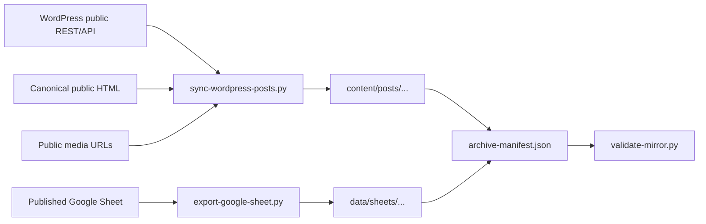

# Architecture

## Purpose

This repository is a public archive of published daryllswer.com content. It is
not the publishing source of truth; WordPress remains canonical.

## Boundaries

- Public inputs only: WordPress REST API, sitemap/RSS, canonical HTML, media
  URLs, and public Google Sheet exports.
- No private admin exports, backend access, database dumps, cookies, browser
  state, or credentials.
- Generated content is deterministic enough to re-run and compare.

## Data Flow

## Invariants

- Every mirrored post has a canonical URL, source REST snapshot, source HTML
  snapshot, Markdown body, metadata JSON, and asset manifest.
- Generated article bodies exclude donation/support CTAs and `/donation/`
  links as site-operational content.
- Every local image reference in Markdown points to an existing local file.
- Every downloaded asset has a source URL and SHA-256 checksum.
- Spreadsheet CSV files remain diffable; ODS remains the styled editable open
  artefact.
- Remote destructive GitHub actions are outside normal script behaviour.
