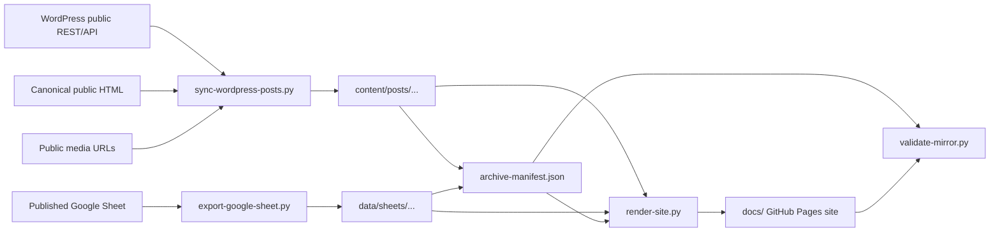

# Architecture

## Purpose

This repository is a public archive of published daryllswer.com content. It is
not the publishing source of truth; WordPress remains canonical.

## Boundaries

- Public inputs only: WordPress REST API, sitemap/RSS, canonical HTML, media
  URLs, and public Google Sheet exports.
- No private admin exports, backend access, database dumps, cookies, browser
  state, or credentials.
- Generated content is deterministic enough to re-run and compare.

## Data Flow

## Rendered Site

- `content/posts/...` and `data/sheets/...` remain the archive source of truth.
- `scripts/render-site.py` generates the public HTML site into `docs/`, which
  can be published by GitHub Pages from the `main` branch `/docs` folder.
- `docs/index.html` is the public article index with title, excerpt, taxonomy,
  date, and featured image for each mirrored post.
- `docs/posts/<slug>/index.html` is the human-readable article page generated
  from the preserved WordPress-rendered article HTML, with localised images,
  internal archive links, responsive figure styling, and embed fallback links.
- `docs/sheets/as141253-ipv6-architecture-example/index.html` is the generated
  tabbed HTML workbook for the AS141253 sheet. It is rendered from repository
  CSV files and keeps adjacent ODS, CSV, CSVW, and Google HTML snapshots for
  editing/provenance.

## Invariants

- Every mirrored post has a canonical URL, source REST snapshot, source HTML
  snapshot, Markdown body, metadata JSON, and asset manifest.
- Generated article bodies exclude donation/support CTAs and `/donation/`
  links as site-operational content.
- Every local image reference in Markdown points to an existing local file.
- Every downloaded WordPress media asset preserves the WordPress URL basename
  and direct response bytes wherever possible. This preserves embedded image
  metadata/EXIF because the archive does not re-encode media files. Any
  filename collision exception must be recorded in the asset manifest.
- Every downloaded asset has a source URL, source filename, stored filename,
  filename-preserved flag, and SHA-256 checksum.
- Spreadsheet CSV files remain diffable; `workbook.html`/Pages sheet output is
  generated from those CSV files; ODS remains the styled editable open
  artefact.
- Spreadsheet CSV exports are normalised to LF line endings for stable Git
  diffs; generated HTML artefacts strip trailing line whitespace; ODS remains a
  binary artefact.
- GitHub Pages output is generated, not hand-authored; rerun
  `make render-site` after sync/content changes.
- GitHub Pages output must not point article media back to
  `www.daryllswer.com/wp-content/uploads/` when a local archive copy exists.
- Remote destructive GitHub actions are outside normal script behaviour.
