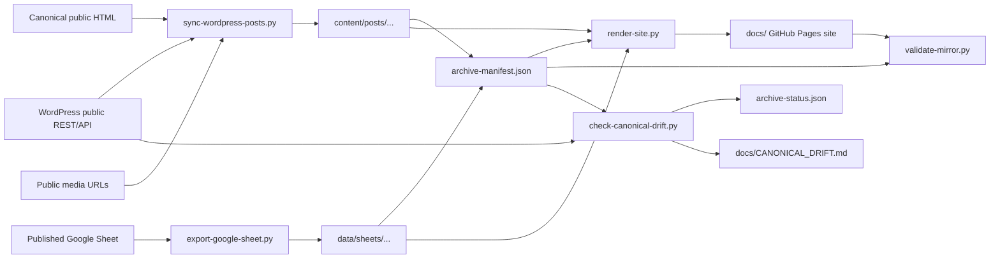

# Architecture

## Purpose

This repository is a public archive of published daryllswer.com content. It is
not the publishing source of truth; WordPress remains canonical.

## Boundaries

- Public inputs only: WordPress REST API, sitemap/RSS, canonical HTML, media
  URLs, and public Google Sheet exports.
- No private admin exports, backend access, database dumps, cookies, browser
  state, or credentials.
- Generated content is deterministic enough to re-run and compare.

## Repository Identity Assets

- `assets/readme/13_DS_Logo_Dark_Mode_SEO.png` is the owner-provided,
  byte-preserved proprietary logo used as the repository README header.
- `assets/brand/01_DS_Favicon_Dark_Mode.png` is the owner-provided,
  byte-preserved proprietary favicon source. `scripts/render-site.py` produces
  a 512 px PNG derivative at `docs/assets/brand/` for the generated Pages
  header and browser icon, avoiding an excessive browser image decode.
- Their SHA-256 checksums and byte-preserved provenance are recorded in
  `assets/readme/ASSET_PROVENANCE.md`, `assets/readme/manifest.json`, and
  `assets/brand/ASSET_PROVENANCE.md`, and `assets/brand/manifest.json`; their
  controlling legal notice is
  `LICENSES/DARYLL-SWER-PROPRIETARY-ASSET-NOTICE.txt`.
- They are not mirrored WordPress content, third-party media, MIT tooling, or
  `CC-BY-NC-SA-4.0` archive content. Future tooling must not rename,
  re-encode, redistribute, or apply an open licence to the source assets. The
  only permitted generated derivative is the documented 512 px Pages favicon.

## Data Flow

## Rendered Site

- `content/posts/...` and `data/sheets/...` remain the archive source of truth.
- `scripts/render-site.py` generates the public HTML site into `docs/`, which
  can be published by GitHub Pages from the `main` branch `/docs` folder.
- `docs/index.html` is the public article index with title, excerpt, taxonomy,
  date, and featured image for each mirrored post.
- `docs/posts/<slug>/index.html` is the human-readable article page generated
  from the preserved WordPress-rendered article HTML, with localised images,
  internal archive links, responsive figure styling, stable section anchors,
  and embed fallback links.
- The generated Pages theme self-hosts `Poppins` for body/content text and
  `Raleway` for headings/titles from `assets/fonts/`, with generated copies
  under `docs/assets/fonts/`. The font files are third-party OFL artefacts with
  family-specific provenance and checksums.
- The generated Pages theme includes the WordPress preset colour variables and
  class mappings needed by preserved article-body inline colour markup, such as
  `has-inline-color`, `has-vivid-red-color`,
  `has-luminous-vivid-orange-color`, and
  `has-luminous-vivid-amber-color`.
- The generated Pages theme must remain mobile-safe: page-level horizontal
  overflow is avoided with mobile viewport metadata, `min-width: 0` grid/flex
  children, bounded media, and explicit scroll containers for wide code/table
  content.
- `docs/sheets/as141253-ipv6-architecture-example/index.html` is the generated
  tabbed HTML workbook for the AS141253 sheet. It is rendered from repository
  CSV files, uses the same archive typography, and keeps adjacent ODS, CSV,
  CSVW, and Google HTML snapshots for editing/provenance.
- `docs/sheets/as141253-ipv6-architecture-example/visual.html` is the sole
  human-facing AS141253 IPv6 visual model. It renders the complete
  CSV-derived containment hierarchy with native `details`/`summary` controls.
  Every hierarchy disclosure is closed on fresh load: generated hierarchy
  `details` elements must not carry `open`. Reserved siblings are collapsed
  into count/range summaries, but retain exact expandable prefix details.
- `data/sheets/as141253-ipv6-architecture-example/cidr-hierarchy.json` and
  `.dot` are derived developer/AI artefacts. They preserve the CSV-derived
  IPv6 containment graph for audit and external tooling; no separate public
  CIDR hierarchy HTML page is generated.
- Historical visual-design material is retained only as a developer/AI
  reference under `data/sheets/as141253-ipv6-architecture-example/legacy-visual-models/`.
  The render pipeline excludes that directory and produces no legacy visual
  pages or navigation under `docs/`, so GitHub Pages cannot serve those routes.
- The public AS141253 hierarchy page must remain responsive across phone,
  tablet, desktop, and wide-display viewport classes. The page itself must not
  introduce horizontal overflow. The responsive support matrix includes the
  WCAG 320 CSS px reflow floor, common phone widths, common framework
  breakpoints, boundary-adjacent widths, desktop widths, and wide displays:
  320, 360, 390, 430, 479/480, 575/576, 599/600, 639/640, 759/760, 767/768,
  899/900, 979/980, 991/992, 1023/1024, 1199/1200, 1279/1280, 1366,
  1399/1400, 1439/1440, 1535/1536, 1599/1600, 1919/1920, and 2560 CSS px.
- Human-facing navigation and canonical URLs use clean directory URLs such as
  `https://daryll-swer.github.io/daryllswer.com-archive/`. The physical
  `docs/index.html` file remains the GitHub Pages entry point and generated
  artefact, not the preferred public link.

## Canonical Drift Automation

- `.github/workflows/canonical-drift.yml` runs a low-frequency weekly check and
  supports manual `workflow_dispatch`.
- `scripts/check-canonical-drift.py` uses only the public WordPress REST index
  and local archive manifests. It checks for new, missing/unlisted, modified,
  featured-image, and WordPress-uploaded image-media drift.
- Third-party documents, PDFs, downloads, and external artefacts are not
  mirror-required drift. They remain outbound links unless the owner explicitly
  approves mirroring a specific artefact.
- The automation is detection-first. It records drift in
  `docs/CANONICAL_DRIFT.md` and durable state in `archive-status.json`; it does
  not silently rewrite article bundles.
- The workflow has a 10 minute timeout and a concurrency group so overlapping
  scheduled/manual runs cannot pile up.
- The workflow commits only `archive-status.json` and `docs/CANONICAL_DRIFT.md`
  when those durable drift-state files change. Timestamped validation reports
  are not committed by scheduled checks.
- The workflow must use explicit `actions/checkout@v6` and
  `actions/setup-python@v6` steps, select CPython 3.12, cache pip by
  `requirements.txt`, and run `python -m pip install -r requirements.txt`
  before every archive Python script. The pip cache only reuses downloaded
  packages; it never replaces dependency installation on a clean runner.
- `scripts/validate-mirror.py` treats that workflow bootstrap as an invariant:
  it verifies active steps, their order, and the `lxml` declaration in
  `requirements.txt`. Any intentional action-version, Python-version, or
  bootstrap redesign must update the workflow and its guard in one commit, then
  pass a manually dispatched clean-hosted-runner verification.
- Official GitHub Actions documentation supports scheduled and manual triggers,
  workflow concurrency, timeout controls, and workflow disabling. This repo
  still uses a sentinel/no-op pattern instead of self-disabling because it
  avoids extra API credentials and keeps the archive state visible in Git.

### Failure State Model

- `healthy`: canonical REST is reachable and checked.
- `degraded`: one or two consecutive canonical failures occurred. Existing
  archive content remains untouched.
- `canonical_unavailable`: three or more consecutive canonical failures
  occurred.
- `frozen_archive`: eight consecutive failures across at least 30 days occurred.
  Future scheduled checks no-op before making any canonical network request.

The frozen state is intended for owner-unavailable futures: DNS expiry, TLS
failure, WordPress death, hosting loss, or a possibly hijacked canonical
surface must not cause repeated workflow failures or archive deletion.

## Invariants

- Every mirrored post has a canonical URL, source REST snapshot, source HTML
  snapshot, Markdown body, metadata JSON, and asset manifest.
- Generated article bodies exclude donation/support CTAs and `/donation/`
  links as site-operational content.
- Every local image reference in Markdown points to an existing local file.
- Mirrored article body links to archived daryllswer.com posts are rewritten to
  archive-local targets. Generated Pages links use local post routes and
  Markdown links use local `content/posts/.../index.md` targets.
- Cross-post fragments are preserved. WordPress heading IDs such as
  `h-dns-and-loopback-addressing` are preserved on headings, and matching
  non-`h-` alias anchors such as `dns-and-loopback-addressing` are emitted when
  needed so canonical section links still land correctly.
- WordPress inline colour classes in article source HTML must survive into
  generated Pages article HTML, and `docs/assets/theme.css` must style the
  corresponding WordPress preset colour classes.
- Generated article headings with IDs expose human-shareable controls: the
  heading text links to its own fragment, a visible permalink link updates the
  browser address bar, and a progressive-enhancement copy button copies the
  full section URL when the Clipboard API is available.
- Every downloaded WordPress media asset preserves the WordPress URL basename
  and direct response bytes wherever possible. This preserves embedded image
  metadata/EXIF because the archive does not re-encode media files. Any
  filename collision exception must be recorded in the asset manifest.
- Third-party documents, PDFs, downloads, and external artefacts are preserved
  as outbound hyperlinks with provenance; they are not assumed to be covered by
  the archive content licence and are not mirrored by default.
- Every downloaded asset has a source URL, source filename, stored filename,
  filename-preserved flag, and SHA-256 checksum.
- Spreadsheet CSV files remain diffable; `workbook.html`/Pages sheet output is
  generated from those CSV files; ODS remains the styled editable open
  artefact.
- The AS141253 CIDR hierarchy is derived from CSV, not manually maintained.
  Parent/child edges must be calculated using IPv6 prefix containment. The
  generated JSON and DOT checksums are recorded in the sheet manifest.
- The AS141253 public visual model is generated from CSV/hierarchy data, not
  hand-authored. `visual.html` is the only reader path and renders the full
  hierarchy through native disclosure controls. CSV `Notes` values remain
  first-class metadata; all hierarchy disclosures must be closed on fresh
  load, and reserved prefixes must not disappear. Reserved prefixes are
  collapsed only as expandable summaries. Historical design logic is
  explicitly non-Pages reference material. The public page must keep
  page-level width bounded at common phone, tablet, desktop, and wide-display
  viewports.
- Spreadsheet CSV exports are normalised to LF line endings for stable Git
  diffs; generated HTML artefacts strip trailing line whitespace; ODS remains a
  binary artefact.
- GitHub Pages output is generated, not hand-authored; rerun
  `make render-site` after sync/content changes.
- GitHub Pages output must not expose redundant `index.html` links in visible
  navigation or root canonical metadata when an equivalent clean directory URL
  exists.
- GitHub Pages output must not point article media back to
  `www.daryllswer.com/wp-content/uploads/` when a local archive copy exists.
- GitHub Pages article bodies must not retain external
  `https://www.daryllswer.com/<archived-post-slug>/` links when the target post
  is mirrored locally. Intentional canonical source footers and the canonical
  site navigation link remain external by design.
- Every generated local `#fragment` article-body link must resolve to a target
  element ID, except browser text-fragment links beginning with `#:~:text=`.
- Generated public pages must not introduce page-level horizontal overflow at
  common mobile widths. Wide article code/table/sheet content may scroll inside
  its own explicit container instead of widening the page.
- Remote destructive GitHub actions are outside normal script behaviour.
