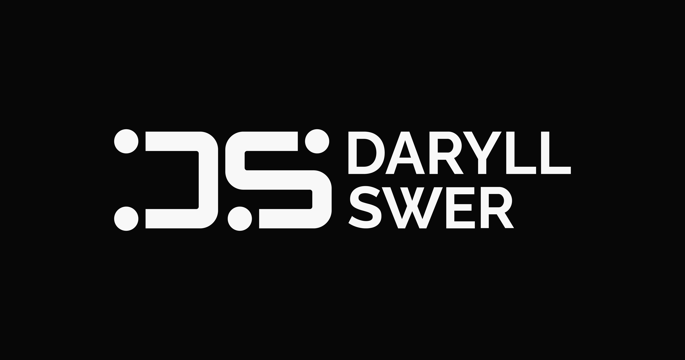

  

# daryllswer.com Archive

This repository is a public mirror/archive of published content from
[daryllswer.com](https://www.daryllswer.com/). The WordPress site remains the
canonical source.

GitHub repository name: `daryllswer.com-archive`.

HTML archive homepage: <https://daryll-swer.github.io/daryllswer.com-archive/>

The archive is designed for long-term reading and inspection. Each post is
stored as a self-contained content bundle with Markdown, source snapshots,
metadata, original media files, and an asset manifest.

## Layout

- `content/posts/YYYY-MM-DD-slug/` - one page bundle per published post.
- `data/sheets/` - public spreadsheet artefacts linked from posts.
- `docs/` - GitHub Pages HTML site plus mirroring and validation notes.
- `schemas/` - JSON Schemas for generated metadata and manifests.
- `scripts/` - public sync, export, validation, preview, and safety-scan tools.
- `archive-manifest.json` - generated root index of mirrored posts and checks.
- `archive-status.json` - public canonical drift/frozen-archive state.

## Copyright and Licences

Repository scripts/tooling are MIT licensed. Mirrored blog content follows
`CC-BY-NC-SA-4.0`, matching daryllswer.com unless per-file metadata says
otherwise. The README header logo
(`assets/readme/13_DS_Logo_Dark_Mode_SEO.png`) and the GitHub Pages favicon
source (`assets/brand/01_DS_Favicon_Dark_Mode.png`) and generated derivative
(`docs/assets/brand/01_DS_Favicon_Dark_Mode-512.png`) are proprietary brand
assets: `© 2026 Daryll Swer. All rights reserved.` They are excluded from both
the MIT and
`CC-BY-NC-SA-4.0` licences. `assets/readme/ASSET_PROVENANCE.md` is provenance
and byte-preservation evidence only; it is not a licence. No licence is granted
beyond applicable law and GitHub's limited public-repository service
operation. Third-party media and external artefacts are not assumed to be
covered by either licence. See [`LICENSING.md`](LICENSING.md),
[`assets/readme/ASSET_PROVENANCE.md`](assets/readme/ASSET_PROVENANCE.md), and
the controlling legal notice:
[`LICENSES/DARYLL-SWER-PROPRIETARY-ASSET-NOTICE.txt`](LICENSES/DARYLL-SWER-PROPRIETARY-ASSET-NOTICE.txt).
