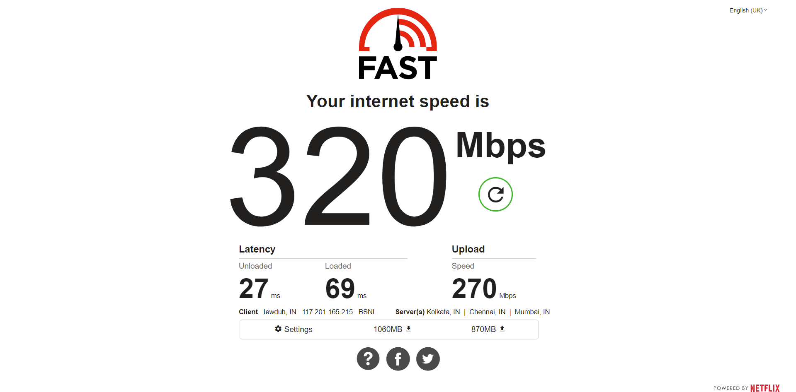
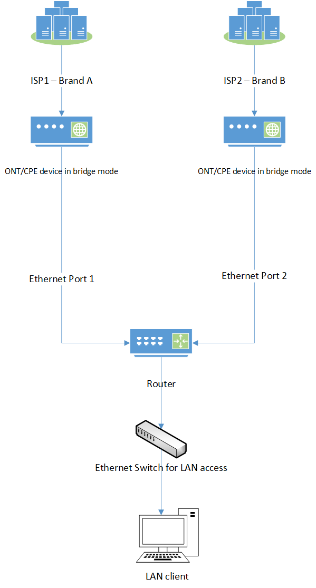

This will be a series with a [Part Two](https://www.daryllswer.com/multi-wan-setups-with-retail-isps-part-2-implementation-using-routeros/).

In **part one**, I would like to talk about a particular networking environment where a site (home, office etc) has more than one uplink either to the same or a different ISP, where the ISP(s) are **retail**meaning “home grade” ISPs or “consumer” ISPs instead of dedicated leased circuits/business-grade ISPs.

## Definition

I could not find a textbook definition for Multi-WAN as it is an umbrella term for many things such as Multi-WAN based load balancing, Multi-WAN based failover etc.

My****definition of Multi-WAN is fairly straightforward, i.e. A router/network/site that has more than one uplink to an ISP or a different ISP is a Multi-WAN setup.

## Pros

- Significantly cheaper than dedicated leased circuits.
  
  
  - Can be deployed for SOHO, Small Businesses and perhaps even enterprise (private firms that do not require their own ASN).
- Redundancy/Failover/High Reliability.
  
  
  - If one uplink goes down, traffic is routed over the next available uplink.
- Load Balancing.
  
  
  - Where traffic is split/balanced between the available uplinks.
  - **Bandwidth aggregation** is also possible without any bonding or routing protocols like ECMP i.e. in other words, you can achieve increased bandwidth throughput in downloads/uploads by using the available bandwidth from the uplinks simultaneously.
- You can route specific destination IPv4/IPv6 addresses/prefixes via a specific WAN interface that happens to have better routing to the said subnets (example: ISP2 has lower latency to Cloudflare’s DNS resolvers when compared to ISP1).
  
  
  - I have done exactly just this [here](https://twitter.com/DaryllSwer/status/1350443020949155840).

## Cons

- Total cost may be higher for the initial installation of CPE/ONT/Router/Switches etc, but this is usually negligible.
- You will not have SLAs like dedicated lines, but this is somewhat mitigated by having multiple uplinks.
- If a proper configuration is not done, HTTPS traffic will break (for example banking sites) since the source IPs would change frequently.
- The monthly cost of the ISPs combined may or may not be higher, depending on the available tariffs in that particular area.
  
  
  - For example, if ISP1 had a ₹500 tariff and the other had ₹300, then the total monthly cost is pretty cheap in my opinion.
- Likely behind an [ugly](https://www.daryllswer.com/shortcomings-of-cgnat-and-potential-work-arounds/) CGNAT deployment.
  
  
  - And likely that they will not provide a public IP as their IPv4 pools are again likely to be exhausted.
  - Also, likely that they will only give a single /64 IPv6 prefix, which makes subnetting impossible without breaking SLAAC (Read [Android](https://www.techrepublic.com/article/androids-lack-of-dhcpv6-support-frustrates-enterprise-network-admins/)).

_Figure-1 (A simple non-technical diagram to illustrate Multi-WAN setup with two ISPs)_

## Real-Life Example

I have deployed a Multi-WAN environment in my own home using RB450Gx4 as the router where:

- ISP1 ([AS9829](https://bgp.tools/as/9829)) has a 200Mbps symmetrical bandwidth (at the time of deployment/testing).
- ISP2 ([AS135756](https://bgp.tools/as/135756)) has a 100Mbps symmetrical bandwidth (at the time of deployment/testing).
- Monthly Tariffs (at the time of deployment/testing).
  
  
  - ISP1 – ₹1277
  - ISP2 – ₹1375

The end result of my setup is demonstrated below:

_Figure-2 [IP Address is intentionally left visible as it poses no security risk (Dynamic IP Address)]_
