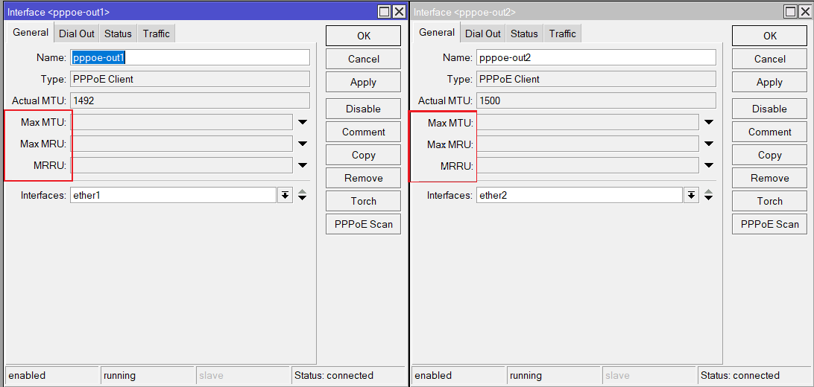

![Multi-WAN setups with retail ISPs [Part 2 – Implementation (Using RouterOS)]](assets/featured.png)

### Please note, it is very unlikely I will maintain this article piece. Even though the underlying concepts and principle are the same on RouterOS v7, if you are still facing some issues or confusion, I would recommend you watch this official video from MikroTik.

In [part one](https://www.daryllswer.com/multi-wan-setups-with-retail-isps-part-1-theory/) of this series, I talked about the theoretical aspects, pros, and cons of a Multi-WAN setup. So now in part two, I will show how one can implement this setup in their network setup and this will be a lengthy article.

## Requirements

- A router that is running either enterprise or open-source network OS.
  
  
  - Like RouterOS.
  - Or like VyOS or pfSense for open-source.
- More than one uplink to the same ISP or a different ISP.
- Minimum 1GbE on all your devices’ interfaces/ports.
- Bridging the ISP’s CPE device to ensure there is no double/triple/quadruple NAT situation.

## Implementation

- For this example, I will use RouterOS v6 stable.
  
  
  - Hardware: RB450Gx4.
  - Only IPv4 config will be covered due to the lack of proper IPv6 support in RouterOS v6 stable at the time of this article, but it would essentially be the same thing.
  - I will be using PCC and Nth together in order to achieve bandwidth aggregation.

Whatever is shown here using RouterOS can be replicated more or less on any other network OS like VyOS etc. Go through the vendor’s documentation if you are not on RouterOS.

### Assumptions

- I will assume you have already taken care of the basic configuration such as securing the router, firewalling, NATting etc.
  
  
  - Regarding **NAT**, use ***masquerade***instead of src NAT, the reason being it [clears](https://help.mikrotik.com/docs/display/ROS/NAT#NAT-Masquerade)****the conn_track table if an interface goes down and hence we can achieve sub 0ms failover effect.
- I will assume you have some basic idea of computer networking and basic ideas on the routing.
- I will assume you have read MikroTik’s documentation on PCC, Nth, Mangle etc.
- Only two uplinks (relevant to the example here).

Let us begin

**Step 1** we create two default routes for each uplink with distance attribute to enable the failover effect (meaning if one link goes down, the next immediate link will be used next)

```
/ip route
###ISP1 has lower distance and hence is the primary link###
add check-gateway=ping comment="Default Route for ISP1" distance=1 gateway=pppoe-out1

add check-gateway=ping comment="Default Route for ISP2" distance=2 gateway=pppoe-out2

###If you have more than two uplinks, you simply increase the distance as required like this:
add check-gateway=ping comment="Example Route for ISP3" distance=3 gateway=pppoe-out3###
```

**Step 2**, we need to take care of **MTU**for the **WAN**interfaces, which is applicable to any networking device or OS in this world. If your uplink is using **DHCP Client**/**Static IP address**, then by default this is already taken care of with 1500 MTU.

However, with **PPPoE**, this is not the case and on RouterOS, there are what a user calls “ghost bytes”. I will discuss PPPoE MTU in a future article, but for now, all that you need to do is set the underlying Ethernet interface’s actual MTU  to 1520 meaning the interface to which your uplink is connected. As of [RouterOS v7.2](https://forum.mikrotik.com/viewtopic.php?p=924589#p923904), MikroTik [has fixed the ghost bytes](https://web.archive.org/web/20220406203854/https://twitter.com/DaryllSwer/status/1511805609020366849), so please set it to **1508** instead (note I did not bother to update the diagrams below).

_Figure-1 (In this case, ether1 and ether2 are the underlying ethernet interfaces)_

**Step 3**, **leave** MTU, MRU, MRRU **blank**to enable auto-negotiation, RouterOS will **automatically**find the correct MTU value set by your ISP. Along with MRU.

[](assets/inline/Figure-2.png)

_Figure-2 (PPPoE Client MTU Config)_

**Step 4**, now we get started with the multi-WAN rules that will enable load-balancing and bandwidth aggregation without breaking HTTP/HTTPS connections

```
###Set Passthrough=no to reduce CPU usage for rules that do not need to be re-validated once they've been processed###
###connection-mark=no-mark to prevent re-marking of already marked connections and hence waste CPU cycles###

/ip firewall mangle
###Incoming connections through ISP1 must leave through ISP1###
add action=mark-connection chain=prerouting connection-mark=no-mark in-interface=pppoe-out1 new-connection-mark=ISP1_conn passthrough=no

###Incoming connections through ISP2 must leave through ISP2###
add action=mark-connection chain=prerouting connection-mark=no-mark in-interface=pppoe-out2 new-connection-mark=ISP2_conn passthrough=no

###I am assuming a 50/50 split ratio between the two ISPs#

###We are using dst-address-list=!not_in_internet && dst-address-type=!local to prevent marking LAN-to-LAN traffic###

###We can use PCC to handle HTTP/HTTPS traffic with "both-addresses" attribute to reduce chances of connections being marked more "randomly" which would break the connections as then connections would go through ISP1 and ISP2 more "randomly" and break. However in this case, I used "both-addresses-and-ports" based on my personal experience of traffic working just fine###

###For old school HTTP/HTTPS traffic###
###50% going to ISP1###
add action=mark-connection chain=prerouting connection-mark=no-mark dst-address-list=!not_in_internet dst-address-type=!local dst-port=80,443 in-interface-list=LAN new-connection-mark=ISP1_conn passthrough=yes per-connection-classifier=both-addresses-and-ports:2/0 protocol=tcp
###50% going to ISP2###
add action=mark-connection chain=prerouting connection-mark=no-mark dst-address-list=!not_in_internet dst-address-type=!local dst-port=80,443 in-interface-list=LAN new-connection-mark=ISP2_conn passthrough=yes per-connection-classifier=both-addresses-and-ports:2/1 protocol=tcp

###For new school HTTP3 traffic aka QUIC###
###50% going to ISP1###
add action=mark-connection chain=prerouting connection-mark=no-mark dst-address-list=!not_in_internet dst-address-type=!local dst-port=80,443 in-interface-list=LAN new-connection-mark=ISP1_conn passthrough=yes per-connection-classifier=both-addresses-and-ports:2/0 protocol=udp
###50% going to ISP2###
add action=mark-connection chain=prerouting connection-mark=no-mark dst-address-list=!not_in_internet dst-address-type=!local dst-port=80,443 in-interface-list=LAN new-connection-mark=ISP2_conn passthrough=yes per-connection-classifier=both-addresses-and-ports:2/1 protocol=udp

###If you have a third uplink, then the split ratio would be 3/0, 3/1, 3/2###

###Now we will use Nth for non HTTP/HTTPs traffic in order to acheieve bandwidth aggregation###

###50% going to ISP1###
add action=mark-connection chain=prerouting connection-mark=no-mark dst-address-list=!not_in_internet dst-address-type=!local in-interface-list=LAN new-connection-mark=ISP1_conn nth=2,1 passthrough=yes
###50% going to ISP2###
add action=mark-connection chain=prerouting connection-mark=no-mark dst-address-list=!not_in_internet dst-address-type=!local in-interface-list=LAN new-connection-mark=ISP2_conn nth=2,2 passthrough=yes

###Now we will send the marked connections to their appropriate routing table###

###For our marked/split traffic###
add action=mark-routing chain=prerouting connection-mark=ISP1_conn in-interface-list=LAN new-routing-mark=to_ISP1 passthrough=no
add action=mark-routing chain=prerouting connection-mark=ISP2_conn in-interface-list=LAN new-routing-mark=to_ISP2 passthrough=no

###For the incoming traffic from WAN###
add action=mark-routing chain=output connection-mark=ISP1_conn new-routing-mark=to_ISP1 out-interface=pppoe-out1 passthrough=no
add action=mark-routing chain=output connection-mark=ISP2_conn new-routing-mark=to_ISP2 out-interface=pppoe-out2 passthrough=no

###Now Finally we add the required routing tables###
/ip route
add check-gateway=ping comment="Load Balancing Route to ISP 1" distance=1 gateway=pppoe-out1 routing-mark=to_ISP1
add check-gateway=ping comment="Load Balancing Route to ISP 2" distance=1 gateway=pppoe-out2 routing-mark=to_ISP2
```

That’s it, you now have aggregated bandwidth capability, load balancing capability and HTTP/HTTPS stability using RouterOS.

For P2P networking (assuming all the uplinks have a public IP), you’d need to use a script like [this](https://forum.mikrotik.com/viewtopic.php?f=9&t=167773#p823917) for UPnP to work correctly (enable it on only one WAN interface and let the script handle the rest).

## Bonus Material

- Use [RFC 6890](https://tools.ietf.org/html/rfc6890) to build the ***not_in_internet***address list.
- RouterOS will automatically use the main routing table (default routes) should any uplink go down, so the “marked connections” will automatically be routed through whichever uplink is available even though for instance they are marked for ISP2, and ISP2 is down.

### Side Note:

In [part one](https://www.daryllswer.com/multi-wan-setups-with-retail-isps-part-1-theory/), you may have noticed the [upload speed](assets/inline/Figure-2-IP-Address-is-intentionally-left-visible-as-it-poses-no-security-risk-Dynamic-IP-Address.png) is lower than what I claimed, and below is the explanation for that.

- ISP1’s MTU = 1460, MRU = 1500
- ISP2’s MTU = 1500, MRU = 1500

The upload bandwidth never reached 300Mbps due to ISP1’s MTU of 1460 which resulted in packet fragmentation and hence affected throughput performance and was able to reach only an average of 170Mbps for upload. ISP2’s MTU is a straight 1500 and was able to reach its advertised speed, which I verified by looking at the link rate on the router itself. Since MRU for both links were 1500, download bandwidth was able to reach its advertised speed on both links.

This is why MTU should be taken care of to prevent issues.
