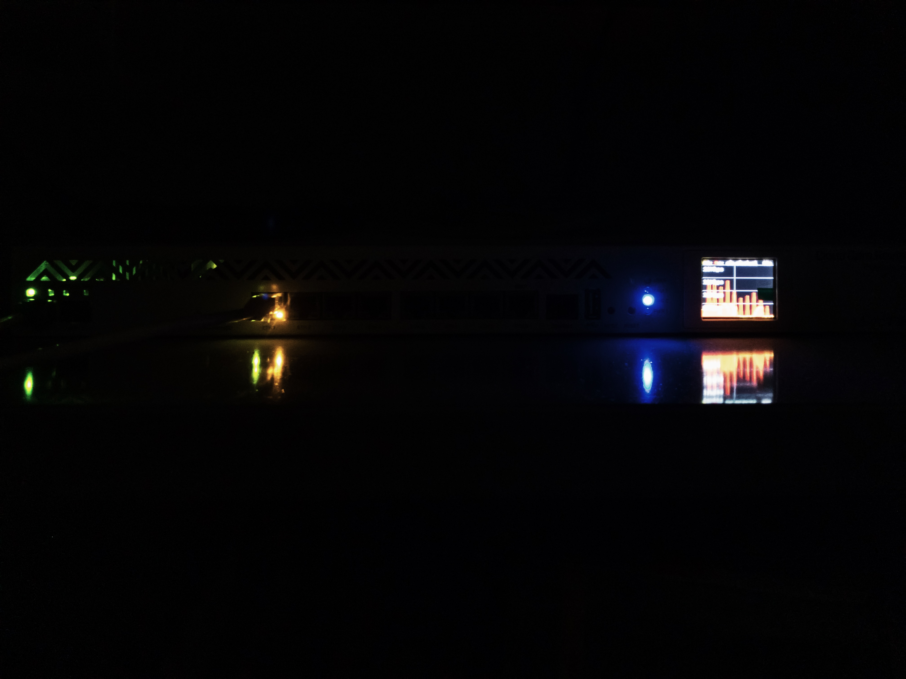

```
AnnouncementThis documentation will no longer be maintained.For any professional services, click here.
```

```
I've updated the CGNAT section with RouterOS v7 EIM-NAT config; this is the best possible CGNAT configuration that can exist on RouterOS at the time of writing this.
```

This guide provides configuration instructions for MikroTik RouterOS, but the principles can be applied to other Network Operating Systems (NOSes) as well. The guide will be updated regularly as new technologies, use cases, and more efficient configurations are discovered.

Many ISPs around the globe use MikroTik RouterOS to provide access to their customers via BNGs over PPPoE and for various other roles such as edge routers. In this guide, I will explore common issues and solutions along with best practices.

This guide is also available on the [APNIC Blog](https://blog.apnic.net/2021/06/24/how-to-edge-router-and-bng-optimization/), however the version there is obsolete. I recommend you follow the source here for the most up-to-date information.

### A brief history of this project

- The configuration was first tested and deployed on [AS135756](https://bgp.tools/as/135756) (small-sized ISP) with its proprietor [Varun Singhania](https://twitter.com/varunzzz/status/1402686735532761088).
- In 2021-22, I tested the configuration further as a downstream customer on [AS132559](https://bgp.tools/as/132559) (IP Transit provider & medium-sized ISP), where I was able to assess the impact and config changes both as an end-user and a consultant.
- From 2022 onwards, I test the configurations on my own network ([AS149794](https://bgp.tools/as/149794)), including the firewall rules, to ensure it would work in any environment as long as the instructions are followed. The tests confirmed that the configuration does not disrupt layer 4 protocols or cause problems for end-users in the last mile.

### A few things to keep in mind

- RouterOS is based on the Linux Kernel. As of RouterOS v7.14.2 it still uses legacy iptables for packet filtering instead of nftables, which has a [negative impact](https://wiki.nftables.org/wiki-nftables/index.php/Main_differences_with_iptables#:~:text=There%20have%20been%20reports%20of%20even%20unused%20base%20chains%20harming%20performance) on performance.
- The guide will be focused on RouterOS v7 as it is the current version of RouterOS.
- This guide assumes the reader has a basic understanding of typical use cases and technologies/protocols used in an ISP/Telco production environment.
- This guide focuses on layer 2-4 configuration (and occasionally up to layer 7) by following various [RFCs](https://en.wikipedia.org/wiki/Request_for_Comments) and BCOPs. It is not a network architecture guide, for which Kevin Myers’s [guide](https://iparchitechs.com/presentations/2022-Separation-Of-Network-Functions/IP-ArchiTechs-2022-Separation-Of-Network-Functions-Webinar.pdf) is recommended.
- Most (virtually everything) on this article has been tested on RouterOS v7.14.2 (stable + 7.14.2 RouterBOARD firmware).

## Basic Router Terminology and overview

- An **edge**or **border**router is an inter-AS router that is used for connecting different networks, such as transit, IXP, or PNIs.
  
  
  
  
  
  
  
  
  
  
  
  
  
  
  
  
  
  
  
  
  
  
  
  
  
  
  
  
  
  
  
  
  
  
  
  
  
  
  
  
  
  
  
  
  
  
  
  
  
  
  
  
  
  
  
  
  
  
  
  
  
  
  
  
  
  
  
  
  
  
  
  
  
  
  
  
  
  
  
  
  
  
  
  
  
  
  
  
  
  
  
  
  
  
  
  
  
  
  
  
  
  
  
  
  
  
  
  
  
  
  
  
  
  
  
  
  
  
  
  
  
  
  
  
  
  
  
  
  
  
  
  
  
  
  
  
  
  
  
  
  
  
  
  
  
  
  
  
  
  
  
  
  
  
  
  
  
  
  
  
  
  
  
  
  
  
  
  
  
  
  
  
  
  
  
  
  
  
  
  
  
  
  
  
  
  
  - It is important to keep an edge router stateless i.e. without connection tracking (stateful firewall filter rules or NAT), to avoid performance issues and vulnerability to DDoS attacks.
  - Do not use an edge router for customer delegation, as it will become stateful.
  
  
  
  
  
  
  
  - Do not confuse an edge router with a *Provider Edge* router, which is an [MPLS-specific](https://www.rfc-editor.org/rfc/rfc4364#section-1.2) terminology.
- A **core**router is **not**typically present in modern networks that follow a [collapsed core topology](https://study-ccna.com/collapsed-core-and-three-tier-architectures/).
  
  
  - However, some people may incorrectly refer to an edge router as a core router due to [linguistic, cultural reasons, or misinformation](https://www.daryllswer.com/the-human-side-of-isps/).
- BNGs, also known as access layer routers, are used for customer delegation tasks such as PPPoE, DHCP, and CGNAT. They are stateful in nature. Some people may also refer to them as BRAS or NAS (Network Access Servers), all of which are synonyms in my opinion.

## General Configuration Changes

Below are the general guidelines that should be applied on all MikroTik devices for optimal performance and security.

- Upgrade RouterOS **and** the [RouterBOARD firmware](https://help.mikrotik.com/docs/display/ROS/Upgrading+and+installation#Upgradingandinstallation-Suggestions) to the latest stable (or long-term if available) v7 releases, Use this command to enable firmware auto upgrade: “***/system routerboard settings set auto-upgrade=yes***”. Remember to reboot the router twice after the RouterOS upgrade to ensure firmware gets automatically upgraded.
- Implement [basic security measures](https://help.mikrotik.com/docs/display/ROS/Securing+your+router), including [reverse path filtering](https://www.theurbanpenguin.com/rp_filter-and-lpic-3-linux-security/) and enabling TCP SYN cookies, for which the latter two are found in [IP>Settings](https://help.mikrotik.com/docs/display/ROS/IP+Settings#IPSettings-IPv4Settings).
  
  
  - For rp-filter use loose mode when a device is behind asymmetric routing or when in doubt, use strict mode when a device is behind symmetric routing.

### IPv6

[IPv6 Router Advertisements (RA)](https://www.daryllswer.com/ipv6-router-advertisement-why-is-it-enabled-by-default-on-some-network-vendors/) are used for SLAAC and/or DHCPv6 and in MikroTik it is called Neighbor Discovery (ND) which is a bit confusing as ND is an umbrella encompassing various protocols and behaviours and not only RAs.

IPv6 RA (ND) is enabled by default for *all* interfaces on RouterOS. This should be disabled to prevent sending RAs randomly out of interfaces that you do not use SLAAC on and for security reasons such as preventing someone from receiving an IPv6 address by connecting a host to a specific port or VLAN along with reducing unnecessary [BUM traffic](https://en.wikipedia.org/wiki/Broadcast,_unknown-unicast_and_multicast_traffic) in your network. We disable it using this command:  
“***/ipv6 nd set [ find default=yes ] disabled=yes***”

You can enable IPv6 RA on a per-interface basis as and when required, i.e. if you set “advertise=yes” for an interface via IPv6>Address, then you need to configure RA/ND for that interface like the example below:  
“***/ipv6 nd add interface=Management_VLAN***”

### Interface Lists

[Interface lists](https://help.mikrotik.com/docs/display/ROS/Interface+Lists) help us simplify firewall rule management by enabling us to refer to an entire list in a single rule instead of multiple rules for every interface.

An interface list should only contain **layer 3** (L3) interfaces which is an interface with IP addressing attached to it, such as a physical port, L3 sub-interface VLAN, L3 bonding interface or GRE interface.

The following are basic guidelines for which lists to create and what should be included on those lists:

- “**WAN**” interface list should contain those interfaces used for connecting to transit, PNI, IXP, upstream peering.
- “**LAN**” interface list should contain those interfaces used for downstream connectivity to your retail customers or IP Transit customers etc. You should include “dynamic” interfaces to account for PPPoE clients on BNGs.
- “**Intra-AS**” interface list should contain those interfaces used for connecting one device to another device within the same network such as redundant connectivity between two routers horizontally.
- “**Management**” interface list should contain those interfaces used exclusively for management.
- Do **not** add bridge members individually into any list as they are purely Layer 2 (L2) interfaces.

It is however, important to note: When you are using bridges (which is discussed later in this article), the interface placements depend on how you set up the bridge – If you’re using a single bridge with physical/bonding interfaces as bridge members without any VLAN configuration, then the bridge will be a member of “**LAN**”. But if you are using VLANs on top of the bridge, then place the VLANs into their appropriate LAN/Intra-AS/Management list based on your local network topology. For example:  
“Management VLAN” will be in the management list, or VLAN123 will be in the “intra-AS” or “LAN” list.

[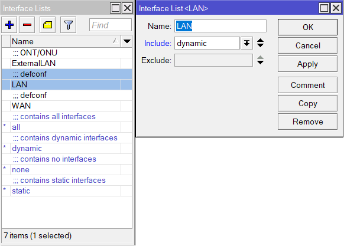](assets/inline/Figure-1-LAN-Include-Dynamic.png)

_Figure-1 (LAN Include Dynamic)_

### Connection Tracking

- Disable connection tracking on the **edge**router and enable loose TCP tracking on **all** routers using the following commands:  
  ***“/ip firewall connection tracking set enabled=no”  
  “/ip firewall connection tracking set loose-tcp-tracking=yes”***
- Use the recommended connection tracking timeout values to improve stability and performance, especially for UDP traffic like VoIP and gaming. If necessary, upgrade the router’s RAM to accommodate these values.

```
/ip firewall connection tracking
set icmp-timeout=30s tcp-close-wait-timeout=1m tcp-fin-wait-timeout=2m tcp-last-ack-timeout=30s tcp-syn-received-timeout=1m tcp-syn-sent-timeout=2m tcp-time-wait-timeout=2m udp-stream-timeout=2m udp-timeout=30s
```

[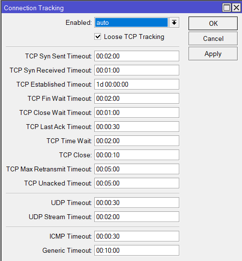](assets/inline/Figure-2-Recommended-Connection-Tracking-Timeout-Values.png)

_Figure-2 (Recommended Connection Tracking Timeout Values)_

### Miscellaneous

- Give the router an accurate system clock by enabling the Network Time Protocol (NTP) client and specifying a reliable NTP server such as this example:  
  ***“/system ntp client set enabled=yes server-dns-names=time.cloudflare.com”***

## MTU

To ensure reliable network performance, it is essential to configure the MTU consistently across all devices in the path in both L2 and L3. Inconsistent MTU configurations can result in dropped frames or strange behaviours. Additionally, it is essential to minimize IP fragmentation, properly deploy RFC4638, and ensure PMTUD is working for both IPv4 and IPv6. This will help to ensure reasonable auto-detected TCP MSS negotiation values.

Jumbo frames are ideally the way to go about MTU configuration as it’s future-proofing your network for whatever protocols you may throw at it. You should encourage your provider, peers, and customers to also configure jumbo frames on their network.

Bigger frames = more data per frame, meaning less frames required to transmit data, less CPU/resource utilisation required as packets per second flow will decrease.

### Guidelines

**Layer 2 MTU**

L2 MTU, also known as the “media MTU” should be configured to the ***maximum*** supported value on physical interfaces such as Ethernet ports, SFP and wireless interfaces. This applies to any networking hardware, including routers, switches, and hypervisors. The maximum supported value **may vary** by vendor or model, but that **is okay** as the L3 MTU will handle the actual packet size negotiation.

However, it is important to note that, you must ensure the interfaces ***all have*** consistently maximum values to minimise the number of MTU profiles on the device – The switch chip or ASIC has limited support for *n* number of MTU profiles which if exceeded could hurt performance or lead to undefined behaviours.

By properly configuring the L2 MTU, you can run any protocol you want (such as VXLAN, MPLS, VPLS, or WireGuard) and still have an MTU far greater than 1500 for layer 3 packets, thereby avoiding fragmentation **completely** on the overlay, intra-as.  
Example:

- Edge router (L2 MTU 9216) > BNG (L2 MTU 9216) > PE router (L2 MTU 9216) > Wireless AP (Bridged mode, often carries 9216 or similar L2 MTU) > Customer edge router (L2 MTU for WAN 9216)
- Edge router (L2 MTU 9216) > BNG (L2 MTU 9216) > PE router (L2 MTU 9216) > OLT (Bridged mode, often carries 9216 or similar L2 MTU) > Customer edge router (L2 MTU for WAN 9216)

**Layer 3 MTU**

Configure it to **9k MTU**, **strictly** for all **physical** ports (ethernet, SFP etc). If there is any L2 overhead, such as on a layer 3 sub-interface VLAN, the system will automatically subtract from the L2 MTU and will show us the subtracted L2 MTU, so you can adjust layer 3 MTU accordingly.

The basic gist of this is, we use the 9k L3 MTU on intra-AS and even inter-AS physical interfaces, unless explicitly your peer doesn’t support 9k.

This allows your ***downstream*** transit customers to talk to your network and your customers in jumbo frames – For which, you should inform your customer if you’ve enabled jumbo frames for them, their L3 MTU must match your L3 MTU.

But if for example, you are configuring an interface towards your transit or IXP, then you should ask your provider if they support >1500 MTU and configure accordingly. Some transit providers and IXPs supports 9000 MTU, so we take advantage of that when possible.

Some things to be careful of:

- If using Stacked VLANs (QinQ), both S and C VLANs should have equal L3 MTU.
- If your customer equipment does not support high jumbo frame, then simply configure your L3 MTU to match theirs, which is usually 1500.

Example:

- Edge router (L3 MTU 9k) > BNG (L3 MTU 9k) > PE router (L3 MTU 9k) > Wireless AP (bridged mode and permits jumbo frames above 9k) > Customer edge router (L3 MTU for WAN will be **9k**, assuming you configure 9k MTU on the S-C VLAN on the BNG)
- Edge router (L3 MTU 9216k) > BNG (L3 MTU 9216k) > PE router (L3 MTU 9k) > OLT (L3 MTU 9k) > (L3 MTU for WAN will be **9k**, assuming you configure 9k MTU on the S-C VLAN on the BNG)

MTU can be mixed and match network-wide, but should never mismatch. PMTUD exists for a reason, I have built networks where I had 9k in some paths, 8k in some paths, 1500 in some paths, differences may be on physical interfaces where a sub-interface is configured on top of the physical interface (such as a bridge, or L3 subinterface VLANs on top of the bridge). With proper planning and thought, you shouldn’t have problems with 9k MTU mixed in with lower sized MTU.

The screenshots below are for references to give you an idea of what MTU mix/match (but never mismatch) looks like, this is based on a network I built from scratch. Ether1 is 1500 L3 MTU because it’s my MGMT/OOB port, the other physical ports are all 9k L3 MTU and maxed L2 MTU. The LACP bonding interfaces are my intra-as interfaces connected to my backbone routers, and 9K is configured on their side as well. The VPLS is jumbo frames MPLS network-wide to ensure I can carry as much VLANs as I want, as much L2VPN customers as I want without any problems for jumbo frames.

The VLANs on top of the bridge (excluding the pe01) are tagged to the VPLS circuit (also member of bridge) which are configured to 1500 MTU as these are layer 3 terminating interfaces, as my residential customers behind these VLANs, don’t have routers with jumbo frames, so 1500 makes sense. But if for example, on VLAN1501, one day, I moved all customers to jumbo frames 9k enabled routers? Then I simply change the MTU config on my VLAN interface right here, as the underlying transport network is already enabled with jumbo frames from day one.

[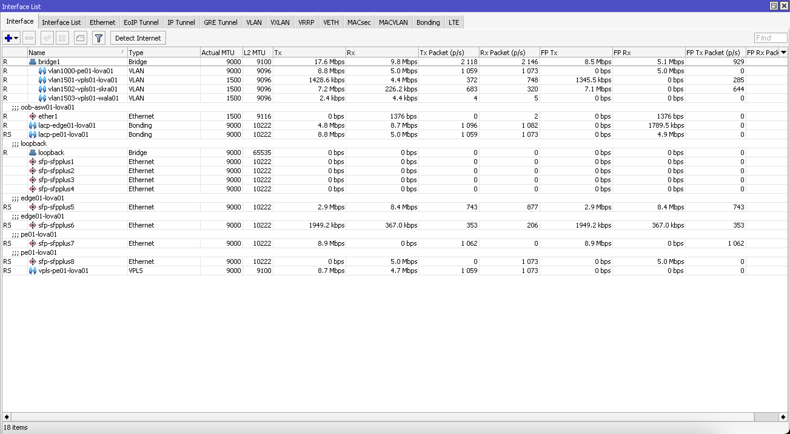](assets/inline/Screenshot-2024-01-20-at-2.36.45 AM.png)

_Figure-3 MTU Overview_

[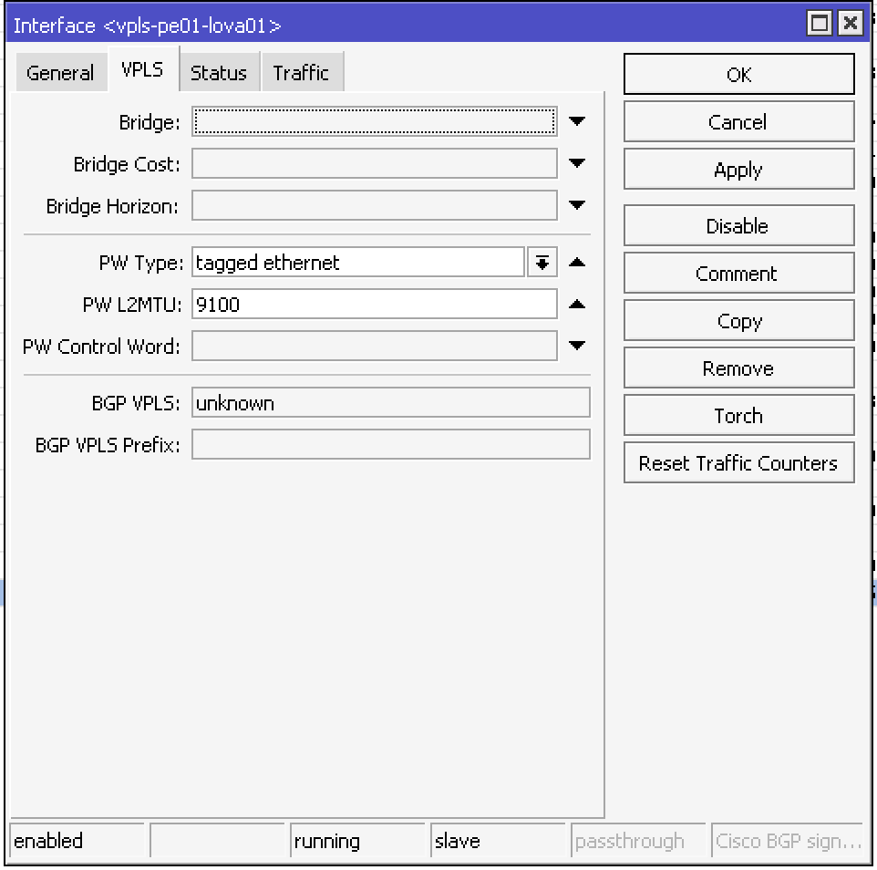](assets/inline/Screenshot-2024-01-20-at-2.37.02 AM.png)

_Figure-4 VPLS MTU_

### MTU Scripts

You can automate the MTU configuration using the scripts below. Please run **each one separately** as I didn’t put delays in between preventing synchronisation, but **be mindful** to **manually** configure L2, L3 MTU and advertised L2 MTU for VPLS/Other PPP interfaces.

```
#Run the ethernet MTU script first before the others#
#Script to autoconfigure max L2/L3 MTU on ethernet ports#
/interface ethernet
:foreach i in=[find] do={
  set $i l2mtu=[/interface get $i max-l2mtu]
  set $i mtu=[/interface get $i max-l2mtu]
}

#Script to autoconfigure max L3 MTU on Layer 3 sub-interface VLAN#
/interface vlan
:foreach i in=[find] do={
  set $i mtu=[/interface get $i l2mtu]
}

#Script to autoconfigure max L3 MTU on Bonding interfaces#
/interface bonding
:foreach i in=[find] do={
  set $i mtu=[/interface get $i l2mtu]
}

#Script to autoconfigure max L3 MTU on VXLAN#
/interface vxlan
:foreach i in=[find] do={
  set $i mtu=[/interface get $i l2mtu]
}

#Script to autoconfigure max L2/L3 MTU on Wireless interfaces#
/interface wireless
:foreach i in=[find] do={
  set $i l2mtu=2290
  set $i mtu=2290
}
#
```

## Linux Bridge Approach

A Linux bridge is a kernel module that acts as a virtual network switch and is used to forward packets between connected interfaces (also known as bridge ports or members). Many network operators do not follow [MikroTik’s official guidelines](https://help.mikrotik.com/docs/display/ROS/Layer2+misconfiguration) to properly implement L2/3 using a bridge, which results in degraded performance as hardware offloading and/or bridge *[Fast Path/Fast Forward](https://help.mikrotik.com/docs/display/ROS/Bridging+and+Switching#BridgingandSwitching-FastForward)* becomes unusable along with the inability to perform [L2 filtering](https://help.mikrotik.com/docs/display/ROS/Bridging+and+Switching#BridgingandSwitching-BridgePacketFilter).

> Linux driven hardware such as MikroTik or even Cumulus Linux devices rely heavily on [Linux DSA](https://www.kernel.org/doc/Documentation/networking/dsa/dsa.txt). Linux DSA, Bridge, vlan-aware bridge is a very complex vast topic that currently doesn't have a comprehensive network engineer oriented documentation, I will try to work with a buddy of mine to write a new blog post to deep diving the Linux DSA/Bridge architecture and what it means for network engineers. Until then, just keep in mind that, for layer 3 offloading to work correctly, you need **single** bridge for all downstream interfaces and use the vlan-filtering to segregate them as "access ports" on a router, and ocassionally trunk port as well depending on your topology and use-case.
>
> This means if you have a box, and the box has only one ASIC, then only one bridge can exist for physical ports/interfaces/LACP etc. However, you can create a loopback bridge, no problem.

To maximize performance benefits and give you L2 filtering capabilities, it is recommended by MikroTik to create a [single bridge](https://help.mikrotik.com/docs/display/ROS/L3+Hardware+Offloading#L3HardwareOffloading-Creatingmultiplebridges) per device with all **downstream** (and intra-AS) interfaces (physical, LACP bonding etc) as bridge members. Tagged/untagged VLANs and hybrid VLANs can be configured using [bridge VLAN filtering](https://help.mikrotik.com/docs/display/ROS/Bridging+and+Switching#BridgingandSwitching-BridgeVLANFiltering). Refer to [vendor guidelines](https://help.mikrotik.com/docs/display/ROS/Basic+VLAN+switching) for model-specific configuration instructions.

If you created an LACP bonding interface between two routers (or switches) for redundancy, you can add the bond interface into the same bridge as a bridge member, where in turn *either* the bridge itself ***or*** the L3 sub-interface VLANs will be an interface list member depending on your topology as discussed in the previous interface lists section.

The management port on newer MikroTik device is a dedicated port connected to the CPU instead of the ASIC, similar to traditional networking devices from Cisco or Juniper. In such cases, the management port will be fully indepdent from any bridge, with its own indepedent VRF. However, if for example you’re transporting managment VLAN for a downstream device from a dowsntream port, example SFP+12, then in this case, SFP+12 will be member of the bridge with VLAN config on the bridge as usual.

A separate bridge can also be created as a loopback interface without impacting physical interface performance. You can assign the “.0” IPv4 address to this interface along with the “::” IPv6 address of an IPv6 subnet for management, testing purposes or for using as the loopback IPs with OSPF.

Below is a sample configuration from a CCR1036 router using MikroTik guidelines along with sample interface lists:

```
#Layer 3 configuration such as IP addressing is attached to these interfaces#
/interface vlan
add interface=bridge1 mtu=10218 name="Main VLAN" vlan-id=20
add interface=bridge1 mtu=10218 name="Management VLAN" vlan-id=10

/interface bridge
add frame-types=admit-only-vlan-tagged name=bridge1 vlan-filtering=yes
#Loopback interface#
add arp=disabled name=loopback protocol-mode=none

/interface bridge port
add bridge=bridge1 frame-types=admit-only-untagged-and-priority-tagged interface=ether1 pvid=20
add bridge=bridge1 frame-types=admit-only-untagged-and-priority-tagged interface=ether2 pvid=20
add bridge=bridge1 frame-types=admit-only-untagged-and-priority-tagged interface=ether3 pvid=20
add bridge=bridge1 frame-types=admit-only-untagged-and-priority-tagged interface=ether4 pvid=20
add bridge=bridge1 frame-types=admit-only-untagged-and-priority-tagged interface=ether5 pvid=20
add bridge=bridge1 frame-types=admit-only-untagged-and-priority-tagged interface=ether6 pvid=20
add bridge=bridge1 frame-types=admit-only-untagged-and-priority-tagged interface=ether7 pvid=20
add bridge=bridge1 frame-types=admit-only-untagged-and-priority-tagged interface=ether8 pvid=10
/interface bridge vlan
add bridge=bridge1 comment="Main VLAN" tagged=bridge1 vlan-ids=20
add bridge=bridge1 comment="Management VLAN" tagged=bridge1 vlan-ids=10

#Attaching IP addressing to the interfaces#
/ip address
add address=100.64.2.1/24 interface="Main VLAN" network=100.64.2.0
add address=103.176.189.0 comment="Public Loopback" interface=loopback network=103.176.189.0
add address=100.64.3.1/25 interface="Management VLAN" network=100.64.3.0

#Example for interface lists#
/interface list member
add interface="Main VLAN" list=LAN
add interface="Management VLAN" list="Management Interfaces"
```

### R/M(STP)

I will not deep dive into how [STP](https://help.mikrotik.com/docs/display/ROS/Spanning+Tree+Protocol) works, as that is outside the scope of a guide post like this one. However, a few quick things to keep in mind:

- MikroTik allows us to [selectively](https://help.mikrotik.com/docs/display/ROS/Bridging+and+Switching#BridgingandSwitching-Per-portSTP) enable/disable STP/BPDU per-port if required. This may be needed in your network with complex layer 2 designs.

### Multicast traffic on the bridge

I personally had a few challenges with multicast traffic/IGMP Snooping best practices, for which I had to reach out to MikroTik support for some clarity. Below are a few basic guidelines to follow based on what I gathered from MikroTik docs and their support team. This is of utmost importance for networks that makes use of multicast routing and traffic for their IPTV services and similar.

- Be mindful of [IGMP Snooping](https://help.mikrotik.com/docs/pages/viewpage.action?pageId=59277403) (and IGMP Proxy/PIM) limitations such as tagged VLAN, and features depending on your local network topology.
- Keep in mind that IPv6 SLAAC will break if you enable multicast querier, for which, you need RouterOS v7.7 onwards to [work around](https://help.mikrotik.com/docs/pages/viewpage.action?pageId=59277403#BridgeIGMP/MLDsnooping-StaticMDBentries) this.
- In a layer 2 network if you are using IGMP Snooping, it should be enabled on all the bridges (devices) involved.
- You can also enable IGMP multicast querier on all the bridges, only one will get elected with the rest acting as failover in case a device fails.
- If you are using PPPoE then there’s no such thing as true multicast, because whilst it may multicast on layer 3, it will not be true multicast on layer 2 due to the nature of PPPoE which is a tunnel over layer 2. If you are using DHCP (preferably) or IPoE, then this issue does not apply.

## Prefix size for PTP links

### IPv4

I have noticed a lot of operators talking about how short they are on IPv4 addresses – Yet for unknown reasons they like to waste 2 extra addresses for every PTP or inter-router link by using a **/30**. Please, stop doing that and start using **/31s** for PTP links as per [RFC3021](https://datatracker.ietf.org/doc/html/rfc3021).

However, RouterOS v6+v7 does not support /31 natively, the following is how we do it.

Example below:  
Prefix: 103.176.189.0/31

```
#MikroTik to MikroTik PTP#

#Router A#
/ip address
add address=103.176.189.0 interface=ether1 network=103.176.189.1 comment="/31 Example"

#Router B#
/ip address
add address=103.176.189.1 interface=ether1 network=103.176.189.0 comment="/31 Example"
```

```
#Cross vendor PTP#

#Router A Cisco/Juniper/Huawei etc#
interface eth2 address 103.176.189.0/31

#Router B MikroTik side#
/ip address
add address=103.176.189.1 interface=ether1 network=103.176.189.0 comment="/31 Example"
```

### IPv6

As per [RFC6164](https://datatracker.ietf.org/doc/html/rfc6164#section-5), it is advised to use **/127s** on PTP links to avoid various forms of network attacks described in the RFC.

However, for ease of management and subnetting, I would advise not to subnet longer (smaller) than a /64. Please [click here](https://www.daryllswer.com/ipv6-architecture-and-subnetting-guide-for-network-engineers-and-operators/) to learn more about IPv6 architecture and subnetting plan.

Note that on MikroTik, /127s do not work with BGP for unknown reasons and hence the longest prefix size we can use would be a /126.

Example below:  
Prefix: 2400:7060::/126

```
#Advertise=no because we aren't using SLAAC#
/ipv6 address
add address=2400:7060::1/126 advertise=no comment="Peering with Transit" interface=ether1
```

However, if you look closely, you might’ve noticed that I avoided using the initial zeroes leading interface ID “2400:7060**::**/126″ and instead used “2400:7060**::1**/126″. The reason for this is, that in some routers, using the “::” (all leading zeroes) interface ID (address) on a link could cause [strange behaviours](https://www.daryllswer.com/behavioural-differences-of-ipv6-subnet-router-anycast-address-implementations/).

## Routing loops with RFC6890 space

I have observed that in most of the networks, including my own personal home lab (AS149794), I find a lot of traffic where source IP = my end hosts or CPE WAN IP (either it is CGNAT IP or public IP), but destination IP = unused RFC6890 blocks. This is why I (and MikroTik themselves) created a forward rule to drop RFC6890 from escaping to WAN.

Now let us step back and think about this: The majority of the ISPs do not implement these filter rules, which means that traffic from customers whereby dst-IP=RFC6890 is forwarded from their CPE to the BNGs, and from there the underlying L3/L2 paths will carry it all the way to the edge router, where further, goes towards your transit or peers if there is a default route. If there is no default route or more specific route for any given dst-IP matching RFC6890 blocks, it would simply loop back and forth until the TTL expires, which means wasted resources, CPU and bandwidth when your network is at scale and you have thousands of customers. So in order to solve this with a quick fix, I derived a simple yet effective solution – Route RFC6890 blocks to blackhole.

We route all RFC6890 space to black hole directly on the edge routers for well edge cases, but we will also do the same on the BNGs directly.

It will not impact your use of the private space for any given interface/servers etc – Because remember, more specific prefixes always win and hence your private /24s etc will always be preferred over the less specific /10 for example and hence will be accessible. Someone on the MikroTik forum has [discussed this](https://forum.mikrotik.com/viewtopic.php?t=112857#p560358) a bit, in the past.

### IPv4

```
#RouterOS v7#

#Copy and paste these on both Edge and BNG routers#
/ip route
add blackhole comment="Blackhole route for RFC6890 (aggregated)" disabled=no dst-address=0.0.0.0/8
add blackhole comment="Blackhole route for RFC6890 (aggregated)" disabled=no dst-address=172.16.0.0/12
add blackhole comment="Blackhole route for RFC6890 (aggregated)" disabled=no dst-address=192.168.0.0/16
add blackhole comment="Blackhole route for RFC6890 (aggregated)" disabled=no dst-address=10.0.0.0/8
add blackhole comment="Blackhole route for RFC6890 (aggregated)" disabled=no dst-address=169.254.0.0/16
add blackhole comment="Blackhole route for RFC6890 (aggregated)" disabled=no dst-address=127.0.0.0/8
add blackhole comment="Blackhole route for RFC6890 (aggregated)" disabled=no dst-address=224.0.0.0/4
add blackhole comment="Blackhole route for RFC6890 (aggregated)" disabled=no dst-address=198.18.0.0/15
add blackhole comment="Blackhole route for RFC6890 (aggregated)" disabled=no dst-address=192.0.0.0/24
add blackhole comment="Blackhole route for RFC6890 (aggregated)" disabled=no dst-address=192.0.2.0/24
add blackhole comment="Blackhole route for RFC6890 (aggregated)" disabled=no dst-address=198.51.100.0/24
add blackhole comment="Blackhole route for RFC6890 (aggregated)" disabled=no dst-address=203.0.113.0/24
add blackhole comment="Blackhole route for RFC6890 (aggregated)" disabled=no dst-address=100.64.0.0/10
add blackhole comment="Blackhole route for RFC6890 (aggregated)" disabled=no dst-address=240.0.0.0/4
add blackhole comment="Blackhole route for RFC6890 (aggregated)" disabled=no dst-address=192.88.99.0/24
add blackhole comment="Blackhole route for RFC6890 (limited broadcast)" disabled=no dst-address=255.255.255.255/32
```

```
#RouterOS v6#

#Copy and paste these on both Edge and BNG routers#
/ip route
add type=blackhole comment="Blackhole route for RFC6890 (aggregated)" disabled=no dst-address=0.0.0.0/8
add type=blackhole comment="Blackhole route for RFC6890 (aggregated)" disabled=no dst-address=172.16.0.0/12
add type=blackhole comment="Blackhole route for RFC6890 (aggregated)" disabled=no dst-address=192.168.0.0/16
add type=blackhole comment="Blackhole route for RFC6890 (aggregated)" disabled=no dst-address=10.0.0.0/8
add type=blackhole comment="Blackhole route for RFC6890 (aggregated)" disabled=no dst-address=169.254.0.0/16
add type=blackhole comment="Blackhole route for RFC6890 (aggregated)" disabled=no dst-address=127.0.0.0/8
add type=blackhole comment="Blackhole route for RFC6890 (aggregated)" disabled=no dst-address=224.0.0.0/4
add type=blackhole comment="Blackhole route for RFC6890 (aggregated)" disabled=no dst-address=198.18.0.0/15
add type=blackhole comment="Blackhole route for RFC6890 (aggregated)" disabled=no dst-address=192.0.0.0/24
add type=blackhole comment="Blackhole route for RFC6890 (aggregated)" disabled=no dst-address=192.0.2.0/24
add type=blackhole comment="Blackhole route for RFC6890 (aggregated)" disabled=no dst-address=198.51.100.0/24
add type=blackhole comment="Blackhole route for RFC6890 (aggregated)" disabled=no dst-address=203.0.113.0/24
add type=blackhole comment="Blackhole route for RFC6890 (aggregated)" disabled=no dst-address=100.64.0.0/10
add type=blackhole comment="Blackhole route for RFC6890 (aggregated)" disabled=no dst-address=240.0.0.0/4
add type=blackhole comment="Blackhole route for RFC6890 (aggregated)" disabled=no dst-address=192.88.99.0/24
add type=blackhole comment="Blackhole route for RFC6890 (limited broadcast)" disabled=no dst-address=255.255.255.255/32
```

### IPv6

```
#RouterOS v7#

#Copy and paste these on both Edge and BNG routers#
/ipv6 route
add blackhole comment="Blackhole route for RFC6890" disabled=no dst-address=::1/128
add blackhole comment="Blackhole route for RFC6890" disabled=no dst-address=::/128
add blackhole comment="Blackhole route for RFC6890 (aggregated)" disabled=no dst-address=64:ff9b::/96
add blackhole comment="Blackhole route for RFC6890 (aggregated)" disabled=no dst-address=::ffff:0:0/96
add blackhole comment="Blackhole route for RFC6890 (aggregated)" disabled=no dst-address=100::/64
add blackhole comment="Blackhole route for RFC6890 (aggregated)" disabled=no dst-address=2001::/23
add blackhole comment="Blackhole route for RFC6890 (aggregated)" disabled=no dst-address=2001::/32
add blackhole comment="Blackhole route for RFC6890 (aggregated)" disabled=no dst-address=2001:2::/48
add blackhole comment="Blackhole route for RFC6890 (aggregated)" disabled=no dst-address=2001:db8::/32
add blackhole comment="Blackhole route for RFC6890 (aggregated)" disabled=no dst-address=2001:10::/28
add blackhole comment="Blackhole route for RFC6890 (aggregated)" disabled=no dst-address=2002::/16
add blackhole comment="Blackhole route for RFC6890 (aggregated)" disabled=no dst-address=fc00::/7
add blackhole comment="Blackhole route for RFC6890 (aggregated)" disabled=no dst-address=fe80::/10
```

```
#In RouterOS v6, IPv6 blackhole is not supported#
```

## QoS and Bufferbloat control

Going forward from 2023 onwards with RouterOS v7 (or any modern OS), based on the immense amount of work, data, and results published by [Dave Täht](https://en.wikipedia.org/wiki/Dave_Taht) on the subject of QoS/QoE and more specifically the main problem with this domain i.e. [bufferbloat](https://www.bufferbloat.net/projects/), I would recommend using [FQ_Codel](https://www.bufferbloat.net/projects/codel/wiki/) **network-wide** as the default queueing algorithm. The main reason to opt for FQ_Codel is primarily because it was designed for backbone network usage, such as ISPs, Telcos and carriers, compared to the end-user-oriented [CAKE](https://www.bufferbloat.net/projects/codel/wiki/CakeTechnical/).

This means configuration wise, you apply the FQ_Codel queueing to all your **physical** ports and wireless interfaces across all your network devices. And ensure for customer queueing the same queue type is used.

An **important point** to note is the default values of FQ_Codel out-of-the-box are good up to 40Gbps physical interfaces. This means that if a **single** physical port is carrying **more** than 40Gbps traffic, you will need to tweak a custom FQ_Codel profile for that specific port.

Example configuration on a CCR1036:

```
/queue type
add kind=fq-codel name=FQ_Codel

/queue interface
set ether1 queue=FQ_Codel
set ether2 queue=FQ_Codel
set ether3 queue=FQ_Codel
set ether4 queue=FQ_Codel
set ether5 queue=FQ_Codel
set ether6 queue=FQ_Codel
set ether7 queue=FQ_Codel
set ether8 queue=FQ_Codel
set sfp-sfpplus1 queue=FQ_Codel
set sfp-sfpplus2 queue=FQ_Codel
```

*In addition to network backbone FQ_Codel implementation, you can also consider deploying an open-source bufferbloat killer traffic shaping device using [LibreQoS](https://libreqos.io/).*

Below is a screenshot of the test results from this [tool](https://www.waveform.com/tools/bufferbloat) on a **wireless** ISP network that I architected and implemented myself from the ground up. I should note that, I implemented everything from this guide + other design considerations which includes network-wide FQ_Codel config, in my case there is no LibreQoS-like device as I wanted a simpler network topology, and the end result below is a result that’s better than even some fibre networks on PON out there in the market.

[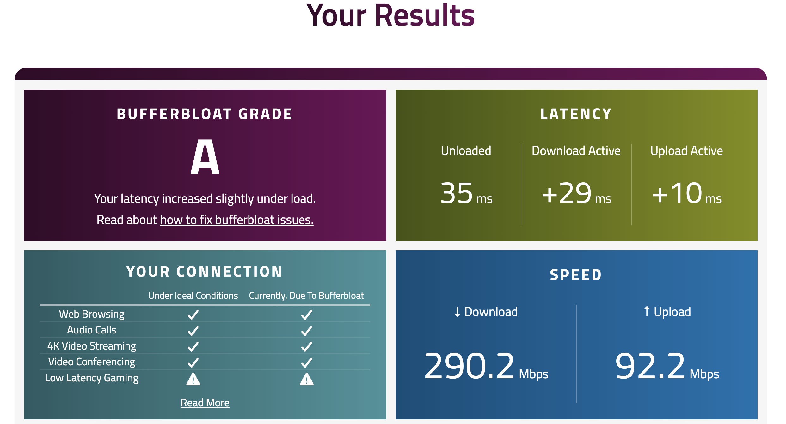](assets/inline/image.png)

_Figure-5 (Bufferbloat test on a wireless network designed and implemented by daryllswer.com)_

## For BNG

### PPPoE

**Issues**

- Packet fragmentation due to non-standard 1500 MTU/MRU
  
  - Typically, ISPs use 1492 or 1480 or some other strange MTU size
  - Both BNG device and customer router need to make use of hacks like TCP MSS Clamping to work around this
  
  
  
  
  - PMTUD is simply unreliable as per [RFC 8900](https://datatracker.ietf.org/doc/html/rfc8900)
    
    
    - Gets worse with CGNAT because remote end-points cannot determine the MTU of your PPPoE customer behind it
- Lack of proper routing for PPPoE Clients (Interfaces or Inter-VLANs)
  
  
  - Most assume that using a single profile for different PPPoE Servers running on different interfaces will work fine

**Solutions**

- The real long term solution is to migrate to DHCP to completely avoid all performance and MTU issues that are exclusively only an issue on PPPoE and similar encapsulation protocols.
- Deploy [RFC 4638](https://datatracker.ietf.org/doc/html/rfc4638)
  
  - Keep in mind that in a network, MTU**affects** the **whole path**of L2/L3 devices whether **physical** or **virtual**, as long as you follow the MTU section above, you should be good
  
  
  
  
  - Simply set MTU and MRU to 1500 **inside PPPoE Server** on the BNG
    
    
    - However, if you are interested in the whole jumbo frames to your peers/PNI/IXP etc – You can configure MTU/MRU to fixed **9000 bytes**, the reason for 9000 nytes for inter-AS traffic is explained [here](https://www.ietf.org/proceedings/82/slides/grow-2.pdf)
      
      
      - In order for this to work correctly you need to strictly follow the MTU section
      - If using **Wireless**APs, then it would 2290-8=**2282**bytes

[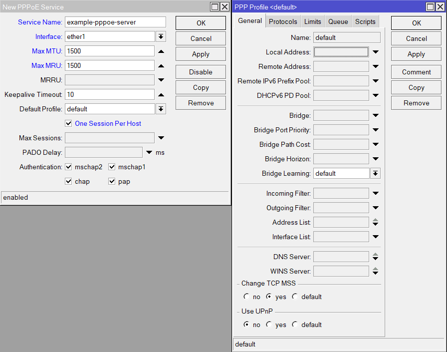](assets/inline/Figure-9-PPPoE-Server-MTU-MRU-TCP-MSS-Clamping-config.png)

_Figure-6 (PPPoE Server MTU/MRU & TCP MSS Clamping config)_

- Disable (and **delete**!) TCP MSS Clamping rules inside **IP>Firewall>Mangle**
  
  - Why set some arbitrary value when you can let the engine determine automatically to ensure optimal performance?
    
    - MikroTik has long since [allowed](https://forum.mikrotik.com/viewtopic.php?t=124717#p615828) automatic TCP MSS ClampingMake use of **PPP**>**Profile**>Default* to enable TCP MSS Clamping directly on the **PPPoE engine**. This will do the work for any customer whose MTU/MRU is less than 1500.
  
  
  
  
  - On the customer side, not all routers can take advantage of RFC4638, such as TP-Link, Tenda etc. For them, **MTU**will remain capped at **1492**.
    
    - The 1492 limitation on their end won’t cause issues with packet fragmentation as packets would fragment at the source (their routers) before it exits the interface and hits the BNG and TCP Clamping on PPPoE engine takes care of anything coming in from the outside world toward the customer
    
    
    
    
    - I have observed 1500 **MRU**when pinging from the outside world. Suggesting some of these consumer routers support 1500 **MRU**
    - If they are using MikroTik, pfSense, VyOS etc, they can take advantage of RFC4638 aka 1500 MTU/MRU for their PPPoE Client
    - Some ONT/ONU devices have strange behaviour for MTU negotiation where they simply do not allow RFC4638 to work (even in bridge mode), only a few brands like GX, TP-Link, and Huawei have been found to be flawless in my personal testing.

**Verify MTU config**

If you have properly configured MTU and MSS Clamping as per the steps above, then you should see the following results when testing from ***customer-side***using this [tool](https://www.speedguide.net/analyzer.php):

[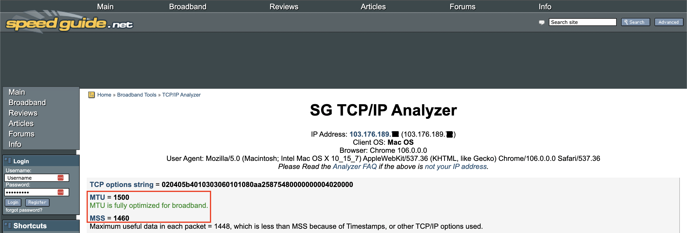](assets/inline/Figure-10-MTU-and-TCP-MSS-correctly-working-on-the-internet.png)

_Figure-7 (MTU and TCP MSS correctly working on the internet)_

**Extra Note on PPPoE**

- Create a single CGNAT pool on a per BNG basis and you can use it for n Number of PPPoE Servers on n number of interfaces  
  `/ip pooladd name=CGNAT_Pool comment="100.64.0.0-9 is reserved for each PPPoE Server Gateway/Profile" ranges=100.64.0.10-100.127.255.255`
  
  
  - Here we are reserving 100.64.0.0-9 for gateway IPs on a per-interface/PPPoE server basis, assuming we only have 10 VLANs/Interfaces
    
    
    - Reserve as per your local requirements
- Local Address in PPP Profile = Gateway IP address
  
  
  - One common mistake is using the router’s public IP from the WAN interface as the local address, which I’ve seen could lead to issues like traceroute failures or some strange packet loss, you should be using an address that does **not** exist in **IP>Address**
  - Each PPPoE Server needs unique profile/gateway in order to allow inter-VLAN communication between CPEs (which is needed to allow two customers behind a NATted IP to play a P2P Xbox game with each other on different VLANs) and will also ensure a clean network approach
    
    
    - If you have **100 PPPoE Servers**, there should be **100 unique PPP Profiles** with **unique local addresses** for each
  - Something like this for two servers:

```
/ppp profile
add change-tcp-mss=yes local-address=100.64.0.1 name=profile1 remote-address=CGNAT_Pool use-upnp=no
add change-tcp-mss=yes local-address=100.64.0.2 name=profile2 remote-address=CGNAT_Pool use-upnp=no

/interface pppoe-server server
add authentication=pap default-profile=profile1 interface=vlan20 keepalive-timeout=disabled max-mru=1500 max-mtu=1500 one-session-per-host=yes service-name=server1

add authentication=pap default-profile=profile2 disabled=no interface=vlan21 keepalive-timeout=disabled max-mru=1500 max-mtu=1500 one-session-per-host=yes service-name=server2
```

### CGNAT

**Issues**

- The majority of ISPs are using RFC1918 subnets for CGNAT and will clash with subnets on the customer site
- Breaks NAT Traversal for protocols like IPSec, FTP etc
- Poor config, that breaks P2P traffic, kills the end-to-end principle
- Lack of [hairpinning](https://help.mikrotik.com/docs/display/ROS/NAT#NAT-HairpinNAT) breaks inter-client P2P traffic
- Lacks [EIM-NAT](https://help.mikrotik.com/docs/display/ROS/NAT#NAT-Endpoint-IndependentNAT) (newly added by MikroTik)
- Routing Loops will occur for any traffic coming from the outside destined towards the public IP pools that aren’t related to NATted traffic

**Solutions**

- Make use of the **100.64.0.0/10** subnet as it’s [meant](https://datatracker.ietf.org/doc/html/rfc6598) for CGNAT usage to prevent clashing on the customer site
- Enable **all** the NAT traversal Helpers on the NAT box, as shown below.

[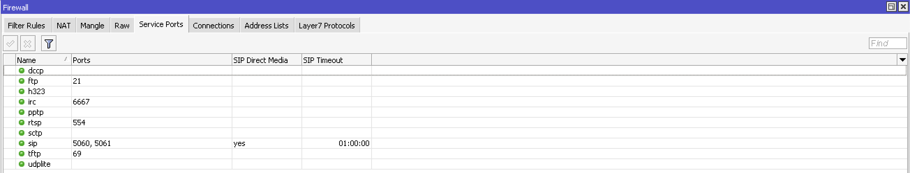](assets/inline/Screenshot-2024-01-20-at-2.31.27 AM.png)

_Figure-8 (NAT Traversal Helpers on RouterOS)_

- Use the follow config template going forward (2024 onwards), which includes [IPsec passthrough](https://forum.mikrotik.com/viewtopic.php?t=161903#p797539), EIM-NAT, Netmap functionality for 1:Many with consistent 1:1 port mapping. Please note **rule order** is important, the following template has accounted for rule order to capture packets correctly. We will assume “103.176.189.0/30” to be our public CGNAT pool.

```
/ip firewall nat
#EIM-NAT#
add action=endpoint-independent-nat chain=srcnat comment=EIM-NAT out-interface-list=WAN protocol=udp randomise-ports=no src-address=100.64.0.0/10 src-port=1024-65535 to-addresses=103.176.189.0/30
add action=endpoint-independent-nat chain=dstnat comment=EIM-NAT dst-address=103.176.189.0/30 dst-port=1024-65535 in-interface-list=WAN protocol=udp randomise-ports=no to-addresses=100.64.0.0/10

#Required as EIM-NAT in MikroTik doesn't support all layer 4 Protocols#
add action=netmap chain=srcnat comment="CGNAT Rule" dst-address-list=!not_in_internet ipsec-policy=out,none out-interface-list=WAN src-address-list=cgnat_subnet to-addresses=103.176.189.0/30

#Hairpinning rule to ensure P2P traffic works for all clients behind the CGNAT#
add action=masquerade chain=srcnat comment="Hairpin for CGNAT clients" dst-address-list=cgnat_subnet src-address-list=cgnat_subnet
```

- Here cgnat_subnet=address list containing CGNAT subnets ***i.e.***100.64.0.0/10
- dst-address-list=!not_in_internet is self-explanatory, anything destined towards private subnets shouldn’t be NATted towards WAN
- The hairpinning  will allow customers to talk to****each other using****their **CGNAT IP**, Xbox makes use of this and is mentioned in [RFC 7021](https://datatracker.ietf.org/doc/html/rfc7021#section-3.1).
- **Avoid**Deterministic****NAT, the above configuration allows P2P traffic initiated from the inside to be reachable from the outside with various applications that make use of ephemeral ports/UDP NAT punching/STUN etc
- We were able to successfully seed the official Ubuntu Torrent behind the CGNAT with the above configuration, which can mean only one thing: P2P networking from in-bound established works!

[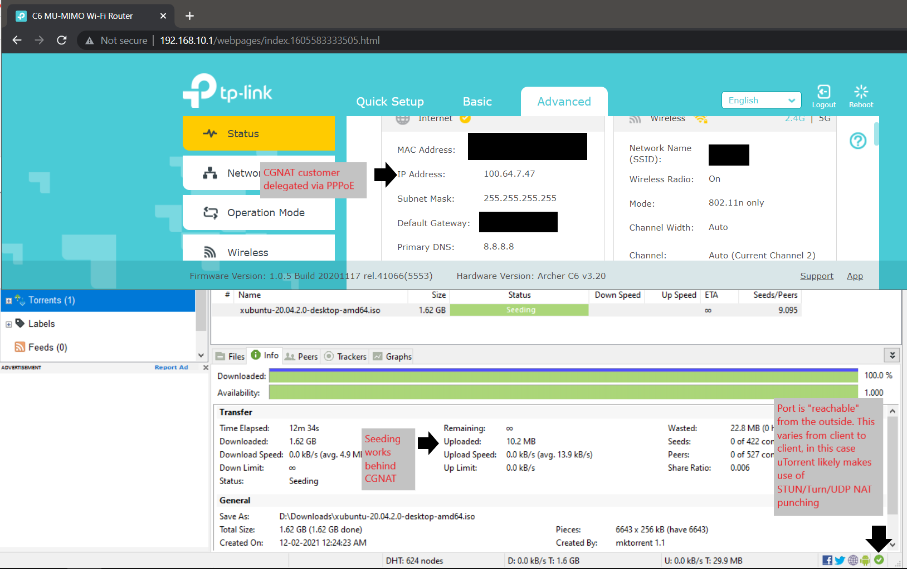](assets/inline/Figure-12-BitTorrent-Seeding-Behind-CGNAT.png)

_Figure-9 (BitTorrent Seeding Behind CGNAT)_

- We tried with src nat as action for src NAT chain but it resulted in the NATted public IP constantly changing on the customer side and breaking things

*Below is what MikroTik support had to say about**netmap vs src nat** as action for src nat chain*

[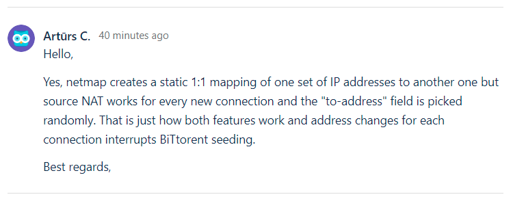](assets/inline/Figure-13-Src-nat-vs-Netmap.png)

_Figure-10 (Src nat = breaks P2P traffic | Netmap = static mapping per client IP)_

- Now we fix routing loops for the CGNAT public pool

```
/ip route
add blackhole comment="Blackhole-CGNAT pool" dst-address=103.176.189.0/30
```

**Subscription Ratio Recommendation**

In my extensive testing and observations, when using the above parameters and steps, I was able to have 200 users behind a /30 without any known complaints from them. BitTorrent worked as expected too, this is likely due to the obvious fact that not all users out of 200 will max out 65k connections and hence use up all the IP:Port combination. Where will you find a CPE that can handle 65k NAT entries anyways?

So tl;dr you can use a /30 per 200 users as long as you follow the steps properly and also to be future-proof and safe, ensure you provide [IPv6](https://www.daryllswer.com/ipv6-architecture-and-subnetting-guide-for-network-engineers-and-operators/) as well.

**End Result**

[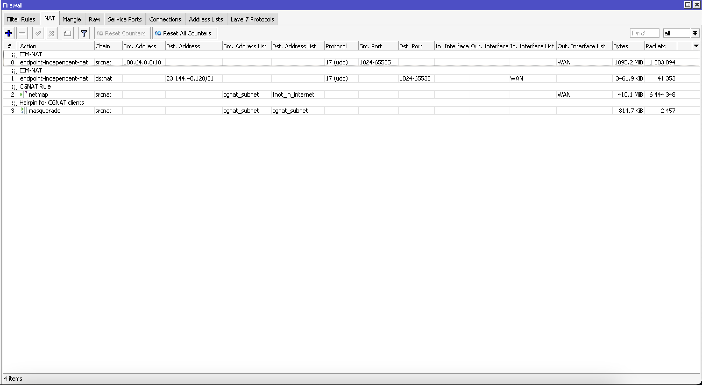](assets/inline/Screenshot-2024-01-20-at-2.27.19 AM.png)

_Figure-11 (Your NAT Table should look as dead simple as this one)_

**Logging compliances for government and regulatory requirements**

For CGNAT logging for compliances purpose, you can use [Traffic Flow](https://help.mikrotik.com/docs/display/ROS/Traffic+Flow) which also adds additional option for NAT events logging in the configuration.

### IPv6

**Issues**

- Addressing may not be optimally subnetted/broken down
- ISP may only have something like a single /48 with 5000 customers downstream which exceeds possible /56s out of the /48
- Not following the proper [guidelines](https://www.ripe.net/publications/docs/ripe-690) for IPv6 deployment
- Lack of [persistent assignment](https://www.ripe.net/publications/docs/ripe-690#5-2--why-non-persistent-assignments-are-considered-harmful) feature on MikroTik
  
  
  - This applies to the majority of ISPs even though they may use Cisco, Juniper etc which supports persistent assignment configuration
- Not properly ensuring that the customer’s WAN side gets a proper single /64
- Forcing the customer to have only a single /64 on the LAN side instead of /56
- MikroTik IPv6 RADIUS does [not work](https://forum.mikrotik.com/viewtopic.php?t=163276) correctly

**Solutions**

- A proper [IPv6 architecture and subnetting](https://www.daryllswer.com/ipv6-architecture-and-subnetting-guide-for-network-engineers-and-operators/) plan should be implemented
  
  
  - However, the logic is simple  
    Ensure customers get **/64 WAN side** and **/56 LAN side** for **home users**  
    Ensure customers  get **/64 WAN side** and **/48 LAN side** for **enterprise/SMEs/DC etc**
- Ensure you request for appropriate prefix allocation based on your customer base from your Regional Internet registry/Local Internet registry
- Follow the proper guidelines and BCOPs
- I came across [a solution](https://forum.mikrotik.com/viewtopic.php?t=163276#p926992) for the lack of **persistent assignment** on MikroTik, simply use the following script and schedule it to run every five minutes:  
  **`#Please don't be stupid enough to set owner=Daryll#`**`/system scriptadd dont-require-permissions=no name=PPPoE-IPv6-Persistent owner=Daryll policy=ftp,reboot,read,write,policy,test,password,sniff,sensitive,romon source=\"/ipv6 dhcp-server binding;\r\\n:foreach i in=[find server~\"pppoe\"] do={\r\\n make-static \$i;\r\\n set \$i comment=[get \$i server];\r\\n set \$i server=all;\r\\n}"`  
  Use the scheduler for automating it:  
  `/system scheduler`  
  `add interval=5m name=PPPoE-IPv6-Persistent-AutoUpdate on-event=PPPoE-IPv6-Persistent policy=ftp,reboot,read,write,policy,test,password,sniff,sensitive,romon start-time=startup`

Now I will cover a simple configuration use-case where a BNG has exactly 1000 customers. The goal here is to ensure that the **WAN side** of each customer gets a **/64**and the**LAN side** gets a **/56**.

- Disable redirects  
  `/ipv6 settings set accept-redirects=no`
- Next need to create two separate pools, one for WAN and one for the LAN side of the customer
  
  
  - `/ipv6 pooladd name=Customer-CPE-LAN prefix=2405:a140:8::/46 prefix-length=56add name=Customer-CPE-WAN prefix=2405:a140:f:d400::/54 prefix-length=64`
    
    
    - Here, prefix-length specifies what prefix length the customer gets, which in this case as per standards, we are giving the WAN side a /64 and the LAN side a /56
- And finally, configure the pools to each PPPoE Profile as below  
  `/ppp profileset *0 dhcpv6-pd-pool=Customer-CPE-LAN remote-ipv6-prefix-pool=Customer-CPE-WANadd name=profile2 dhcpv6-pd-pool=Customer-CPE-LAN remote-ipv6-prefix-pool=Customer-CPE-WAN`
  
  
  - **Remote** IPv6 prefix is for the **WAN**side of the customer
  - **DHCPv6**PD Pool is for the **LAN**side of the customer

[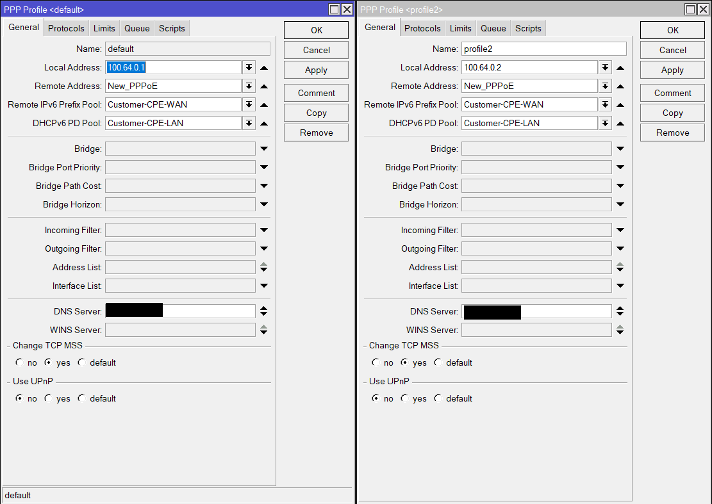](assets/inline/Figure-15-PPPoE-IPv6-configuration.png)

_Figure-12 (PPPoE IPv6 configuration)_

That’s it, now the customers will dynamically get a routed /64 and routed /56 for WAN and LAN sides respectively.

**Verify IPv6 config**

If you have properly configured IPv6 as per the steps above, then you should see the following results when testing from ***customer-side*** using this [tool](https://test-ipv6.com/):

[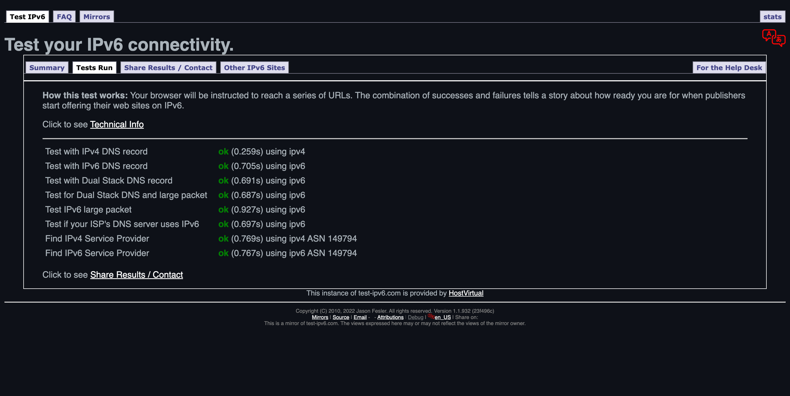](assets/inline/Figure-16-IPv6-working-correctly.jpg)

_Figure-13 (IPv6 working correctly)_

### Routing Loop prevention

If a customer happens to go offline (due to power loss etc), traffic destined for those customers will continue to persist until they time out leading to increased CPU usage. To solve this, we simply route aggregated customer prefixes to blackhole – Because remember in routing, more specific prefixes always win, so should those more specific prefixes go offline, the less specific (aggregated) routes take precedence in which case we are routing to blackhole and hence all pending traffic times out with immediate effect to give us optimal CPU usage.

```
#RouterOS v7 example#

/ipv4 route
add blackhole comment="Blackhole route for Customer CGNAT pool" disabled=no dst-address=103.176.189.0/25
add blackhole comment="Blackhole route for Customer public pool" disabled=no dst-address=103.176.189.128/25

/ipv6 route
add blackhole comment="Blackhole route for Customer LAN pool" disabled=no dst-address=2405:a140:8::/46
add blackhole comment="Blackhole route for Customer WAN pool" disabled=no dst-address=2405:a140:f:d400::/54
```

```
#RouterOS v6 example#
/ip route
add type=blackhole comment="Blackhole route for Customer CGNAT pool" disabled=no dst-address=103.176.189.0/25
add type=blackhole comment="Blackhole route for Customer public pool" disabled=no dst-address=103.176.189.128/25

#In RouterOS v6, IPv6 blackhole is not supported#
```

### Firewall/Security

**Issues**

- Blocks inbound ports based on the false logic of “protecting” the customer
  
  
  - Port blocking does nothing to improve security, it only breaks legitimate traffic such as apps or games that use various methods for VoIP
  - Malware can make use of port 443 and that is the reality of modern-day malware anyway
- **Net Neutrality Violations**
  
  
  - Such as blocking TCP/UDP traffic destined towards Cloudflare or Google Anycast DNS
- Lacks [basic DDoS protection](https://forum.mikrotik.com/viewtopic.php?f=2&t=54607)
- Lacks simple bogon filtering
- Lacks basic rules such as dropping invalid traffic on the input chain
- Lacks FastTracking for traffic destined towards your NATted pools
- Connection tracking of customers having a public IPv4 address makes no sense and wastes CPU cycles
- Incorrect ICMPv4/ICMPv6 filtering rules such as rate limiting fragmentation needed and then wonders why customers are facing strange issues with regards to PMTUD

**Solutions**

- Remove **most** “port blocking” rules
  
  
  - Customer Site security should be handled on the customer site such as having proper basic firewalling on their Edge Routers
  - I’ve dropped some ports on the RAW table directly
- Avoid Net Neutrality Violation unless otherwise enforced by your local state or central government
- I’ve shared the rule for FastTracking NATted pools
- I’ve shared the rule for reducing connection tracking impact on customers having public IPv4 address
- I have crafted ICMPv4/ICMPv6 manually to drop all deperecated ICMP types while accepting all valid ICMP types
  
  
  - Source of truth for [ICMPv4 deprecated types](https://www.iana.org/assignments/icmp-parameters/icmp-parameters.xhtml)
  - Source of truth for [ICMPv6 deprecated types](https://www.iana.org/assignments/icmpv6-parameters/icmpv6-parameters.xhtml#icmpv6-parameters-4)

Below are the generic firewall rules that should be deployed on the BNG to cover basic security grounds.

### IPv4 Firewall

```
#First we take care of address lists#
/ip firewall address-list

#Enter all local subnets/public subnets applicable to your AS for the specific BNG where you've routed pools for use#

#Example I'm using only a /24 public+private pools for this specific BNG#
add address=103.176.189.0/24 comment="Public Pool" list=lan_subnets
add address=192.168.0.0/24 comment="Local interfaces" list=lan_subnets

#The usual CGNAT pool entire range#
add address=100.64.0.0/10 comment="CGNAT Pool" list=lan_subnets

#Here we will enter the public pool used for giving customers public IP addresses directly, this will be used for no-tracking to boost performance of customers having public IPv4 addresses and reduce load on the CPU of the BNG#

add address=103.176.189.0/25 comment="Public Pool" list=public_subnets

###Required for DDoS protection rules###
add list=ddos-attackers
add list=ddos-targets

###Bogon filtering addresses for each of the rules in RAW/Filter###
add address=0.0.0.0/8 comment=RFC6890 list=not_in_internet
add address=172.16.0.0/12 comment=RFC6890 list=not_in_internet
add address=192.168.0.0/16 comment=RFC6890 list=not_in_internet
add address=10.0.0.0/8 comment=RFC6890 list=not_in_internet
add address=169.254.0.0/16 comment=RFC6890 list=not_in_internet
add address=127.0.0.0/8 comment=RFC6890 list=not_in_internet
add address=224.0.0.0/4 comment=Multicast list=not_in_internet
add address=198.18.0.0/15 comment=RFC6890 list=not_in_internet
add address=192.0.0.0/24 comment=RFC6890 list=not_in_internet
add address=192.0.2.0/24 comment=RFC6890 list=not_in_internet
add address=198.51.100.0/24 comment=RFC6890 list=not_in_internet
add address=203.0.113.0/24 comment=RFC6890 list=not_in_internet
add address=100.64.0.0/10 comment=RFC6890 list=not_in_internet
add address=240.0.0.0/4 comment=RFC6890 list=not_in_internet
add address=192.88.99.0/24 comment="6to4 relay Anycast [RFC 3068]" list=not_in_internet
add address=255.255.255.255 comment=RFC6890 list=not_in_internet
add address=127.0.0.0/8 comment="RAW Filtering - RFC6890" list=bad_ipv4
add address=192.0.0.0/24 comment="RAW Filtering - RFC6890" list=bad_ipv4
add address=192.0.2.0/24 comment="RAW Filtering - RFC6890 documentation" list=bad_ipv4
add address=198.51.100.0/24 comment="RAW Filtering - RFC6890 documentation" list=bad_ipv4
add address=203.0.113.0/24 comment="RAW Filtering - RFC6890 documentation" list=bad_ipv4
add address=240.0.0.0/4 comment="RAW Filtering - RFC6890 reserved" list=bad_ipv4
add address=224.0.0.0/4 comment="RAW Filtering - multicast" list=bad_src_ipv4
add address=255.255.255.255 comment="RAW Filtering - RFC6890" list=bad_src_ipv4
add address=0.0.0.0/8 comment="RAW Filtering - RFC6890" list=bad_dst_ipv4
add address=224.0.0.0/4 comment="RAW Filtering - multicast" list=bad_dst_ipv4 disabled=yes

/ip firewall raw
add action=drop chain=prerouting comment="Drop DDoS src and dst address list" dst-address-list=ddos-targets src-address-list=ddos-attackers

add action=drop chain=prerouting comment="drop port 25 to prevent spam" port=25 protocol=tcp
add action=drop chain=prerouting comment="drop port 25 to prevent spam" port=25 protocol=udp

#Required at least in India to reduce call spam/scam#
add action=drop chain=prerouting comment="Drop outgoing SIP to block call centre scammers" port=5060,5061 protocol=tcp
add action=drop chain=prerouting comment="Drop outgoing SIP to block call centre scammers" port=5060,5061 protocol=udp

add action=accept chain=prerouting comment="Enable this rule for transparent mode" disabled=yes

#If you are using DHCP, change this to accept#
add action=drop chain=prerouting comment="defconf: Drop DHCP discover" dst-address=255.255.255.255 dst-port=67 in-interface-list=LAN protocol=udp src-address=0.0.0.0 src-port=68

add action=drop chain=prerouting comment="defconf: drop bad src IPs" src-address-list=bad_ipv4
add action=drop chain=prerouting comment="defconf: drop bad dst IPs" dst-address-list=bad_ipv4
add action=drop chain=prerouting comment="defconf: drop bad src IPs" src-address-list=bad_src_ipv4
add action=drop chain=prerouting comment="defconf: drop bad dst IPs" dst-address-list=bad_dst_ipv4
add action=drop chain=prerouting comment="defconf: drop non global from WAN" in-interface-list=WAN src-address-list=not_in_internet
add action=drop chain=prerouting comment="defconf: drop forward to private ranges from WAN" dst-address-list=not_in_internet in-interface-list=WAN

#Remember to properly enter all subnets in the lan_subnet list for both your AS public IPv4 blocks and CGNAT/local subnets#
add action=drop chain=prerouting comment="defconf: drop local if not from default IP range" in-interface-list=LAN src-address-list=!lan_subnets

add action=drop chain=prerouting comment="defconf: drop bad UDP" port=0 protocol=udp
add action=jump chain=prerouting comment="defconf: jump to TCP chain" jump-target=bad_tcp protocol=tcp
add action=jump chain=prerouting comment="defconf: jump to ICMP chain" jump-target=icmp protocol=icmp

#Rule for reducing connection tracking impact for public IPv4 customers, we no longer exlucde RFC6890 bound packets as the route to blackhole rules takes care of that#
add action=notrack chain=prerouting comment="Reduce load on conn_track" in-interface-list=LAN src-address-list=public_subnets

add action=accept chain=prerouting comment="defconf: accept everything else from LAN" in-interface-list=LAN
add action=accept chain=prerouting comment="defconf: accept everything else from WAN" in-interface-list=WAN
add action=accept chain=prerouting comment="Accept local traffic to self" src-address-type=local
add action=drop chain=prerouting comment="defconf: drop the rest"

add action=drop chain=bad_tcp comment="defconf: TCP port 0 drop" port=0 protocol=tcp
add action=drop chain=bad_tcp comment="defconf: TCP flag filter" protocol=tcp tcp-flags=!fin,!syn,!rst,!ack
add action=drop chain=bad_tcp comment="defconf: TCP flag filter" protocol=tcp tcp-flags=fin,syn
add action=drop chain=bad_tcp comment="defconf: TCP flag filter" protocol=tcp tcp-flags=fin,rst
add action=drop chain=bad_tcp comment="defconf: TCP flag filter" protocol=tcp tcp-flags=fin,!ack
add action=drop chain=bad_tcp comment="defconf: TCP flag filter" protocol=tcp tcp-flags=fin,urg
add action=drop chain=bad_tcp comment="defconf: TCP flag filter" protocol=tcp tcp-flags=syn,rst
add action=drop chain=bad_tcp comment="defconf: TCP flag filter" protocol=tcp tcp-flags=rst,urg

add action=drop chain=icmp comment="Drop Source Quench (Deprecated)" icmp-options=4 protocol=icmp
add action=drop chain=icmp comment="Drop Alternate Host Address (Deprecated)" icmp-options=6 protocol=icmp
add action=drop chain=icmp comment="Drop Information Request (Deprecated)" icmp-options=15 protocol=icmp
add action=drop chain=icmp comment="Drop Information Reply (Deprecated)" icmp-options=16 protocol=icmp
add action=drop chain=icmp comment="Drop Address Mask Request (Deprecated)" icmp-options=17 protocol=icmp
add action=drop chain=icmp comment="Drop Address Mask Reply (Deprecated)" icmp-options=18 protocol=icmp
add action=drop chain=icmp comment="Drop Traceroute (Deprecated)" icmp-options=30 protocol=icmp
add action=drop chain=icmp comment="Drop Datagram Conversion Error (Deprecated)" icmp-options=31 protocol=icmp
add action=drop chain=icmp comment="Drop Mobile Host Redirect (Deprecated)" icmp-options=32 protocol=icmp
add action=drop chain=icmp comment="Drop IPv6 Where-Are-You (Deprecated)" icmp-options=33 protocol=icmp
add action=drop chain=icmp comment="Drop IPv6 I-Am-Here (Deprecated)" icmp-options=34 protocol=icmp
add action=drop chain=icmp comment="Drop Mobile Registration Request (Deprecated)" icmp-options=35 protocol=icmp
add action=drop chain=icmp comment="Drop Mobile Registration Reply (Deprecated)" icmp-options=36 protocol=icmp
add action=drop chain=icmp comment="Drop Domain Name Request (Deprecated)" icmp-options=37 protocol=icmp
add action=drop chain=icmp comment="Drop Domain Name Reply (Deprecated)" icmp-options=38 protocol=icmp
add action=drop chain=icmp comment="Drop SKIP (Deprecated)" icmp-options=39 protocol=icmp

/ip firewall filter
add action=accept chain=input comment="defconf: accept established,related,untracked" connection-state=established,related,untracked
add action=drop chain=input comment="defconf: drop invalid" connection-state=invalid
add action=accept chain=input comment="defconf: accept ICMP after RAW" protocol=icmp
add action=accept chain=input comment="defconf: accept UDP traceroute" port=33434-33534 protocol=udp

#Example to allow access to router's ports from all interfaces LAN/WAN#
add action=accept chain=input comment="Accept Winbox TCP" dst-port=65000 protocol=tcp
add action=accept chain=input comment="Accept API TCP" dst-port=8728 protocol=tcp
add action=accept chain=input comment="Accept API UDP" dst-port=8728 protocol=udp
add action=accept chain=input comment="Accept SNMP for internal use" dst-port=161 protocol=udp
add action=accept chain=input comment="Accept RADIUS UDP" dst-port=1700,1812,1813 protocol=udp
add action=accept chain=input comment="Accept RADIUS TCP" dst-port=1700,1812,1813 protocol=tcp
#End of example#

add action=drop chain=input comment="defconf: drop all not coming from LAN's interface list/subnets" in-interface-list=!LAN

#PPPoE Clients are excluded as to not bypass queues, if using DHCP excluded src and dst address list of customer pool#
add action=fasttrack-connection chain=forward comment="Rule for NAT Accelaration behaviour (Will reduce CPU usage for NATted traffic)" in-interface=!all-ppp out-interface=!all-ppp

add action=accept chain=forward comment="allow already established connections" connection-state=established,related,untracked

add action=jump chain=forward comment="Jump to DDoS detection" connection-state=new in-interface-list=WAN jump-target=detect-ddos
add action=return chain=detect-ddos dst-limit=50,50,src-and-dst-addresses/10s
add action=add-dst-to-address-list address-list=ddos-targets address-list-timeout=10m chain=detect-ddos
add action=add-src-to-address-list address-list=ddos-attackers address-list-timeout=10m chain=detect-ddos

#This rule should be redudant as we are now routing RFC6890 to blackhole directly and hence I am commenting it out#
#add action=drop chain=forward comment="Drop tries to reach not public addresses from LAN" dst-address-list=not_in_internet in-interface-list=LAN out-interface-list=WAN#
```

### IPv6 Firewall

I have now added a rule in the raw table to drop**header 0, 43** as per [this](https://theinternetprotocolblog.wordpress.com/2020/11/28/ipv6-security-best-practices/), now the linked article also suggests dropping **header 60**, but I decided to **not** drop header 60 for reasons stated in the re-tweet [here](https://twitter.com/DaryllSwer/status/1485577760483733505) – Please note, this only works in **ROS v7.4** **onwards** as there is a [bug that was fixed](https://forum.mikrotik.com/viewtopic.php?p=947248#p947248:~:text=*)%20firewall%20%2D%20fixed%20IPv6/Firewall/RAW%20functionality%3B) in that version and going forward.

I have now also removed the forward rules completely to improve performance and moved them to the raw table.

```
/ipv6 firewall address-list

#Enter all the public prefixes that you've routed to this particular BNG#
#We will use this to block spoofed IPv6 coming from customers#
#We will also use this for no-tracking to boost performance of customers having behind the public IPv6 addresses and reduce load on the CPU of the BNG#

#example#
add address=2405:a140:8::/46 comment="CPE-LAN-Pool" list=lan_subnets
add address=2405:a140:c::/54 comment="CPE-WAN-Pool" list=lan_subnets

#Example of any IPv6 you're using on the BNG towards downstream switches/devices/VMs etc#
add address=2405:a140:e::/48 comment="Backbone-Pool" list=lan_subnets

#To prevent breaking link-local#
add address=fe80::/10 comment="Link-local" list=lan_subnets

#Add your BGP peers here, example below#
add address=2400:7000:1::/126 comment="Peering with Transit on VLAN100" list=bgp_peers

#Copy Paste all the following#
add address=::/3 comment="IPv6 invalids" list=not_in_internet
add address=4000::/3 comment="IPv6 invalids" list=not_in_internet
add address=6000::/3 comment="IPv6 invalids" list=not_in_internet
add address=8000::/3 comment="IPv6 invalids" list=not_in_internet
add address=a000::/3 comment="IPv6 invalids" list=not_in_internet
add address=c000::/3 comment="IPv6 invalids" list=not_in_internet
add address=e000::/4 comment="IPv6 invalids" list=not_in_internet
add address=f000::/5 comment="IPv6 invalids" list=not_in_internet
add address=f800::/6 comment="IPv6 invalids" list=not_in_internet
add address=fc00::/7 comment="IPv6 invalids" list=not_in_internet
add address=fe00::/9 comment="IPv6 invalids" list=not_in_internet
add address=fec0::/10 comment="IPv6 invalids" list=not_in_internet
add address=2001::/23 comment="IPv6 invalids" list=not_in_internet
add address=2001:2::/48 comment="IPv6 invalids" list=not_in_internet
add address=2001:10::/28 comment="IPv6 invalids" list=not_in_internet
add address=2001:db8::/32 comment="IPv6 invalids" list=not_in_internet
add address=2002::/16 comment="IPv6 invalids" list=not_in_internet
add address=3ffe::/16 comment="IPv6 invalids" list=not_in_internet

#We will use this to eliminate the need for stateful firewalling on IPv6 to catch spoofed traffic in the raw table instead of forward chain#
add address=2000::/3 list="global_unicast_prefix(es)"

add address=fe80::/10 list=allowed
add address=ff02::/16 comment="multicast" list=allowed
add address=fe80::/10 comment="defconf: RFC6890 Linked-Scoped Unicast" list=no_forward_ipv6
add address=ff00::/8 comment="defconf: multicast" list=no_forward_ipv6
add address=::1/128 comment="defconf: lo" list=bad_ipv6
add address=::ffff:0:0/96 comment="defconf: ipv4-mapped" list=bad_ipv6
add address=::/96 comment="defconf: ipv4 compat" list=bad_ipv6
add address=2001:db8::/32 comment="defconf: documentation" list=bad_ipv6
add address=2001:10::/28 comment="defconf: ORCHID" list=bad_ipv6
add address=2001::/23 comment="defconf: RFC6890" list=bad_ipv6
add address=::/128 comment="defconf: unspecified" list=bad_dst_ipv6
add address=::/128 comment="RAW Filtering" list=bad_src_ipv6
add address=ff00::/8 comment="RAW Filtering" list=bad_src_ipv6

/ipv6 firewall raw
#New rule to drop deprecated header type 0 & 40#

#Works only on ROS v7.4 onwards#
add action=drop chain=prerouting comment="Drop packets with extension header types 0, 43" headers=hop,route:contains

add action=accept chain=prerouting comment="defconf: RFC4291, section 2.7.1" dst-address=ff02::1:ff00:0/104 icmp-options=135:0-255 protocol=icmpv6 src-address=::/128

#Migrated this rule from the foward chain to make it more CPU efficient#
add action=drop chain=prerouting comment="defconf: rfc4890 drop hop-limit=1" hop-limit=equal:1 in-interface-list=!LAN protocol=icmpv6

add action=drop chain=prerouting comment="drop port 25 to prevent spam" port=25 protocol=tcp
add action=drop chain=prerouting comment="drop port 25 to prevent spam" port=25 protocol=udp

#This is required for traffic whereby the SRC may be Link-local and the DST is GUA for BGP peers particuarly in IXPs#
add action=accept chain=prerouting comment="Accept all ICMPv6 traffic from BGP peers (Required for LL<>GUA packets)" icmp-options=!154:4-5 in-interface-list=WAN protocol=icmpv6 src-address-list=bgp_peers

add action=drop chain=prerouting comment="Drop invalids from WAN" dst-address-list="global_unicast_prefix(es)" in-interface-list=WAN src-address-list=not_in_internet
add action=drop chain=prerouting comment="Drop forwarded invalids from WAN" dst-address-list=not_in_internet in-interface-list=WAN src-address-list="global_unicast_prefix(es)"
add action=drop chain=prerouting comment="Drop invalids from LAN" dst-address-list="global_unicast_prefix(es)" in-interface-list=LAN src-address-list=not_in_internet
add action=drop chain=prerouting comment="Drop forwarded invalids from LAN" dst-address-list=not_in_internet in-interface-list=LAN src-address-list=lan_subnets

#This rule replaces the need for forward chain rule for doing the same thing#
add action=drop chain=prerouting comment="Drop spoofed traffic from LAN going towards Global Unicast" dst-address-list="global_unicast_prefix(es)" in-interface-list=LAN src-address-list=!lan_subnets

add action=accept chain=prerouting comment="defconf: enable for transparent firewall" disabled=yes
add action=drop chain=prerouting comment="defconf: drop bogon IP's" src-address-list=bad_ipv6
add action=drop chain=prerouting comment="defconf: drop bogon IP's" dst-address-list=bad_ipv6
add action=drop chain=prerouting comment="defconf: drop packets with bad src ipv6" src-address-list=bad_src_ipv6
add action=drop chain=prerouting comment="defconf: drop packets with bad dst ipv6" dst-address-list=bad_dst_ipv6

add action=accept chain=prerouting comment="defconf: accept local multicast scope" dst-address=ff02::/16
add action=drop chain=prerouting comment="defconf: drop other multicast destinations" dst-address=ff00::/8
add action=drop chain=prerouting comment="defconf: drop bad UDP" port=0 protocol=udp
add action=drop chain=prerouting comment="defconf: drop bad TCP" port=0 protocol=tcp
add action=jump chain=prerouting comment="defconf: jump to ICMP chain" jump-target=icmpv6 protocol=icmpv6

#Since all filtering for LAN is done in RAW, we do not need to have stateful tracking for LAN, and hence we are notracking all LAN originating/bound traffic after filtering#
add action=notrack chain=output comment="Reduce load on conn_track" in-interface-list=LAN
add action=notrack chain=output comment="Reduce load on conn_track" out-interface-list=LAN
add action=notrack chain=prerouting comment="Reduce load on conn_track" in-interface-list=LAN
add action=notrack chain=prerouting comment="Reduce load on conn_track" dst-address-list=lan_subnets in-interface-list=WAN

add action=accept chain=prerouting comment="defconf: accept everything else from LAN" in-interface-list=LAN
add action=accept chain=prerouting comment="defconf: accept everything else from WAN" in-interface-list=WAN
add action=accept chain=prerouting comment="Accept local traffic to self" src-address-type=local
add action=drop chain=prerouting comment="defconf: drop the rest"
add action=drop chain=icmpv6 comment="Drop FMIPv6 HI + FMIPv6 HAck - Deprecated (RFC5568)" icmp-options=154:4-5 protocol=icmpv6

/ipv6 firewall filter
add action=accept chain=input comment="defconf: accept established,related,untracked" connection-state=established,related,untracked
add action=drop chain=input comment="defconf: drop invalid" connection-state=invalid
add action=accept chain=input comment="defconf: accept ICMPv6" protocol=icmpv6
add action=accept chain=input comment="defconf: accept UDP traceroute" port=33434-33534 protocol=udp
add action=accept chain=input comment="defconf: accept DHCPv6-Client prefix delegation." dst-port=546 protocol=udp src-address=fe80::/10

#Example to allow access to router's ports from all interfaces LAN/WAN#
add action=accept chain=input comment="Accept Winbox TCP" dst-port=65000 protocol=tcp
add action=accept chain=input comment="Accept API TCP" dst-port=8728 protocol=tcp
add action=accept chain=input comment="Accept API UDP" dst-port=8728 protocol=udp
add action=accept chain=input comment="Accept SNMP for internal use" dst-port=161 protocol=udp
add action=accept chain=input comment="Accept RADIUS UDP" dst-port=1700,1812,1813 protocol=udp
add action=accept chain=input comment="Accept RADIUS TCP" dst-port=1700,1812,1813 protocol=tcp
#End of example#
add action=accept chain=input comment="allow allowed addresses" src-address-list=allowed
add action=drop chain=input comment="defconf: drop everything else not coming from LAN" in-interface-list=!LAN

#All forward rules have been migrated to the RAW table for BNGs, so better performance and no stateful tracking required for customers#
```

## For Edge Router

The **purpose**of the **Edge**router is to **route as fast as possible**. So, with that in mind,**along with**the basic general changes I’ve mentioned at **the beginning** of this article, the following should also be kept in mind:

1. No NAT
2. **No connection tracking** aka stateful firewalling (**filter table** on the firewall section)
  
  
  - If you enable stateful firewalling on the edge, the router will die in case of DDoS attacks or even just heavy traffic in general
3. No fancy “features” (like Hotspot, PPPoE)
  
  
  - Use your BNG routers for any customer delegation that is required

### BGP Optimisation

This is a work in progress section and at this point in time, I am writing based on my experience with Indian ISPs, so if you’re in the EU/US or other locations, you’re probably already implementing the following:

Please note on RouterOS v7, you need to properly configure [BGP affinity](https://youtu.be/py4up-lO8zY) to avoid CPU issues.

**BGP Timers**

Based on Huawei documentation [here](https://support.huawei.com/enterprise/en/doc/EDOC1000178171/e2053a/configuring-bgp-keepalive-and-hold-timers#:~:text=Setting%20the%20Keepalive%20time%20to%2020s%20is%20recommended.%20If%20the%20Keepalive%20time%20is%20less%20than%2020s%2C%20sessions%20between%20peers%20may%20be%20closed.) and [here](https://support.huawei.com/enterprise/en/doc/EDOC1000178171/e2053a/configuring-bgp-keepalive-and-hold-timers#:~:text=or%20peer%20group.-,The%20proper%20maximum%20interval%20at%20which%20Keepalive%20messages%20are%20sent%20is%20one%20third%20the%20holdtime.,-By%20default%2C%20the), I personally tested the following configuration and observed that BGP negotiation time and stability (during occasional link flaps/packet loss) improved significantly, so I would recommend network operators to set the same timers globally on their networks (for both eBGP and iBGP) – Keepalive time to 20s, Holdtime to 60s.

- `/routing bgp templateset default as=149794 disabled=no hold-time=1m keepalive-time=20s`

Preferably convince your peers to do the same config on their end as well at least for the individual BGP sessions that are between you and them.

#### Traffic Engineering and loop prevention

- Always route your aggregated prefixes [Like say you have a  /24 or /22 (IPv4) or /32 or /36 (IPv6)] to blackhole for IPv4+IPv6 to prevent layer 3 looping and stop disabling synchronisation on RouterOS v6, it is anyways mandatory on RouterOS v7 to either route to blackhole or have the prefix assigned to an interface
  
  
  - This will also reduce CPU usage whenever downstream routers/users/switches go offline and incomplete traffic from remote hosts/networks keeps trying to establish a connection and since it gets routed to blackhole it will immediately timeout and save resources.
    
    
    - In other words, there’s no sense in doing things that increase CPU usage (not routing to blackhole)
    - And there is no sense in avoiding loop prevention mechanisms
  - Example config on my own network (AS149794) on RouterOS v7  
    `/ip routeadd blackhole comment="Blackhole route" disabled=no dst-address=103.176.189.0/24`  
      
    `/ipv6 routeadd blackhole comment="Blackhole Route" disabled=no dst-address=2400:7060::/32add blackhole comment="Blackhole Route" disabled=no dst-address=2400:7060::/48`

- If you have multi-homing transit
  
  
  - Always at the very least, request for partial routing table from **all** the upstream providers you’re connected to. If the router can handle full tables from the upstreams, go for it!
    
    
    - This will ensure your router has the best paths to choose from
    - Stop going with the strange concept of taking only default routes from the upstreams and creating asymmetric routing conditions where outgoing traffic is going via Transit A and incoming traffic is coming in via Transit B.
  - Always advertise **all** your IP pools to **all** transit providers to help minimise asymmetric routing which in turn leads to high latency and possibly packet loss in rare cases
    
    
    - If you need traffic engineering, you can consider BGP based load balancing or local preferences with some automation like [Pathvector](https://pathvector.io/)
- If you have a single homing setup
  
  
  - Still request for partial table/full table whichever fits your router’s specs in order to futureproof in case you plan to go multi-home

### Filtering & Security

We only need to do broadly **two**things for filtering and security:

1. Implement [MANRS throughout your network](https://github.com/manrs-tools/MANRS-Implementation-Guide/blob/main/MANRS-Network_Implementation_Guide.docx) (and business)
2. Use the RAW table to drop remaining bogon/rubbish traffic similar to the one used on the BNG and you can also use it for ACL if you need that
  
  
  - CPU usage stays minimal when using the RAW table
  - Absolutely **nothing** on the**filter table** i.e. no stateful firewalling
    
    
    - The only exception here is we can use FastTrack for untracked traffic i.e. stateless traffic to improve IPv4 routing performance

#### IPv4 Firewall

```
#Disable conn_track for using FastTrack statelessly#
/ip firewall connection tracking
set enabled=no

/ip firewall address-list
#Enter all local subnets/public subnets applicable to your AS, use the full CIDR notation of the public IPv4 block assigned to you to avoid missing anything out, please avoid something like /30#

add address=103.176.189.0/24 comment="LAN subnets" list=lan_subnets
add address=192.168.0.0/24 comment="LAN subnets" list=lan_subnets

add address=0.0.0.0/8 comment=RFC6890 list=not_in_internet
add address=172.16.0.0/12 comment=RFC6890 list=not_in_internet
add address=192.168.0.0/16 comment=RFC6890 list=not_in_internet
add address=10.0.0.0/8 comment=RFC6890 list=not_in_internet
add address=169.254.0.0/16 comment=RFC6890 list=not_in_internet
add address=127.0.0.0/8 comment=RFC6890 list=not_in_internet
add address=224.0.0.0/4 comment=Multicast list=not_in_internet
add address=198.18.0.0/15 comment=RFC6890 list=not_in_internet
add address=192.0.0.0/24 comment=RFC6890 list=not_in_internet
add address=192.0.2.0/24 comment=RFC6890 list=not_in_internet
add address=198.51.100.0/24 comment=RFC6890 list=not_in_internet
add address=203.0.113.0/24 comment=RFC6890 list=not_in_internet
add address=100.64.0.0/10 comment=RFC6890 list=not_in_internet
add address=240.0.0.0/4 comment=RFC6890 list=not_in_internet
add address=192.88.99.0/24 comment="6to4 relay Anycast [RFC 3068]" list=not_in_internet
add address=255.255.255.255 comment=RFC6890 list=not_in_internet
add address=127.0.0.0/8 comment="RAW Filtering - RFC6890" list=bad_ipv4
add address=192.0.0.0/24 comment="RAW Filtering - RFC6890" list=bad_ipv4
add address=192.0.2.0/24 comment="RAW Filtering - RFC6890 documentation" list=bad_ipv4
add address=198.51.100.0/24 comment="RAW Filtering - RFC6890 documentation" list=bad_ipv4
add address=203.0.113.0/24 comment="RAW Filtering - RFC6890 documentation" list=bad_ipv4
add address=240.0.0.0/4 comment="RAW Filtering - RFC6890 reserved" list=bad_ipv4
add address=224.0.0.0/4 comment="RAW Filtering - multicast" list=bad_src_ipv4
add address=255.255.255.255 comment="RAW Filtering - RFC6890" list=bad_src_ipv4
add address=0.0.0.0/8 comment="RAW Filtering - RFC6890" list=bad_dst_ipv4
add address=224.0.0.0/4 comment="RAW Filtering - multicast" list=bad_dst_ipv4 disabled=yes

/ip firewall raw
add action=accept chain=prerouting comment="Enable this rule for transparent mode" disabled=yes

#If you are using DHCP, change this to accept#
add action=drop chain=prerouting comment="defconf: Drop DHCP discover on LAN" dst-address=255.255.255.255 dst-port=67 in-interface-list=LAN protocol=udp src-address=0.0.0.0 src-port=68

add action=drop chain=prerouting comment="defconf: drop bad src IPs" src-address-list=bad_ipv4
add action=drop chain=prerouting comment="defconf: drop bad dst IPs" dst-address-list=bad_ipv4
add action=drop chain=prerouting comment="defconf: drop bad src IPs" src-address-list=bad_src_ipv4
add action=drop chain=prerouting comment="defconf: drop bad dst IPs" dst-address-list=bad_dst_ipv4
add action=drop chain=prerouting comment="defconf: drop non global from WAN" in-interface-list=WAN src-address-list=not_in_internet
add action=drop chain=prerouting comment="defconf: drop forward to private ranges from WAN" dst-address-list=not_in_internet in-interface-list=WAN

#Remember that lan_subnets here should only include your public ranges not CGNAT#
add action=drop chain=prerouting comment="defconf: drop local if not from default IP range" in-interface-list=LAN src-address-list=!lan_subnets

add action=drop chain=prerouting comment="defconf: drop bad UDP" port=0 protocol=udp
add action=jump chain=prerouting comment="defconf: jump to TCP chain" jump-target=bad_tcp protocol=tcp
add action=jump chain=prerouting comment="defconf: jump to ICMP chain" jump-target=icmp protocol=icmp
add action=accept chain=prerouting comment="defconf: accept UDP traceroute" dst-address-type=local port=33434-33534 protocol=udp
add action=accept chain=prerouting comment="defconf: accept everything else from LAN" in-interface-list=LAN
add action=accept chain=prerouting comment="defconf: accept everything else from WAN" in-interface-list=WAN
add action=accept chain=prerouting comment="Accept local traffic to self" src-address-type=local
add action=drop chain=prerouting comment="defconf: drop the rest"

add action=drop chain=bad_tcp comment="defconf: TCP port 0 drop" port=0 protocol=tcp
add action=drop chain=bad_tcp comment="defconf: TCP flag filter" protocol=tcp tcp-flags=!fin,!syn,!rst,!ack
add action=drop chain=bad_tcp comment="defconf: TCP flag filter" protocol=tcp tcp-flags=fin,syn
add action=drop chain=bad_tcp comment="defconf: TCP flag filter" protocol=tcp tcp-flags=fin,rst
add action=drop chain=bad_tcp comment="defconf: TCP flag filter" protocol=tcp tcp-flags=fin,!ack
add action=drop chain=bad_tcp comment="defconf: TCP flag filter" protocol=tcp tcp-flags=fin,urg
add action=drop chain=bad_tcp comment="defconf: TCP flag filter" protocol=tcp tcp-flags=syn,rst
add action=drop chain=bad_tcp comment="defconf: TCP flag filter" protocol=tcp tcp-flags=rst,urg
add action=drop chain=icmp comment="Drop Source Quench (Deprecated)" icmp-options=4 protocol=icmp
add action=drop chain=icmp comment="Drop Alternate Host Address (Deprecated)" icmp-options=6 protocol=icmp
add action=drop chain=icmp comment="Drop Information Request (Deprecated)" icmp-options=15 protocol=icmp
add action=drop chain=icmp comment="Drop Information Reply (Deprecated)" icmp-options=16 protocol=icmp
add action=drop chain=icmp comment="Drop Address Mask Request (Deprecated)" icmp-options=17 protocol=icmp
add action=drop chain=icmp comment="Drop Address Mask Reply (Deprecated)" icmp-options=18 protocol=icmp
add action=drop chain=icmp comment="Drop Traceroute (Deprecated)" icmp-options=30 protocol=icmp
add action=drop chain=icmp comment="Drop Datagram Conversion Error (Deprecated)" icmp-options=31 protocol=icmp
add action=drop chain=icmp comment="Drop Mobile Host Redirect (Deprecated)" icmp-options=32 protocol=icmp
add action=drop chain=icmp comment="Drop IPv6 Where-Are-You (Deprecated)" icmp-options=33 protocol=icmp
add action=drop chain=icmp comment="Drop IPv6 I-Am-Here (Deprecated)" icmp-options=34 protocol=icmp
add action=drop chain=icmp comment="Drop Mobile Registration Request (Deprecated)" icmp-options=35 protocol=icmp
add action=drop chain=icmp comment="Drop Mobile Registration Reply (Deprecated)" icmp-options=36 protocol=icmp
add action=drop chain=icmp comment="Drop Domain Name Request (Deprecated)" icmp-options=37 protocol=icmp
add action=drop chain=icmp comment="Drop Domain Name Reply (Deprecated)" icmp-options=38 protocol=icmp
add action=drop chain=icmp comment="Drop SKIP (Deprecated)" icmp-options=39 protocol=icmp

#Filter rules for FastTracking stateless traffic#
/ip firewall mangle
add action=fasttrack-connection chain=prerouting
add action=fasttrack-connection chain=output
```

#### IPv6 Firewall

```
/ipv6 firewall address-list

#Enter the aggregated public prefixes originating from your AS that you use along with link-local fe80::/10#

#example#
add address=2405:a140::/32 comment="AS Prefix" list=lan_subnets
add address=fe80::/10 comment="Link-local" list=lan_subnets

#Add your BGP peers here, example below#
add address=2400:7000:1::/126 comment="Peering with Transit on VLAN100" list=bgp_peers

#Copy Paste all the following#
add address=::/3 comment="IPv6 invalids" list=not_in_internet
add address=4000::/3 comment="IPv6 invalids" list=not_in_internet
add address=6000::/3 comment="IPv6 invalids" list=not_in_internet
add address=8000::/3 comment="IPv6 invalids" list=not_in_internet
add address=a000::/3 comment="IPv6 invalids" list=not_in_internet
add address=c000::/3 comment="IPv6 invalids" list=not_in_internet
add address=e000::/4 comment="IPv6 invalids" list=not_in_internet
add address=f000::/5 comment="IPv6 invalids" list=not_in_internet
add address=f800::/6 comment="IPv6 invalids" list=not_in_internet
add address=fc00::/7 comment="IPv6 invalids" list=not_in_internet
add address=fe00::/9 comment="IPv6 invalids" list=not_in_internet
add address=fec0::/10 comment="IPv6 invalids" list=not_in_internet
add address=2001::/23 comment="IPv6 invalids" list=not_in_internet
add address=2001:2::/48 comment="IPv6 invalids" list=not_in_internet
add address=2001:10::/28 comment="IPv6 invalids" list=not_in_internet
add address=2001:db8::/32 comment="IPv6 invalids" list=not_in_internet
add address=2002::/16 comment="IPv6 invalids" list=not_in_internet
add address=3ffe::/16 comment="IPv6 invalids" list=not_in_internet
add address=2000::/3 list="global_unicast_prefix(es)"
add address=fe80::/10 list=allowed
add address=ff02::/16 comment="multicast" list=allowed
add address=fe80::/10 comment="defconf: RFC6890 Linked-Scoped Unicast" list=no_forward_ipv6
add address=ff00::/8 comment="defconf: multicast" list=no_forward_ipv6
add address=::1/128 comment="defconf: lo" list=bad_ipv6
add address=::ffff:0:0/96 comment="defconf: ipv4-mapped" list=bad_ipv6
add address=::/96 comment="defconf: ipv4 compat" list=bad_ipv6
add address=2001:db8::/32 comment="defconf: documentation" list=bad_ipv6
add address=2001:10::/28 comment="defconf: ORCHID" list=bad_ipv6
add address=2001::/23 comment="defconf: RFC6890" list=bad_ipv6
add address=::/128 comment="defconf: unspecified" list=bad_dst_ipv6
add address=::/128 comment="RAW Filtering" list=bad_src_ipv6
add address=ff00::/8 comment="RAW Filtering" list=bad_src_ipv6

/ipv6 firewall raw
#New rule to drop deprecated header type 0 & 40#

#Works only on ROS v7.4 onwards#
add action=drop chain=prerouting comment="Drop packets with extension header types 0, 43 at network border" headers=hop,route:contains

add action=accept chain=prerouting comment="defconf: RFC4291, section 2.7.1" dst-address=ff02::1:ff00:0/104 icmp-options=135:0-255 protocol=icmpv6 src-address=::/128

#Migrated this rule from the foward chain in BNG to drop these packets on the network edge#
add action=drop chain=prerouting comment="defconf: rfc4890 drop hop-limit=1" hop-limit=equal:1 in-interface-list=!LAN protocol=icmpv6

add action=drop chain=prerouting comment="drop port 25 to prevent spam" port=25 protocol=tcp
add action=drop chain=prerouting comment="drop port 25 to prevent spam" port=25 protocol=udp

#This is required for traffic whereby the SRC may be Link-local and the DST is GUA for BGP peers particuarly in IXPs#
add action=accept chain=prerouting comment="Accept all ICMPv6 traffic from BGP peers (Required for LL<>GUA packets)" icmp-options=!154:4-5 in-interface-list=WAN protocol=icmpv6 src-address-list=bgp_peers

add action=drop chain=prerouting comment="Drop invalids from WAN" dst-address-list="global_unicast_prefix(es)" in-interface-list=WAN src-address-list=not_in_internet
add action=drop chain=prerouting comment="Drop forwarded invalids from WAN" dst-address-list=not_in_internet in-interface-list=WAN src-address-list="global_unicast_prefix(es)"
add action=drop chain=prerouting comment="Drop invalids from LAN" dst-address-list="global_unicast_prefix(es)" in-interface-list=LAN src-address-list=not_in_internet
add action=drop chain=prerouting comment="Drop forwarded invalids from LAN" dst-address-list=not_in_internet in-interface-list=LAN src-address-list=lan_subnets

add action=accept chain=prerouting comment="defconf: enable for transparent firewall" disabled=yes

#Drop anything from your network going towards the public internet if source addresses does not match your allocated pools#
add action=drop chain=prerouting comment="Drop spoofed traffic from LAN going towards Global Unicast" dst-address-list="global_unicast_prefix(es)" in-interface-list=LAN src-address-list=!lan_subnets

add action=drop chain=prerouting comment="defconf: drop bogon IP's" src-address-list=bad_ipv6
add action=drop chain=prerouting comment="defconf: drop bogon IP's" dst-address-list=bad_ipv6
add action=drop chain=prerouting comment="defconf: drop packets with bad src ipv6" src-address-list=bad_src_ipv6
add action=drop chain=prerouting comment="defconf: drop packets with bad dst ipv6" dst-address-list=bad_dst_ipv6

add action=accept chain=prerouting comment="defconf: accept local multicast scope" dst-address=ff02::/16
add action=drop chain=prerouting comment="defconf: drop other multicast destinations" dst-address=ff00::/8
add action=drop chain=prerouting comment="defconf: drop bad UDP" port=0 protocol=udp
add action=drop chain=prerouting comment="defconf: drop bad TCP" port=0 protocol=tcp
add action=accept chain=prerouting comment="defconf: accept UDP traceroute" dst-address-type=local port=33434-33534 protocol=udp
add action=jump chain=prerouting comment="defconf: jump to ICMP chain" jump-target=icmpv6 protocol=icmpv6
add action=accept chain=prerouting comment="defconf: accept everything else from LAN" in-interface-list=LAN
add action=accept chain=prerouting comment="defconf: accept everything else from WAN" in-interface-list=WAN
add action=accept chain=prerouting comment="Accept local traffic to self" src-address-type=local
add action=drop chain=prerouting comment="defconf: drop the rest"
add action=drop chain=icmpv6 comment="Drop FMIPv6 HI + FMIPv6 HAck - Deprecated (RFC5568)" icmp-options=154:4-5 protocol=icmpv6
```

## Firewall Explanation

I will keep this concise as stated earlier I suggest you study and understand how iptables function in general and study the packet flow to know what rule does what: With that being said, I will break it down into simpler points

- I used [this](https://help.mikrotik.com/docs/display/ROS/Building+Your+First+Firewall) and [this](https://help.mikrotik.com/docs/display/ROS/Building+Advanced+Firewall) as the source for building the base for the firewall
  
  
  - MikroTik has ensured to conform to various RFCs and taken the efforts to not break any legitimate protocol/traffic
- IPv6 firewall rules are trickier and more complex, but rest assured that the rules in this article do not break any protocol/standard nor do they impact customer’s end-to-end reachability
- We are dropping spoofed traffic
  
  - The RAW rules drop anything coming from WAN that’s spoofed (RFC 6890 addresses)
  - The RAW rules drop anything coming from LAN that does not match your public prefixes/internal subnets (aka lan_subnets address list), meaning any spoofing traffic is dropped from exiting your network
  
  
  
  
  - [Here’s](https://blog.apnic.net/2021/04/29/spoofing-packets-what-is-it-and-why-do-people-do-it/) an APNIC blog post detailing more on this subject
- Next, we are dropping bad traffic such as TCP/UDP port 0 or bad TCP flags
- The filter rules are pretty self-explanatory

## Strange Anomalies

These are some strange behaviours that I could not explain. If you have further information, please reach out to me.

1. NAT Leak
  
  
  - For example, let’s say we CGNAT 100.64.0.0/24 to customers with 103.176.189.0/25. Now, it’s common sense that anything WAN bound will have a source IP belonging to the /25 on the other end of the NAT. But nope, this isn’t always the case. What I have observed is, sometimes (meaning all the time if you have thousands of customers), the source IP would be the CGNAT subnet and the destination IP would be public, hence it “escapes” from the NAT engine.
  - This behaviour is **NOT** exclusive to MikroTik. I have observed the same thing on Ubuntu 20.04/Debian based distros, where the source IP is the NAT subnet and it escapes to the WAN interface with the destination IP being real-live public IPs
    
    
    - Solution: We just drop anything coming from the BNG that’s not public using the Edge Router, this is already taken care of in my configuration above, you just need to follow the instructions
  - I have been unable to find documentation or bug reports on this behaviour
2. Netmap vs Src Nat
  
  
  - Publicly available documentation suggests simple definitions for both  
    Src NAT = 1:Many binding  
    Netmap = 1:1 binding
    
    
    - But for whatever reason, when using src NAT as the action for a public prefix, it keeps on changing the “NATted” public IP and hence the source IP on the WAN for the customers. This results in traffic breaking or triggering DDoS protection on sites like Cloudflare protected ones
    - And for whatever reason, even though Netmap is meant for 1:1, it works for 1:Many bindings and it does not result in the constant changing of source IP for the customers
  - I have not found any technical information on why these behaviours occur or why netmap even works in the first place for 1:Many bindings
