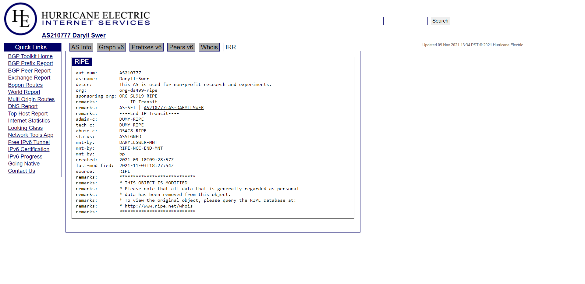
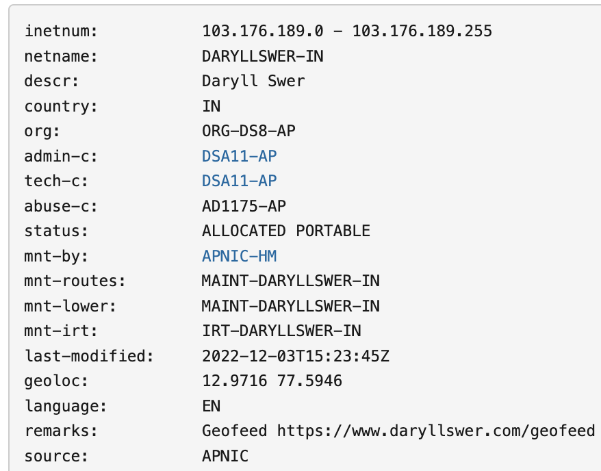
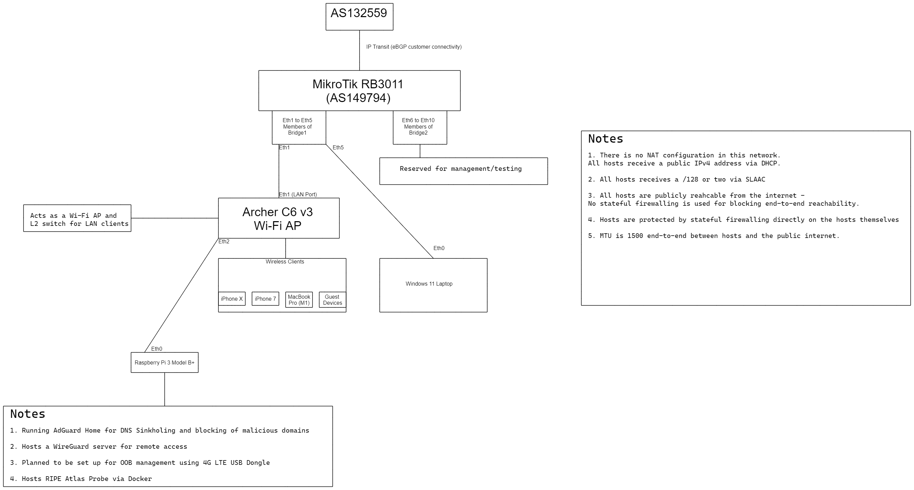
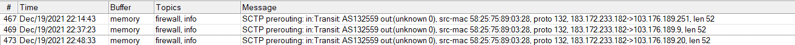
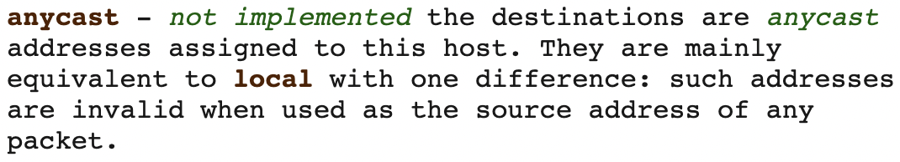
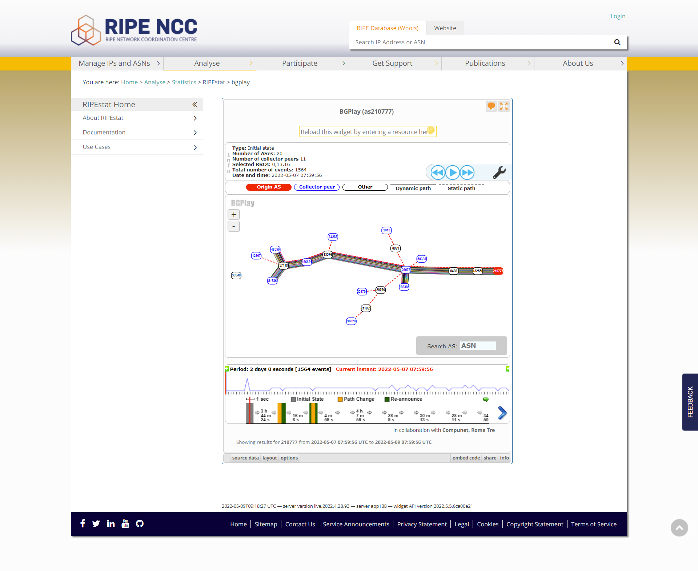

*Note: During the course of  writing this article, I [migrated](https://twitter.com/DaryllSwer/status/1519575084687818752) from AS210777 to [AS149794](https://bgp.tools/as/149794). The rest pretty much stays the same.*

**This article has been published on the [APNIC blog](https://blog.apnic.net/2022/07/01/how-i-set-up-my-own-autonomous-system/) as well.**

First, I would like to give [Civo](https://www.civo.com/) a shout out for [sponsoring](https://twitter.com/DaryllSwer/status/1436345785973497857) the Autonomous System Number ASN allocation ([AS210777](https://web.archive.org/web/20220428071633/https://bgp.tools/as/210777)), a [/32 IPv6 prefix](https://web.archive.org/web/20220428071817/https://bgp.tools/prefix/2a10:6747::/32) and also a [/24 IPv4 prefix](https://web.archive.org/web/20220428071659/https://bgp.tools/prefix/103.176.189.0/24) for me. I’d also like to thank APNIC, which allocated the /24 for experimental purposes, and later allocated an IPv6 prefix and an ASN.

This AS is my own personal network. I use it for conducting experiments, research, and just [eyeballing](https://en.wikipedia.org/wiki/Eyeball_network) in my free time.

In this post I’ll share the procedures I followed, serially, to have my prefix advertised to the world and get the network up and running. Anything of operational/ISP value that arose from this project has been entered into my [guide](https://www.daryllswer.com/edge-router-bng-optimisation-guide-for-isps/). Everything else is research, observation, and some minor operationally useful content such as IRR/GeoIP practices.

## Step 1: Applying for the resources from a RIR

In my case, both the ASN (210777) allocation and IPv6 prefix (the old prefix before migration) were requested from and allocated by RIPE directly via the folk at Civo. However, I manually requested the /24 prefix from APNIC under the [experimental allocation](https://www.apnic.net/community/policy/resources#5.7.-Experimental-allocations-policy) policies.

The procedure to apply for Internet number resources is similar, if not identical, at all RIRs. You can use [this](https://blog.apnic.net/2021/10/27/how-to-connect-to-the-internet-with-your-own-ip-addresses-and-asns/) as a guide. Keep in mind that the RIRs will evaluate your request and may simply deny all resources at their discretion.

## Step 2: Inputting IRR information

Inputting correct and up-to-date data in the Internet Routing Registry (IRR) can be of [great help](https://www.apnic.net/manage-ip/apnic-services/routing-registry/) to network troubleshooting, route filtering, and so on, although I was unable to find any proper documentation on IRR best practices, except for the [MANRS Implementation Guide](https://github.com/manrs-tools/MANRS-Implementation-Guide/blob/main/MANRS-Network_Implementation_Guide.docx).

### ASN essential database entries

Below are some of the object entries that I feel are essential to ensuring other networks can get a clear idea of what your AS is for:

- AS-Name = Daryll-Swer — name of the organization/individual behind the AS.
- Description = This AS is used for non-profit research and experiments — explains the purpose of the AS.
- Displaying the AS-SET directly under the AS WHOIS to ensure other networks can quickly find it — no need to hunt for it on peeringdb or similar.

[](assets/inline/Figure-1-AS-SET.png)

_Figure-1 (AS-SET of AS 210777 in IRR.)_

- Up-to-date abuse contact info — for obvious reasons, this should always be pointing to a valid and working contact.

### IPv4 essential prefix database entries

Ensure you create a [route and origin object](https://apps.db.ripe.net/docs/RPSL-Object-Types/Descriptions-of-Primary-Objects/#description-of-the-route-object) to so everyone else knows which AS is supposed to originate the prefix. Set up [RPKI/ROAs](https://blog.apnic.net/2019/09/11/how-to-creating-rpki-roas-in-myapnic/) for your routes. Input up-to-date abuse contact info.

**IPv6 essential prefix database entries**

Ensure you create a [route6 and origin object](https://apps.db.ripe.net/docs/RPSL-Object-Types/Descriptions-of-Primary-Objects/#description-of-the-route6-object) to ensure everyone else knows which AS is supposed to originate the prefix. Set up [RPKI/ROAs](https://blog.apnic.net/2019/09/11/how-to-creating-rpki-roas-in-myapnic/) for your routes. Input up-to-date abuse contact info.

## Step 3: Dealing with GeoIP Data

**Issue:**

Any network operator who has just received a fresh allocation or transfer would know the pain of having to deal with different GeoIP providers and manually correct the data for each provider! However, I have devised my own method to deal with this problem and within 15 days (I saw visible results within 10-14 days), I was able to see the correct geolocation propagating around the world/various databases.

**Solutions:**

- First, create a [Geoloc object](https://www.ripe.net/manage-ips-and-asns/db/tools/geolocation-in-the-ripe-database) for your prefix using IRR via the RIR concerned
- The second and highly recommended step is to make use of Geofeeds ([RFC 8805](https://datatracker.ietf.org/doc/html/rfc8805)) because it basically automates the process of GeoIP updates. Make use of your own domain and ensure that when a bot or someone clicks on the link, it should redirect to a .csv file, for example: [http://daryllswer.com/geofeed/](https://www.daryllswer.com/geofeed/)
  
  
  - Submit your URL to the GeoIP providers that accept it (even Google will accept it via the [ISP Portal](https://isp.google.com/geo_feed/)). You can attach your Geofeed link in the email template below (Form 1) to save yourself round-trip time!
  - Add the URL to your Geofeed directly under your prefix’s IRR info, as shown in Figure 2 per [RFC9092](https://datatracker.ietf.org/doc/html/rfc9092) via a remarks object. At the time of writing, the “geofeed” object for IRR is not supported on APNIC, but it should be used once it is available.

[](assets/inline/image-1.png)

_Figure-2 (The geoloc object and geofeed URL on IRR.)_

- Thirdly, manually fill up the correction forms on a per provider basis for those that offer it. Below is a list of some of the forms that I could find on the web:
  
  
  - Maxmind’s [Correct a GeoIP Location form](https://www.maxmind.com/en/geoip-location-correction)
  - iapi’s [IP Address Location Update Request](https://ipapi.co/update-location/) (note: they also accept RFC 8805 geofeeds)
  - IPWHOIS.IO’s [contact form](https://ipwhois.io/contact)

- The fourth and final step is to mass email the remaining GeoIP data providers with a single email. Be sure to use the email address or abuse email address associated with your prefix on the IRR to ensure the providers view it as a valid email. Below is a sample template of what I used for myself:

> Hi  
>   
> We have an IPv4 Prefix allocated to us, whose location has just been recently updated/finalised on the APNIC Database. We would like to have the same changes reflected on your database.
>
>
>
>
>
>
>
> Prefix: 103.176.189.0/24  
> You can also add our Geofeed (RFC8805) to your system: http://daryllswer.com/geofeed/  
>   
> You can verify the location of the prefix by checking the geoloc object for the prefix [here](https://wq.apnic.net/static/search.html) *[hyperlink the WHOIS link for your prefix(es)]*
>
>
> Daryll Swer

- Attach a screenshot like Figure 2 to make it easier for the providers to parse quickly and BCC the following:
  
  - team@abstractapi.com
  
  
  
  
  - support@ip2location.com
  - support@ipdata.co
  - support@getfastah.com
  - support@ipregistry.co
  - support@ipgeolocation.io
  - support@ipinfo.io
  - service.desk@whoisxmlapi.com
  - support@bigdatacloud.com
  - support@apiip.net
  - Tech@Melissa.com
  - support@db-ip.com

You can additionally use this [tool](https://geolocatemuch.com/) to test your Geofeed.

## Step 4: Securing IP Transit

The most important step of all, after handling all the trivial tasks, is to secure IP Transit. Now, being a non-profit individual, I cannot afford to pay for physical IP transit via the normal means, so the following is what I did to get the AS live on the global routing table:

1. I initially spun up a VyOS/RouterOS instance on a cloud provider, but quickly dropped this idea due to high latency via VPN tunnels and losing access to my ISP’s Netflix Open Connect (OCA), caching, their bilateral peers, and so on.
2. The second approach was securing a virtual PoP in Mumbai via my friend [Vijay Ahire](https://twitter.com/DaryllSwer/status/1446016772637802500). The network operating system of choice was VyOS 1.4. This solution had reasonable latency towards India-bound networks and reachability to caches and their peers. I used this until I was able to secure physical transit.
3. The third approach was securing IP transit directly to my house! To get this working, I got help from [Devendra Singh](https://www.linkedin.com/in/devendra-prasad-singh-4ab27854/) and his team at [AS132559](https://twitter.com/DaryllSwer/status/1462069688800661504)****—****a local ISP in Karnataka, India. I have known them for a while because I helped with various issues in their network in the past (the lesson here is to use your contacts). So, I was able to secure transit on a physical level where the fibre was terminated in my house. It is a dedicated single-mode fibre with a distance of about 0.5 kilometres that’s terminated with an LC connector and plugged into an SFP module on my end (1,310nm), and directly connected to an L2 switch on their end (1,550nm). It is an uncapped 1Gbps symmetrical link that is delivered without queuing, traffic shaping or any other shenanigans. At the time of writing, I am grateful that the transit is sponsored (free of cost) by the kind gesture of the provider.

## Network Topology

I lack the funds to build a high-end network lab in my home with all the fancy bells and whistles, so Figure 3 shows my simple and budget-friendly setup.

[](assets/inline/Figure-3-Network-Topology.png)

_Figure-3 (Network Topology)_

### Hardware used

- MikroTik RB3011UiAS-RM — shout out to Praveen Gite (AS136342) for [shipping it](https://twitter.com/DaryllSwer/status/1490622518641958913) to me
- Generic Chinese SFP module that just works without a problem — shout out to Devendra Singh again for that one
- TP-Link Archer C6 v3 (stock firmware, Wi-Fi AP configuration) — Once again, thanks to Devendra Singh.
- Raspberry Pi 3 Model B — many thanks to [Anurag Bhatia](https://anuragbhatia.com/) for shipping this to me back in 2020!

## BGP Configuration

Since I am single-homed and only have a default route from the upstream, I did not implement route filters/RPKI validation (however, both of these are covered in my [ISP guide](https://www.daryllswer.com/edge-router-bng-optimisation-guide-for-isps/)), so the configuration below is simple and straight-forward.

Below is my configuration using RouterOS v7:

### IPv4

```
#First we route the prefix to blackhole to eliminate any possibility of Layer 3 loops#
/ip route
add blackhole comment="Blackhole route" disabled=no dst-address=103.176.189.0/24
#Next we add the prefix we'd like to advertise to our peer using firewall address-list#
/ip firewall address-list
add address=103.176.189.0/24 list=bgp-networks
#Now we simply configure BGP#
/routing bgp template
set default as=210777 disabled=no name=default output.network=bgp-networks router-id=a.b.c.e routing-table=main
/routing bgp connection
add address-families=ip as=210777 disabled=no local.role=ebgp-customer name=IPv4-Deshkal output.network=bgp-networks remote.address=103.176.189.1/32 .as=132559 router-id=103.176.189.0 routing-table=main templates=default
```

### IPv6

```
#First we route the prefix to blackhole to eliminate any possibility of Layer 3 loops#
/ipv6 route
add blackhole comment="Blackhole Route" disabled=no dst-address=2400:7060::/32
add blackhole comment="Blackhole Route" disabled=no dst-address=2400:7060::/48
#Next we add the prefixes we'd like to advertise to our peer using firewall address-list#
/ipv6 firewall address-list
add address=2400:7060::/32 list=bgp-networks
add address=2400:7060::/48 list=bgp-networks
#Now we simply configure BGP#
/routing bgp connection
add address-families=ipv6 as=210777 disabled=no local.role=ebgp-customer name=IPv6-Deshkal output.network=bgp-networks remote.address=2400:7060::2 .as=132559 router-id=103.176.189.0 routing-table=main templates=default
```

## Layer 3/4 Configuration

There are a few points to note on how I configured L3/L4 (or lack thereof) on my network. Every host in my LAN had a public IPv4 and IPv6 address assigned on the WAN interface (including iPhones, a MacBook Pro, Windows 11 laptop, and the Raspberry Pi), IPv4 was managed via DHCP and IPv6 was automated via SLAAC.

The hosts in the LAN were publicly reachable from the Internet. I did not use stateful firewalling on the forward chain in the edge router to avoid interfering with end-to-end connectivity because iOS has its own built-in firewall, Windows 11 has stateful firewalling, and the Debian-based OS on Pi had some basic iptables configuration. No security incident nor breaches ever occurred to my knowledge or observations. The network used absolutely no NAT, excluding times when I tested NAT44 and NAT444.

## Observations

I will try to keep this as readable as possible as there are a bunch of different observations that I have come across.

### Layer 3

**IPv4**

Since each host on the network had a public IPv4 address and no NAT, we would expect to see native IPv4 end-to-end traffic. However, that was not the case — By using WireShark and sniffing directly from the WAN interface of the router I observed a lot of STUN traffic for several applications, ranging from social media apps to websites, to various apps on various OS platforms. P2P applications on the LAN hosts failed to talk to each other directly via their public IPs, instead, they are relayed via TURN. For example, iPhone X to iPhone 7 via WhatsApp/Telegram/Signal VoIP call should have been direct P2P connectivity, but that was not observed. Certain applications such as BitTorrent clients, Apple FaceTime, and similar, were able to establish P2P connectivity between LAN hosts without a problem or reliance on STUN.

No performance difference was discerned when a host was in the following environments:

- **Behind NAT** — P2P works via STUN and similar mechanisms.
- **Behind CGNAT** — P2P works via STUN and similar mechanisms. Do note, that I used [best practices for CGNAT](https://www.daryllswer.com/edge-router-bng-optimisation-guide-for-isps/) and not typically broken CGNAT implementations used in the wild
- **Public IP on the host**— P2P works via both STUN and natively depending on the application(s)

**IPv6**

Since each host on the network had a public IPv6 address and no NAT66 (please don’t use it), we would expect to see native IPv6 end-to-end traffic 100% of the time. However, that was not the case. As with IPv4, similar observations were made.

A smaller but still noticeable amount of STUN traffic —why is STUN even coded into these apps for IPv6 anyway? P2P applications on the LAN hosts failed to talk to each other directly via their public IPs, instead, they are relayed via TURN and often they fail to work over IPv6 and just fall back to IPv4. This suggests that [Happy Eyeballs](https://en.wikipedia.org/wiki/Happy_Eyeballs) is broken for a large percentage of the apps out there. For example, iPhone X to iPhone 7 via WhatsApp/Telegram/Signal VoIP call should have had direct P2P connectivity over IPv6, but that was not observed. Telegram is a weird one – When I reran the test months later and sniffed with WireShark, I observed it was able to establish native IPv6 P2P, but only if IPv4 is completely disabled. Certain applications such as BitTorrent clients, Apple FaceTime, and similar were able to establish P2P connectivity between LAN hosts without a problem, without reliance on STUN or fallback to IPv4.

**A Quick Note on STUN**

I tweeted about this observation with some more interesting context below:

> So as of today, I packet sniffed on my WAN interface to see what's up and oddly enough, I saw zero STUN traffic! Maybe the remote end-points store data of the source IPs that have been determined to not be behind a NAT or something?
>
> — Daryll Swer (@DaryllSwer) [February 1, 2022](https://twitter.com/DaryllSwer/status/1488608520748425223?ref_src=twsrc%5Etfw)

**A Quick Note on Apple products**

During my observations, it seemed Apple software had clean NAT Traversal/Happy Eyeballs code — In 9 out of 10 cases apps like FaceTime were able to establish P2P connectivity between native IP (IPv4 and IPv6) end points, or even behind CGNAT where other apps failed and fell-back to STUN/TURN. Kudos to Apple for that one!

### Layer 4 (IPv4 and IPv6)

Most of us already know of the classic transport protocols, TCP and UDP. However, both TCP and UDP have successors known as Datagram Congestion Control Protocol (DCCP), Stream Control Transmission Protocol (SCTP), UDP-Lite, and Multipath TCP, but we don’t see these protocols being deployed in the wild, at least not on the public Internet.

There are a few factors that I believe are responsible for the lack of usage in the wild:

1. From the network engineering perspective, CGNAT is ugly, can break a lot of things, and forces the requirement for Application Layer Gateway (ALG) for various protocols including these Layer 4 protocols. So, it is only natural for TCP/UDP to remain in popular use due to well-known NAT traversal mechanisms for both. However, if you did deploy your CGNAT boxes with best practices from A to Z shown in my guide, all these protocols should, in theory, work just fine as the ALG will handle it out of the box.
2. Another reason for the lack of usage is simply a lack of awareness or lack of [competency](https://www.daryllswer.com/the-human-side-of-isps/). I have spoken with folk who have been in the field for 10-22 years, and none of them had heard of TCP/UDP successors — Which is odd.
3. Also, it’s possible that networks blanket drop non-TCP/UDP on the routers/firewalls.
4. From the software development perspective, I suspect the issue is [Layer 7-centric](https://web.archive.org/web/20220503221044/https://twitter.com/rothgar/status/1521613185962311680) software development. There doesn’t appear to be much focus on the lower layers, and an over-reliance on pre-existing libraries and functions for any over-the-network data transmission, namely TCP/UDP.
  
  
  1. This has arguably contributed to the development of QUIC, which is over UDP — Sadly. But I hope to see mainstream usage of these non-TCP/UDP protocols grow over time.

### Interesting observations

For a [brief period](https://twitter.com/DaryllSwer/status/1472823455754055683), I observed SCTP traffic originating from Chinese ASNs (AS45102 and AS4538) hitting my network. This was likely the result of research and development work, and they were probably just as curious as me to see if any node or end point on the Internet would reply to SCTP packets. However, none of the OSes (Windows, macOS, Linux, iOS) I use replied to these packets, which I think is not RFC compliant at all.

[](assets/inline/Figure-4-SCTP-Traffic-Snippet.png)

_Figure-4 (SCTP Traffic Snippet)_

There are other less significant but still interesting observations I made while running this project. I usually just Tweet about them and some of them are listed below:

- Internet censorship/blocking of sites seems to be less effective on [IPv6 native sites](https://twitter.com/DaryllSwer/status/1522553547472404481)
- Android Device(s) showing [strange behaviour](https://twitter.com/DaryllSwer/status/1517398523352064000) with NDP NA
- IPv6 packets where source IP = ::/128 somehow [traverses inter-AS](https://twitter.com/DaryllSwer/status/1516777131883528193). RIPE Labs have [published their analysis](https://labs.ripe.net/author/kistel/the-curious-case-of-packets-from/) of this behaviour; the mystery was [solved](https://twitter.com/DaryllSwer/status/1531265452831174656) much later though
- Strange behaviour where the Linux kernel [injects](https://twitter.com/DaryllSwer/status/1516388176923074565) an ‘anycast route’ (which according to the [manual page](https://man7.org/linux/man-pages/man8/ip-route.8.html) does not exist) whenever we use ::/64 instead of ::1/64 on a link prefix at the router, to which a Linux host is connected. This results in a loop if the router (::) tries to ping a host that injected this route. It’s my understanding that using ::/64 instead of ::1/64 as a link prefix is perfectly [RFC compliant](https://twitter.com/DaryllSwer/status/1516769128862056451)

[](assets/inline/image.png)

_Figure-5 (Route type anycast is not implemented in Linux.)_

- A [small observation](https://twitter.com/DaryllSwer/status/1515246672523440129) on Windows’ default behaviour with IPv6 (Linux can also be configured the same way)
- Certain DDoS/Captcha protection platforms are [overly aggressive](https://twitter.com/DaryllSwer/status/1509894472427257863)
- An odd observation was made where old routes of AS210777 were still being advertised by AS29075 to its peers long after I withdrew them. This prevented AS210777 from being returned to RIPE as their policies require that an AS and its prefixes must be completely invisible on the public table before being decommissioned. This is possibly caused by a bug in their router(s)

[](assets/inline/Figure-5-BGPlay-showing-AS29075-still-advertising-old-routes-of-AS210777.png)

_Figure-6 (BGPlay showing AS29075 still advertising old routes of AS210777.)_

## Challenges

Although running your own AS is cool, fascinating, and cool (did I say that already?), there are challenges that come with it.

Various routing problems can take a lot of time to solve such as when the provider’s upstream (AS9498 in my case) [randomly stopped](https://twitter.com/DaryllSwer/status/1509889212207996930) advertising my prefixes, [causing route loops](https://twitter.com/DaryllSwer/status/1506182119114309632), or taking [days](https://twitter.com/DaryllSwer/status/1520158254269370368) to accept new prefixes. Also, asymmetric routing can be an issue when ISPs prefer default routes from upstreams instead of partial or full tables.

For all the benefits received by updating the GeoIP data of all your prefixes with all the GeoIP providers, there’s no guarantee that all companies, networks, and organizations will update their cached copy of the various databases for months. For me, this led to an issue where I was unable to establish VoWiFi from my network towards 4G providers such as [Reliance Jio](https://twitter.com/DaryllSwer/status/1471009238864384001) and some random sites/services on the Internet refused to load (for months).

Maintaining the RIR membership account is not cheap, and neither is network equipment and power redundancy. I rely heavily on sponsorships from various folk to keep it well funded. Securing physical transit for a non-profit individual is next to impossible without some luck. Even if you’re able to secure it, physical redundancy will be an issue; no provider will sponsor multiple Gigabit links for free to an individual (this could possibly be solved by requesting the provider to provide BGP over PON).

## IPv4 vs IPv6, actual usage

If we were to look at this from a content (CDN, YouTube, Netflix, and so on) point of view, then around 70% of traffic moves to IPv6 when dual-stacked, but it’s largely video content that drives these statistics. The reality is that a large percentage of non-video, non-content-based sites and applications are still IPv4-only or have broken IPv6 implementation (such as blocked ICMPv6 leading to broken PMTUD), which results in Happy Eyeballs kicking traffic over to IPv4.

You could easily prove/disprove my observations above by completely disabling IPv4 (with no NAT64 or translation mechanisms either) and trying to surf the web. It seems that at least 80% of the web is still lacking proper IPv6 support.

Remember, having AAAA records does not magically mean the end point is IPv6 ready. A major contributing factor to the lack of IPv6 in the world around us, in my opinion, is the big cloud providers like Google, AWS, Azure, and similar. They don’t provide routed /56s (or shorter prefixes) to the LAN side of the virtual machine (VM), which prevents a lot of admins and developers from being able to deploy native IPv6 apps on Docker or similar, where a routed /64 (at least) is needed to make things work natively. This forces the requirement for NAT66 and/or NDP Proxy, which is ugly and defeats the purpose of IPv6, which is to provide end-to-end connectivity without any form of NAT. Only a few niche cloud providers like [ungleich.ch](https://ungleich.ch/) provide [routed prefixes](https://twitter.com/ungleich/status/1434582206945669123) to the LAN side of the VM. Some cloud providers have decided that implementing a /64 link prefix [via SLAAC](https://twitter.com/DaryllSwer/status/1441248662667948037) is a good idea. SLAAC creates problems when the ‘host’ VM is configured to forward packets (We are a router) – Learning the gateway via Router Advertisements (RAs) will require [some hacking](https://forum.vyos.io/t/ipv6-autoconf-forwarding/2349). The /64 is useless as it is a link prefix — If you want to use it you will still need NDP Proxy and/or NAT66.

However, over time I observed IPv6 usage on my personal network increasing and outperforming IPv4. Perhaps these various CDNs and content players store metadata of other ASes that are known to have fully functional IPv6 and redirect/route those networks via IPv6? It’s just a theory.

## Is it worthwhile to run your own AS?

The answer to this question depends on your perspective. On one hand, running my own AS allowed me to make all these fascinating observations and learn various lessons like how to solve some layer 8/9 problems with routing, latency issues, and how to deal with upstream providers when things break. It also gives me control over the IP address space as it becomes a [provider-independent address](https://en.wikipedia.org/wiki/Provider-independent_address_space) space in nature. Since I control the address space, I can also reliably host various stuff from home.

## Future plans

Networking is a vast field; it is impossible for me to learn and know everything, so the goal is to keep the AS live, keep learning, and keep experimenting. However, I do have one immediate and specific topic to investigate — using jumbo frames on the public Internet (or at least, with peers via bilateral/PNIs/IXPs). A larger frame size means a larger payload, which means the underlying L2 paths require a smaller number of frames to be forwarded and fewer packets to be routed on L3. In theory, this should improve end-to-end performance. I aim to find out how much of a performance improvement the end user really sees.

I currently do not have the capacity to peer/connect with IXPs, but hopefully I’ll be able to test this out and document the process, in the near future.
