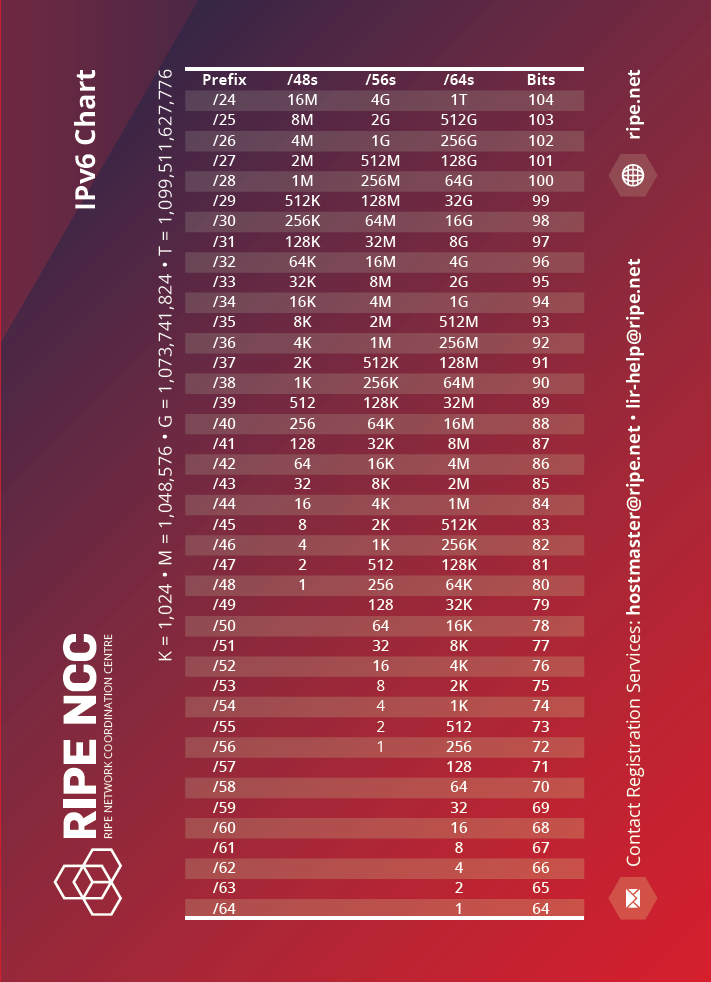
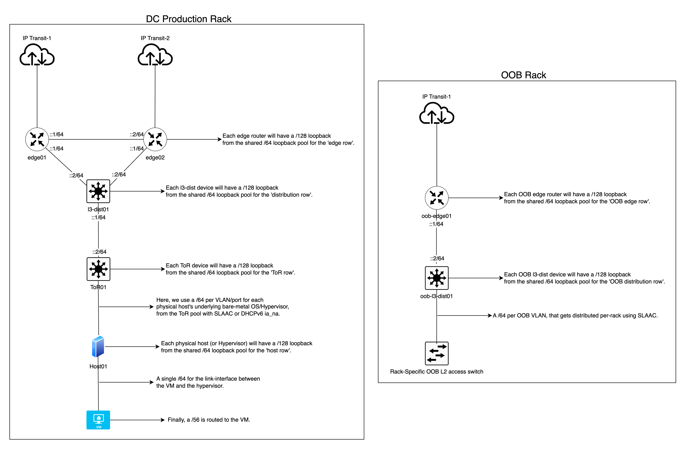
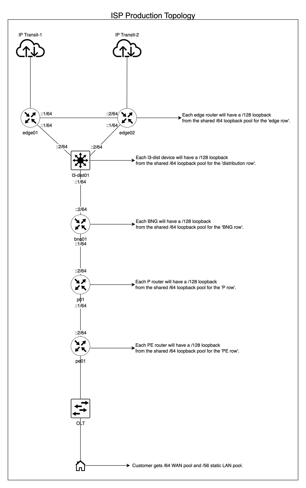

> **For professional IPv6 consulting, [click here](https://www.swernetworks.com/).**

**This article has been published on the [APNIC blog](https://blog.apnic.net/2023/04/04/ipv6-architecture-and-subnetting-guide-for-network-engineers-and-operators/) as well as discussed on a Packet Pushers [podcast](https://packetpushers.net/podcast/ipv6-buzz-129-ipv6-architecture-and-subnetting-with-daryll-swer/). It was also selected for APNIC’s 2023 “[Three of the best: IPv6](https://blog.apnic.net/2023/12/28/three-of-the-best-ipv6-7/)”, in addition this article has been offiically linked in APNIC’s [IPv6 BCP](https://www.apnic.net/community/ipv6/deploy-ipv6/#resources) under the “Deployment and Addressing Planning” section.**

### Changelog

- 20th November 2023


  - Updated the OOB subnetting logic in the Telco/ISP section, backbone sub-section. Also updated the Excel sheet in the same section.
- 18th August 2024


  - Updated grammar inconsistencies.
  - Updated my advice on PtP link assignments.
  - OOB subnetting logic is unified across the board for consistency.
  - Updated PtP subnetting logic for both DC and ISP section for consistency.
  - Updated diagrams to reflect updated PtP links assignments.
  - All updates were made based on my real-life continous improvement work results, in production.
- 23rd August 2024


  - Deleted some remnant of “/127” references.
  - Minor grammar fixes.
- 4th October 2024


  - Deleted previously missed, obsolete text on “/127” references, again.

As networks continue to expand, the need for effective management of the Internet Protocol version 6 (IPv6) is becoming increasingly important. This guide is designed for network engineers and operators who are already familiar with the fundamentals and concepts of IPv6 and are looking for a practical guide on implementing an IPv6 architecture and subnetting system. I take an in-depth look at the most efficient ways to ensure a sufficient and future-proofed IPv6 subnetting model on a per-site and per-network segment basis.

For those who need a refresher on the IPv6 fundamentals, there are many [online resources](https://networklessons.com/ipv6/introduction-to-ipv6) available to help.

This article provides a guide to IPv6 architecture and subnetting for network operators and enterprises. It draws upon my experience as an independent consultant and as a friendly peer in various industries, including telecommunications, data centres (DC)/enterprises, and ISPs. Through conversations with other network engineers, I observed resistance to learning the basics of IPv6, or an over-reliance on archaic IPv4 processes. This guide aims to provide a comprehensive overview of IPv6 architecture and subnetting for efficiently deploying IPv6 and *avoiding* the pitfalls of an **IPv4-centric** mindset as elaborated further in the podcast below.

> Embedded media: [Blubrry Podcast Player](https://packetpushers.net/?powerpress_embed=53518-podcast&powerpress_player=mediaelement-audio)

The risks associated with an inefficient deployment or management of IPv6 are readily available. From an administrative point of view, it can lead to messy and non-scalable subnetting that results in fragile and unreliable networks. Regarding engineering, it can lead to unjustified use of small subnets and force the need to use Network Address Translation (NAT66) when not required. This goes hand-in-hand with the idea of using Unique Local Addresses (ULAs) when unnecessary – all of which are serious impediments to the ultimate goal of providing an efficient, reliable and scalable network service while preserving the [end-to-end principle](https://en.wikipedia.org/wiki/End-to-end_principle) in the network layer to minimise or eliminate complexities brought about by NAT such as NAT traversal helpers and mechanisms.

Below are some examples of what happens when an organisation tries to deploy IPv6 with an IPv4-centric approach:

- Without a proper IPv6 subnetting management plan, random IPv6 prefixes/addresses are allocated to Point-to-Point (PtP) links, servers, and other infrastructure, resulting in a chaotic and unmanageable situation. In the long run, this could lead to a ‘race to the bottom’ issue (running out of IPv6 addresses); a situation that must be avoided at all costs to keep the network secure and scalable.
- A single /64 LAN prefix per customer/CPE or, worse, a much longer (smaller) prefix.
- A dynamic LAN prefix that changes every time the user reconnects and [breaks connectivity](https://www.6connect.com/blog/is-your-isp-constantly-changing-the-delegated-ipv6-prefix-on-your-cpe-router/).
- The strange idea that IPv6 is IPv4, and you should use NAT66 to ‘save’ IPv6 addresses. A public example of this is DigitalOcean’s idea of a /124 per VM, and from a shared /64 per DC/rack/network segment.
- The even stranger idea of using [ULAs](https://blogs.infoblox.com/ipv6-coe/ula-is-broken-in-dual-stack-networks/) in *certain* cases where it is not required.


  - With the exception of [banking](https://twitter.com/stubarea51/status/1511083163921092609) or similar organisations, where compliances mandate NAT66 or you need it because of Provider-Aggregatable address space (PA) for load balancing and failover.

While the pre-NAT era version of the end-to-end principle, in general, no longer exists in today’s era of the Internet due to the obsession with IPv4, it is still important to avoid NAT66 to prevent the requirement for Layer 5 – 7 helpers (Application Layer Gateways) and Traversal Using Relays around NAT (TURN) which just adds complexities and overhead to the network when you build networks for large scale use. Such ‘helper’ traffic consumes unnecessary resources that could be avoided completely.

In short, bad IPv6 architecture and subnetting leads to technical debt for your organisation in the long run.

## Things to keep in mind with IPv6

We need to keep something in mind with IPv6. It is 128 bits in nature, and the mathematical structure of IPv6 allows a [/48 per human for 480 years](https://www.internetsociety.org/deploy360/ipv6/faq/#:~:text=There%20is%20an%20erroneous%20perception%20that%20the%20assignment%20of%20large%20IPv6%20prefixes%20to%20end%20customers%20is%20wasteful%2C%20but%20the%20IPv6%20address%20space%20is%20so%20huge%20that%20it%20has%20been%20calculated%20(by%20Tony%20Hain)%20that%20a%20/48%20could%20be%20assigned%20to%20every%20human%20for%20the%20next%20480%20years%20before%20they%20run%20out.). This means there are no technical justifications for using a prefix delegation smaller than a /56 per customer, which is also documented in [BCOP 690](https://www.ripe.net/publications/docs/ripe-690#4-2-2---48-for-business-customers-and--56-for-residential-customers).

When deploying IPv6, bear in mind:

1. The link-prefix (or WAN prefix) is used for inter-device connectivity.
2. The routed prefix (or LAN prefix) refers to the prefix that is routed to the ‘LAN’ side of a device where the next-hop IP of that route equals the link-prefix address that is used on the device the prefix is being routed to.
3. You should always strive to enable **auto link-local config** network wide, we should never burden ourselves with manually configuring link-local addressing.
4. Avoid using the initial ‘leading zero’ address in an IPv6 subnet on an interface or network segment, that is, an address where the least significant [address segment](https://web.archive.org/web/20230214115432/https://www.ibm.com/docs/en/ts4500-tape-library?topic=functionality-ipv4-ipv6-address-formats) (right-most group of four digits) are zeroes. This is known to cause [unexpected behaviours](../2023-08-28-behavioural-differences-of-ipv6-subnet-router-anycast-address-implementations/index.md). For example, instead of 2001:db8**::**, use 2001:db8**::1** instead.


  - However, it should be fine to use leading zero addresses **only** for loopback on network devices (Routers, L3 switches) if you want to. I would still avoid using leading zero addresses on hosts.

Below is an example of the principles described above:

## Link prefix

Let’s say we want to connect router **A** to router **B** via a Cat6a UTP cable on interface eth0 on both and assume we have the following prefix available for use: **2001:db8::/64**.

We will configure the addresses as shown:

```
router A (eth0): 2001:db8::1/64
router B (eth0): 2001:db8::2/64
```

Both routers have a link-prefix with /64 prefix length, where they can now directly talk to each other on the assigned respective addresses ::1 and ::2.

## Routed prefix

Let us assume that router B is an access layer router where it is configured to handle 500 VLANs, and we have at least 800 PCs behind each VLAN, and we want to give native IPv6 connectivity to 800×500 hosts. How will we do this with the /64 link-prefix natively without the IPv4 mindset and approaches like NAT66 or the NDP Proxy? The answer is, we do not use a link-prefix for the LAN. We need a routed prefix, where each VLAN has a dedicated /64. In this example we need five hundred /64s in total.

So let us assume we have the following for LAN prefix use that is reachable via router A: **2001:db8:1::/52**.

A /52 gives us four thousand /64s, which is more than enough for our purpose, with room for growth and expansion in the future.

For the purpose of this example, we can now statically route the /52 to router B like the following, where next-hop/gateway is the IPv6 address of router B:

```
ipv6 route 2001:db8:1::/52 next-hop 2001:db8::2
```

So we can now use 2001:db8:1::/52 on router B and subnet it further to give us /64s, from which we can assign a unique /64 per VLAN. For example, VLAN1 gets 2001:db8:1::/64, VLAN2 has 2001:db8:1:1::/64, and so forth.

## Address allocation size

Although smaller companies may get away with a /48 or /44 or /40 and so on. I do not recommend following this method of incremental allocations because:

1. You cannot aggregate them 10 years down the line as you scale your company.
2. It results in a polluted IPv6 routing table that could be avoided by aggregation.
3. It will impact your subnetting plan and architecture.
4. You will always end up needing more subnets eventually.
5. You end up going back and forth with your respective Regional Internet Registry (RIR), National Internet Registry (NIR), or Local Internet Registry (LIR) each time.

My recommendation is to apply for a /32 per Autonomous System Number (ASN), or RIR member account, as a minimum:

1. You can aggregate to a /32 if possible or a few /36s or any combination based on your company’s scale and topology.
2. It keeps the routing table clean.
3. You have a scalable subnetting plan and architecture.
4. There is room for additional subnets.
5. It reduces the need for having to go back and forth with your respective RIR, NIR or LIR.

I hope somebody (or myself) eventually submits a policy proposal for making this (/32 minimum per ASN/Member) a reality at the RIR level, at least for APNIC.

You can also check Packet Pusher’s podcast on this subject below for further insights.

> Embedded media: [Blubrry Podcast Player](https://packetpushers.net/?powerpress_embed=54818-podcast&powerpress_player=mediaelement-audio)

## Subnetting guideline

Every network and organization is different, which includes different business models and network architecture and topology. I like to use what I call the geographical denomination model when it comes to IPv6 subnetting, that is, we plan and perform the subnetting based on how your network is set up in the physical world while accounting for future-proofing such as scaling up or down.

I will show some examples for ISPs/telcos, DC/enterprise from real-life hands-on deployments later in this article.

With the above in mind, the following is what I strongly believe is an optimised and generalised guideline that operators may want to follow:

- The bare minimum for every eBGP speaker (public ASN) is to have a /32 prefix as discussed in the previous section.
- Perform the planning based on the **geographical distribution model** of your network with a top-to-bottom approach. For example, per continent, then per economy, then per state, then per city, then per town or district, then per site, and per network segment.
- Ensure the prefix length is always a multiple of 4 where the lowest possible denomination is a /64, not anything smaller, with the reason being that we would want to [avoid exceeding](https://blog.apnic.net/2018/08/10/how-to-calculating-ipv6-subnets-outside-the-nibble-boundary/) the [nibble bit boundary](https://web.archive.org/web/20250425113018/https://afrinic.net/support/ipv6/nibble).


  - However, sometimes we cannot avoid exceeding the nibble boundary, and it is perfectly fine as long as the ‘exceed’ stays in an administrative layer and never enters the network layer. I will highlight this with a real-life example in the architecture section.
- Some prefer to use /126s or /127s for eBGP peering with third parties and also for PtP links between two devices, in such cases, we will reserve the entire /64 per interface (or peer) for every carved /126-/127 we use, in the event that we scale up the port/interface in the future ensuring a /64 is always available in the IPAM and therefore avoid messy subnetting/addressing records.

[](assets/inline/IPv6Chart_2015.png)

_Figure-1 IPv6 cheat sheet from RIPE (source)_

## Example of the above principles

Let us assume we have 2001:db8::/32 as our assigned prefix from the RIR. We can slice 2001:db8::/32 into /36s. Out of the resulting /36s, we can use the first four of them for the north, east, west, and south parts of an economy/state/city and so on where each geographical denomination receives a /36.

From the /36 we can slice it into /40 per Point of Presence (PoP) (site), out of which we slice it further into /44s, then into /48s. We can then use a /48 per function, for example, [Out of Band](../2024-11-12-out-of-band-network-design-for-service-provider-networks/index.md) (OOB), management, internal servers, switches, PtP, and so on. We can then slice the /48 into /52s or /56s to ensure we get a sufficient amount of /64s per device. We can use a /64 per VLAN/VXLAN segment where we take a /127 for PtP links and reserve the entire /64 for it, in case the links grows in the future into a multipoint link. Where a /127 would no longer suffice we can then just use the entire reserved /64 without ever having to change the subnetting plan/IP Address Management (IPAM).

**Please note**, the above is **just an example**. IPv6 is flexible, and you can subnet it in a way to match your network’s geographical distribution, which can vary. As long as you follow the general guidelines, you should be able to scale it up/down without much of an issue.

```
I personally, stopped using /126s and /127s on PtP links, because it offers zero benefits, and only increases the human management overhead, therefore, I recommend you use a regular /64 per PtP interface from day zero, going forward.
```

## Architecture

In this section, I will broadly cover two categories, DCs/enterprises and Telcos/ISPs, although generally speaking, you can use the subnetting guide similarly for both. However, there are technical and business model differences, which I believe is best explained with some real-life examples based on my own hands-on experience.

### DC/enterprise

I will cover this with a real-life, but more generalised example, that’s based on what I deployed in production at my former employer’s network ([AS48635](https://bgp.tools/as/48635)) at the time, to show how we implemented my guidelines above to fit our specific needs.

**Context:**

In this real-life example, I decided to use a single /32 for infrastructure/backbone across multiple economies, locations, and sites as it is sufficient for the geographical denomination model of this particular organization. But for the customers, I opted for a dedicated /32 per site to ensure future scalability, with plenty of /48s or /56s routed to them as needed.

**For the backbone:**

This is how I decided to break the single /32 for ‘global’ substructure/backbone addressing:

- Slice the /32 into /36s – where we use the first /36 and reserve the rest for future use.
- Then slice the first /36 into /40s – where we use the first /40 and reserve the rest for future use.
- Then slice the first /40 into /44s – where we use a /44 per site.


  - Here you can reserve the first /44 for future experiments/testing if ever required.
- Then slice a /44 into /48s – here we use a /48 per function per site.

A /48 per function in each site is broken down in the following manner:

- Loopback IP function – one /48 sliced into /64s. Use a /64 per ‘row’ of devices type in a given topology, this simplifies readability and routing filters for OSPF/IS-IS on each row of devices you simply filter import/export to match a /64. Ultimately, we will assign a /128 per device for loopback. For example, a /64 for edge devices, another /64 for core or distribution devices, and so on, where each device type gets a /128 from the respective /64.
- OOB function – one /48 sliced into /52 per sub-function, example:


  - /52 for Loopback sub-function.


    - The /52 is sliced into /56 per ‘row’ of devices type. For example, a /56 for OOB edge devices, another /52 for OOB layer 3 distribution, and so on, where each device type gets a /128 from the respective /64.
  - /52 for PtP sub-function.


    - The /52 is sliced into /56 per ‘row’ of devices type. For example, a /56 for OOB edge devices, another /56 for OOB layer 3 distribution, and so on.
    - We then slice each /56 into /64s for use on each corresponding device “row”, for example a /56 is assigned to the oob edge, out of which it is then sliced into /64s per Interface/VLAN.
  - /52 for OOB Rack Access sub-function.


    - The /52 is sliced into /64s, use a /64 per OOB VLAN on a given rack (single rack; has single OOB VLAN for all devices).
  - /52 for employee access sub-function.


    - The /52 is sliced into /64s, where we can use a /64 per VPN instance for VPN clients or employees to access the infrastructure. Each employee or user will get a /128 GUA assigned to them on the VPN’s client interface from the /64 pool.
- PtP function intra/inter-AS – one /48 sliced into /52s per ‘row’ of devices in a given topology. For example, a /52 for edge, a /52 for Layer 3 distribution, a /52 for BNGs and so on.


  - We then slice each /52 into /64s for use on each corresponding device “row”, for example a /52 is assigned to the edge, out of which it is then sliced into /64s per Interface/VLAN.
- Peering function (transit, PNIs, and so on) – one /48 sliced into /64 per peer.
- Top-of-Rack (ToR) switches – one /48 for all ToRs in a site, /55 per rack, then /56 per ToR device. Finally, from a /56 for each ToR device, slice it into /64s for use per port basis (or VLAN segments) for end-hosts such as SLAAC or DHCPv6, capable up to 256 ports/VLAN per ToR device.


  - This is an example of ‘**exceeding**‘ the nibble bit boundary in the **administrative layer** (/55) **without** percolating it down to the **network layer**, and hence this does not present any technical issues.

**For the customer:**

For the /32-customer pool, the logic should ideally be simpler than the backbone to avoid headaches down the road as your number of customers scales up.

In my former employer’s network, we decided the minimum pool for a customer to be /56, however, I will share a more generalized approach that is not specific to the business logic of my former employer. You can always go with a /48 per customer if you want to and that does allow more flexibility to the customer to subnet and route the prefixes to their corresponding VMs in whatever way they want it.

For the /56 logic:

- We slice the /32 into /40s, this gives you 256 /40s. Take the first /40, and slice it into /48s, this gives you 256 /48s.
- This pool of /48s will be used as /48 per rack for the PtP link between a hypervisor and the customer’s VM WAN interface. So, this means each rack gets a /48, and each /48 is sliced into /64s.


  - Therefore, we now have 65k /64s. Each rack can now support 65k VMs where each VM’s WAN interface gets a /64.
  - However, you may also want to use a /64 for a single L2 domain across multiple VMs, whereby a customer’s VLAN or “VPC” has a single /64 for the VMs’ WAN interface, whereby each VM receives a /128.
- Next, we will use the remaining /40s for providing routed prefixes to each customer’s VM. Each rack will get a dedicated /40 out of the original pool of /40s sliced from the /32.


  - Now that each rack has a dedicated /40, this gives us 65k /56s.
  - We now simply route a /56 to each customer’s VM, therefore all customers will have their own dedicated /56 pool for their own uses on each VM which is by far larger than what most mainstream cloud providers do and hence is a future-proofed approach in the long run.

For the /48 logic:

- We slice the /32 into /48s. This gives us 65k /48s. We can, for example, use/reserve the first 10k /48s for the PtP link between a hypervisor and the customer’s VM WAN interface. This means, we can handle 10k hypervisors, where each VM’s WAN interface will get a /64 or an entire L2 domain will get a /64, where each VM inside the L2 domain will get a /128.
- We now simply route/map a /48 to each customer account. Every customer will get their own /48, and then subnet it as needed, or you can default the subnetting to a routed /56 per VM, while still allowing the customer to change the subnetting should they want to.

Either approach is perfectly fine. However, you have probably noticed that the /56 approach has an additional overhead on the network layer, whereas the /48 has less overhead on the network layer but more overhead on the application layer as you will need to provide a web interface or CLI for your customer to subnet and break their own /48 if they choose to.

Since it is /32 per site, it does not result in confusion or a messy IPAM/subnet. You can easily just announce any /48 from the ToRs towards the L3 distribution switches (or VXLAN/VTEP gateway) which then announces that to the edge routers. You can always perform route aggregation on each layer of devices to minimise the routing table in your local network.

In short, for the customer pool in DCs/enterprises you can either opt for a /48 per customer (I prefer this to avoid subnetting any further and increasing the possibility of customers requesting more /56s) or a /56 per customer’s VM, so each VM will still get a /56.

**Topology:**

It should be noted that the diagram below is only for reference to give you an idea on the IPv6 subnetting. It is a smaller, simplified topology diagram compared to the production topology, which is far bigger and more complex and would not fit in a single diagram.

[](assets/inline/Figure-2-DC-Topology-Example.png)

_Figure-2 DC Topology Example_

### ISP/Telco

I will cover this with a real-life example, that I architected for [AS141253](https://bgp.tools/as/141253) (one of my upstream providers at the time of writing this article), to implement an IPv6 architecture for their network that covers the whole of India, which serves as a good example for large scale networks.

Based on India’s geographical denomination (Country>State>District>and so on), I believe it is a good example to reference due to its size and large population. I recommend you have a minimum /32-**customer** pool allocated **per state** for scalability and future-proofing.

**Context example:**

They have a /32 ‘Global’ prefix for a nation-wide backbone and at the time of writing this, there is a separate /32 “Customer” prefix solely for the state of [Mizoram](https://en.wikipedia.org/wiki/Mizoram).

I use [this government document](https://web.archive.org/web/20220707185957/https://www.dcmsme.gov.in/publications/tender/Final%20REoI/Annexure%201.pdf) as a source of truth for the geographical denomination of India up-to the state level.

**For the backbone:**

This is how I decided to break the single /32 for ‘global’ India-wide substructure/backbone addressing:

- Slice the /32 into /34s – where we use each /34 (another example of outside nibble-bit boundary prefix length, but only on an administrative layer) for each geographical zone (North, East, South, West).
- Then slice each /34 into /40s – where we use a /40 per state/Union Territory in each respective zone mapping. This gives us 64 /40s.


  - Although this additional delegation is not mandatory, I prefer to reserve an “even” number of /40s for each state. This means, for example, the “North India” zone has a total of eight states—now we divide 64 by eight (the number of states in a zone), we get eight as the quotient. This means each state has a total of eight /40s allocated, which helps with administrative overhead and keeping the prefixes aligned geographically in an alphabetical/serial order.
- Then slice the first /40 into /44s – where we use a /44 per site.


  - Here you can reserve the first /44 for future experiments/testing if ever required.
- Then slice a /44 into /48s – here we use a /48 per function in a given site.

A /48 per function in a given site is broken down in the following manner:

- Loopback IP function – one /48 sliced into /64s. Use a /64 per ‘row’ of devices type in a given topology, this simplifies readability and routing filters for OSPF/IS-IS on each row of devices you simply filter import/export to match a /64. Ultimately, we will assign a /128 per device for loopback. For example, a /64 for edge devices, another /64 for core or distribution devices, and so on, where each device type gets a /128 from the respective /64.
- OOB function – one /48 sliced into /52 per sub-function, example:


  - /52 for Loopback sub-function.


    - The /52 is sliced into /56 per ‘row’ of devices type. For example, a /56 for OOB edge devices, another /52 for OOB layer 3 distribution, and so on, where each device type gets a /128 from the respective /64.
  - /52 for PtP sub-function.


    - The /52 is sliced into /56 per ‘row’ of devices type. For example, a /56 for OOB edge devices, another /56 for OOB layer 3 distribution, and so on.
    - We then slice each /56 into /64s for use on each corresponding device “row”, for example a /56 is assigned to the oob edge, out of which it is then sliced into /64s per Interface/VLAN.
  - /52 for OOB Rack Access sub-function.


    - The /52 is sliced into /64s, use a /64 per OOB VLAN on a given rack (single rack; has single OOB VLAN for all devices).
  - /52 for employee access sub-function.


    - The /52 is sliced into /64s, where we can use a /64 per VPN instance for VPN clients or employees to access the infrastructure. Each employee or user will get a /128 GUA assigned to them on the VPN’s client interface from the /64 pool.
- PtP function intra/inter-AS – one /48 sliced into /52s per ‘row’ of devices in a given topology. For example, a /52 for edge, a /52 for Layer 3 distribution, a /52 for BNGs and so on.


  - We then slice each /52 into /64s for use on each corresponding device “row”, for example a /52 is assigned to the edge, out of which it is then sliced into /64s per Interface/VLAN.
- Peering function (transit, PNIs, and so on) – one /48 sliced into /64 per peer.
- CDN Caching node – one /48 sliced into /56s per CDN. For example, a /56 for Google, sliced into /64s for use on PtP links or for routed prefixes, ensures each CDN’s caching nodes/equipment has up to 256 /64s available for use in a site.

Ultimately this is for the backbone and not the customer pool. Hence, a single /32 can cover the whole network for India.

> You can find an example of the above principles in this [Excel sheet](../../../data/sheets/as141253-ipv6-architecture-example/workbook.html) I made for AS141253.

**For the customer:**

The /32-customer pool for the state of Mizoram is sliced into /37s. Of these, sixteen /37s are group reserved for enterprise/commercial customers, and the remaining sixteen /37s are reserved for residential customers.

Each group of sixteen /37s  is then respectively mapped to each [district](https://en.wikipedia.org/wiki/Mizoram#Administration) of the state, where each district gets a /37 with plenty more available if required. If you don’t have the exact number of districts, counties or province, you can slice the /32 into /38s or even further, until you get whatever works best for your geographical denomination.

Remember, that this is simply at an administrative level, not the network layer, however I recommend avoiding going too far into the hierarchy—with a general rule of thumb that the smallest prefix per BNG for the customer LAN pool will be a /42, based on the fact a /42 guarantees 16k customers will get a /56, and it gives room for some future proofing as you would likely want to limit the number of customers per BNG to 16k or lower and spread the load on other BNGs to avoid creating a Single Point of Failure (SPOF) scenario. Even if you add more customers beyond 16k, you can just route an additional /42 thereby ensuring 32k customers per BNG will all get a static /56.

**This is how I decided to break each /37 per district for residential customers:**

Each /37 in a given district is sliced into /42s, and the first /42 is sliced into /48s. Each /48 will be routed to each BNG, whereby it will provide a /64 WAN allocation to each customer for up to 65k customers per BNG, which is future-proofing as well. The remaining /42s will be allocated per BNG, where each /42 will provide static (persistent) /56s for up to 16k customers per BNG.

In short, residential customers will get a **/64 for the WAN side** and a**static /56 for the LAN side**.

**This is how I decided to break each /37 per district for enterprise customers:**

Each /37 in a given district, is sliced into /48s for use within the specified district. From here, we can use a /48 per site for the PtP between the provider and the customer, where it’s sliced into /64s per interface/VLAN.

Next, we simply route a dedicated /48 to each customer either via BGP with private ASN or with static routing of the /48 to the ::2/64 address of the customer’s PtP interface.

In short, **enterprise** customers will get a **/64 for the WAN side** and a **static** **/48 for the LAN side**.

**Topology:**

The topology for an ISP is fairly typical; if you are already an ISP, you likely already have similar topologies. The scale is naturally much larger than a DC/enterprise operator and different altogether, as you typically have an edge, distribution layer (in some cases a core and distribution), access layer, Multiprotocol Label Switching (MPLS) rings, and so on.

The topology diagram below is only for reference to give you an idea on the IPv6 subnetting for ISPs.

[](assets/inline/Figure-3-ISP-Topology-Example-1.png)

_Figure-3 ISP Topology Example_

## Implementation

### DC/enterprise

We used static addressing for PtP links, Open Shortest Path First (OSPF) for learning loopback IPs of each device, a combination of eBGP and iBGP for routing everything else and avoiding fully-mesh iBGP, and BGP confederation or route reflectors based on RFC 7938. In simple terms, iBGP is used between loopbacks of adjacent/redundant neighbors forming a horizontal relationship, for example, a set of edge routers each connected to different transits or IXPs. Whereas, eBGP is used between vertical neighbors establishing an upstream/downstream relationship where each of them is in separate Autonomous Systems using a private ASN extended range.

For OOB, we used SLAAC + EUI-64 to auto-generate addresses on network devices and hosts on the OOB VLAN that are easily mappable to their MAC addresses. This means our routers, switches, server nodes, Power Distribution Units (PDUs) (PDUs), and so on, all received a /128 Global Unicast Address (GUA) via SLAAC through the rack-specific OOB switch, which then obtains connectivity from the OOB distribution switch in the OOB rack. For production or main VLANs (customer VMs or machines), you should avoid EUI-64.

Although I have not deployed this configuration using DHCPv6 address assignment and prefix delegation in a DC/enterprise, it is a perfectly valid solution if you prefer stateful control over how hosts obtain their addresses and also for Authentication, Authorization, and Accounting (AAA) purposes.

### ISP

In this particular ISP, the implementation was simple. We used static addressing for backbone PtP links, BGP/OSPF for routing internally and/or to enterprise customers similar to the DC/enterprise example, using PPPoE or DHCPv6-PD to delegate the /48s or /56s to customers. I will not do a deep dive into the implementation details as it varies wildly between different vendors. This is only to give you a general idea and guide to deploying BCOP-690-compliant IPv6 on your network.

However, I recommend that you use a vendor/AAA provider that supports static IPv6 addressing/PD for your customers. As mentioned in the introduction of this article, dynamic prefixes break SLAAC, and also make it impossible for a customer to use your GUA on their end-hosts for global accessibility should they want to.

## What about VPN?

You can have a dedicated /48 function for VPN in a given site, or it can be shared with the management function, where clients receive a stable (static) /128 GUA from a /64 pool. You now simply use a stateful firewall on the router or VPN server host, where you accept established, related, untracked traffic and accept ICMPv6, dropping the rest on the forward chain (iptables). That’s it. Your VPN clients will have native IPv6 without any hacks and be fully secured from the outside world. Of course, you will still need to apply access control list logic, but that is organisation-dependent and outside the scope of this article.

You can also even provide routed prefixes to VPN clients, where each client can be routed a /64. This helps employees working on application development on Docker to have a native /64 routed straight into their laptops for native IPv6 container networking.

## Global routing approach

Instead of announcing individual /48s to the Default-Free Zone (DFZ) and increasing the global routing table size, you should aim to announce aggregated prefixes to the largest possible extent for a given site or a given set of sites. For example, you can advertise a /44 ‘backbone’ prefix directly to all your peers and transit instead of individual /48s. Or if all your sites have direct Layer 2 reachability between each other and are geographically close enough for latency to not be of concern, you could then just announce the /32 ‘backbone’ prefix directly from all sites towards the transit and peers, therefore keeping the DFZ clean. For the customer pool, it is simply a matter of announcing a /32 per site directly to all peers and transits.

Note, this article does not cover BGP and traffic engineering. I would emphasise that aggregating your prefixes allows for cleaner and more efficient traffic engineering in the long run.

## NAT66 vs NPTv6 usage

I will not do a deep dive into NAT44, NAT66, or NPTv6 as it is outside the scope of this article, but there are a few points to note below as NPTv6 (not NAT66) is required in certain use cases.

NAT66 is no different from traditional NAT44, — along with all the problems such as breaking Layer 4 (L4) protocols, forcing the need for an ALG, and the list goes on. The only difference is NAT66 supports IPv6 addressing. For this reason, the IETF came up with a new solution and method of ‘translation’ for IPv6 that is free from issues introduced by NAT, that is, [IPv6-to-IPv6 Network Prefix Translation](https://datatracker.ietf.org/doc/rfc6296/) (NPTv6).

NPTv6 is a **stateless** and**transport-agnostic** (L4) mechanism for translating one address space to another. Therefore, it preserves the end-to-end principle on the network layer and does not introduce a stateful mechanism that breaks L4 protocols, which is simply not possible on traditional NAT in a stateless manner.

In order for NPTv6 to work as intended (in a stateless manner) the ‘inside’ and ‘outside’ IPv6 prefixes both need to be of the *same prefix length*. For example, let’s say your internal prefix is ‘200::/64’ and you want to translate this into a different ‘outside’ prefix that is visible on the public Internet such as ‘2001:db8::/64’. You simply configure NPTv6 depending on your Network Operating System (NOS) to translate one /64 to another /64. You will have done the translation without breaking the network layer’s end-to-end reachability and L4 protocols.

So in general, I strongly recommend you avoid NAT66 to avoid problems associated with it and go with NPTv6 in all production networks.

However, if you are forced to use NAT66 such as being a customer of DigitalOcean where they only provide a /124, then you are unfortunately going to lose the benefits of IPv6 (native end-to-end principle and transport agnosticism on Layer 4) and have the same network related downfall as NATted IPv4. The only solution would be to demand them to provide best practice-compliant IPv6 or move to a different provider that does.

## Managing PA blocks

[PA blocks](https://www.ripe.net/participate/member-support/faqs/isp-related-questions/pa-pi) are those assigned to a customer by an ISP, rather than the customer having their own Provider Independent (PI) IPv6 blocks. The main problem with PA blocks is, you need to perform renumbering when you change providers or when your provider goes out of business and shuts down or for any other reason.

Renumbering is one issue, the other is load-balancing and failover when you have multiple providers with their own unique PA block assigned to your business. You could use router advertisements in IPv6 to advertise one block or the other based on your preferences, but this does not allow true load balancing on the network layer to even out your bandwidth consumption.

The only way to work around this **without** using ULA and [breaking](https://datatracker.ietf.org/doc/slides-114-v6ops-unintended-operational-issues-with-ula/) your dual-stack networks is to use NPTv6 in combination with non-ULA address space. At the time of writing this article, IANA has **not** assigned dedicated address space for this purpose. In theory, you can use the ‘200::/7’ block for your internal network, and subnet it based on the general guidelines laid out in this article.

However, you should be aware that since the ‘200::/7’ block is **not officially** assigned for NPTv6 usage, it remains in limbo, and it may be re-assigned in the future to become perhaps a documentation prefix or a Global Unicast Prefix, for which in either case, you will still need to re-number your internal network. It is the only prefix at this point in time that works as an alternative to ULA for NPTv6, and it is ‘free’ to use.

In short, there is no perfect solution provided by the IETF presently regarding operational issues with ULA in production networks.

> Please note that this is not an official recommendation by the IETF; you can proceed with my solution at your own discretion.

## Example

Let’s assume that you have two providers that gave you a /48 each, and you have sliced each /48 identically to match your network infrastructure. You have also sliced two /48s out of the ‘200::/7’ block that you then slice to match your PA block subnetting.

We will assume that for example, you have VLAN1 and VLAN2, for which you have two /64s; one set from each provider and another set of two /64s from the ‘200::/7’ block.

Now you can do something to this effect, in order of precedence, for both load balancing and failover, noting that you need to do the config in both directions (internal>external, external>Internet) to preserve the end-to-end principle.

```
#Source NPTv6#
200::/64 <NPTv6-translated> ISP1 /64
200:1::/64 <NPTv6-translated> ISP2 /64

#Destination NPTv6#
ISP1 /64 <NPTv6-translated> 200::/64
ISP2 /64 <NPTv6-translated> 200:1::/64
```

Below is the RouterOS v7-specific sample using a single ISP prefix where ‘200::/64’ is the internal prefix and ‘2001:db8::/64’ is the PA block from the ISP.

```
/ipv6 firewall mangle
add action=snpt chain=postrouting comment="NPTv6 (Internal>External)" dst-prefix=2001:db8::/64 src-address=200::/64 src-prefix=200::/64

add action=dnpt chain=prerouting comment="NPTv6 (External>Internal)" dst-address=2001:db8::/64 dst-prefix=200::/64 src-prefix=2001:db8::/64
```

## IPv6 security

Although IPv6 security is a subject on its own, and therefore is not the focus of this article, I felt it is still important to mention a few key points to help guide you in the right direction for research and testing of IPv6 security in your own local network environment.

- Do not blindly block ICMPv6. ICMPv6 is already rate-limited by default on all major networking vendors and OSes and therefore does not represent some additional security concern. You can, however, block invalid or deprecated ICMPv6 subtypes as per [IANA](https://www.iana.org/assignments/icmpv6-parameters/icmpv6-parameters.xhtml#icmpv6-parameters-4) guidelines. The same principles also apply to IPv4.
- There are some concerns about Neighbour Discovery Cache exhaustion attacks. However, as long as your OS is already rate limiting ICMPv6 out of the box, and you religiously ensure to route your prefixes to blackhole on your edge routers, access routers, L3 switches, and so on (which also prevents L3 loops), this should not pose an issue in practice.


  - You can limit your Neighbour Cache table to 8k/16k hosts, and then it really would not matter if someone is scanning your /64 VLAN segment, as the old entries that are unreachable will simply expire and those that are valid will remain cached. My own personal R&D network (AS149794) was once a ‘victim’ of this type of attack, but even on an ancient MikroTik RB3011, **no performance** impact was visible on the network even though the neighbour cache table was flooded to the 16k limit I configured.
- [This](https://theinternetprotocolblog.wordpress.com/2020/11/28/ipv6-security-best-practices/) is also a good source for IPv6 best security practices. Production-grade [IPv6 security practices for MikroTik](../2021-06-08-edge-router-bng-optimisation-guide-for-isps/index.md) is also available.
- NAT is not and never was a [security tool](https://www.f5.com/services/resources/white-papers/the-myth-of-network-address-translation-as-security).
- For insecure network segments such as guest VLANs, or IoT VLANs in enterprise, simply follow the same model as VPN clients, firewall in-bound on the forward chain using iptables (or nftables) to accept established, related, untracked and ICMPv6, and drop the rest. This ensures there is no possibility of external actors being able to reach your hosts from the outside directly, unless of course, your host is infected with malware or a botnet.
- I recommend keeping the network layer simple. Handle stateful firewalling directly on the host and implement OS policy control to prevent employees or guests from executing random files that are possibly malware or installing unauthorized software. You could always have a third-party firewall appliance as well that does the security, but I personally prefer a vendor-agnostic approach. On-host firewalling using iptables/nftables or even Windows’ built-in firewall combined with OS policy control would therefore be my personal preference.


  - You can also implement advanced filtering on Linux hosts using eBPF or XDP if you want fine-grained control in large-scale companies with the right skill set in their employees.

## Conclusion

I will emphasize again that these are general guidelines and examples. Every organization can subnet things differently, but you should aim to ensure your backbone and customers get sufficient and persistent (static) subnets that are scalable for decades to come by. BCOP-690 is not a silver bullet for every scenario, but it, along with this article, serves as thorough end-to-end guidelines to help you reach the best-practices compliant design and architecture for your network and business needs.

Ideally, NAT66/NPTv6 should be avoided to the maximum possible extent as both defeat the purpose of native IPv6 (which is only possible in a network that complies with best practices) and only adds additional overhead to the network.

I also hope that the Payment Card Industry Data Security Standard (PCI DSS) learns that NAT(66) is not a security tool and there is no need for NAT in IPv6 to begin with, sooner than later, before their [current requirements](https://twitter.com/stubarea51/status/1511083163921092609) create a technical debt that becomes far too difficult to remove in the future.

I want this article to drop a ground-shaking delivery to the networking industry for a best-practices-compliant-IPv6 roll-out! Let’s see more routed /48s!
