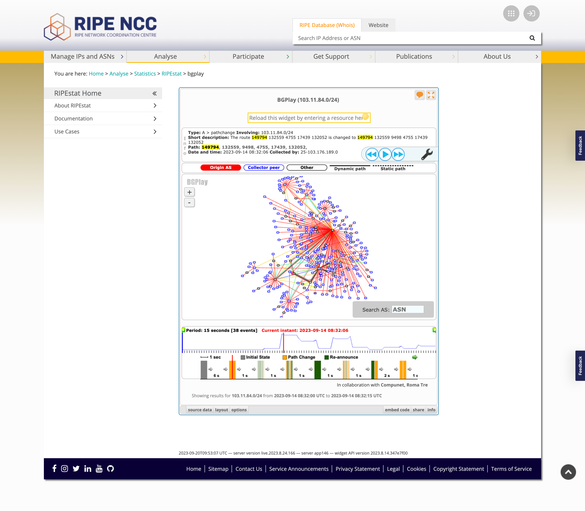

**This article has been published on the [APNIC blog](https://blog.apnic.net/2023/11/20/bgplay-data-misinterpretation-led-to-a-bgp-false-alarm-call/) as well.**

On September 14, 2023, I received a call from a transit provider ([AS17439](https://bgp.tools/as/17439)) in a far-away location from where I actually operate. They were concerned that I was potentially leaking and/or hijacking a route ([103.11.84.0/24](https://web.archive.org/web/20230921032726/https://bgp.tools/prefix/103.11.84.0/24#connectivity)) that originates from one of their downstream BGP customers ([AS132052](https://web.archive.org/web/20230921032837/https://bgp.tools/as/132052)), through my [AS149794](https://www.daryllswer.com/as149794/), based on RIPE’s [BGPlay data](https://stat.ripe.net/ui2013/widget/bgplay#w.ignoreReannouncements=false&w.resource=103.11.84.0/24&w.starttime=1694680320&w.endtime=1694680335&w.rrcs=0,1,3,4,5,6,7,10,11,12,13,14,15,16,18,19,20,21,22,23,24,25,26&w.instant=null&w.type=bgp).

However, after investigating the issue myself using various tools, I determined that they had misinterpreted the data from BGPlay. In this article, I will explain what actually happened and why it is important for network managers, administrators, and engineers to have a good understanding of how to read BGP data correctly.

## Context

I have peered my AS with RIPE’s [RIS](https://www.ripe.net/analyse/internet-measurements/routing-information-service-ris), whereby I export the full routing table from my POV to RIPE for both IPv4 and IPv6. This gives BGPlay full access to routing information from my AS.

BGPlay is a tool that allows network operators to view the routing tables of other networks. This can be useful for troubleshooting routing problems and for understanding how traffic is flowing across the Internet.

## How to avoid BGP false alarms

In this harmless incident, the staff of the transit provider saw the BGP data for 103.11.84.0/24 from my AS’s POV on BGPlay for a very specific time-frame (Date and time: 2023-09-14 08:32:06) on BGPlay, though I am unsure of the timezone utilised by BGPlay.

The AS-PATH of the route showed my ASN on the left and the origin (AS132052) on the right. This shows that I learnt the route directly from AS132559, my upstream transit provider, moving from left to right in the AS-PATH.

_Figure-1 Screenshot from RIPE BGPlay of the very specific BGP data output_

The transit provider in question misinterpreted this data to mean that I was either hijacking their prefix and/or leaking it. However, this is not the case. What we are seeing here is a simple route output from my AS towards RIPE RIS, that shows the path on my end towards this specific prefix changed from ‘149794 132559 **4755** 17439 132052′ to ‘149794 132559 **9498** 4755 17439 132052′.

During my conversation with the transit provider in question who called me, I pointed them to other tools for confirming the situation, following are the tools I used myself:

1. [Cloudflare Radar](https://radar.cloudflare.com/)
2. bgp.tools’s [super looking glass](https://bgp.tools/super-lg)
3. Some data output from [Kentik](https://www.kentik.com/blog/bgp-monitoring-from-kentik/) – Shout out to [Doug Madory](https://www.linkedin.com/in/dougmadory/) and [Wilhelm](https://www.linkedin.com/in/wilhelmsch/) who were kind enough to support me with some data output from Kentik’s platform.

## Conclusion

This is a common mistake that network operators make, especially those who are not familiar with how to read BGP data correctly. It is important to remember that the AS-PATH simply shows the path that a route has taken from the origin AS to the current AS and vice versa.

In the case of a route **hijack**, it is easy to spot the event by looking at the right-most AS in the AS-PATH, the right-most AS will be the origin AS for said route and one can determine if said AS is a valid AS or invalid AS by checking the route object and/or RPKI ROA. However, there can also be a case of a route hijack via [ASN hijacking](https://datatracker.ietf.org/meeting/108/materials/slides-108-sidrops-draft-sriram-sidrops-as-hijack-detection-00-00).

In the case of a route **leak**, the leak can occur anywhere between any AS in the AS-PATH, especially in provider-to-provider AS relationships. Detecting a route leak is not as straightforward, but it can be done so by using a myriad of publicly available tools such as looking glasses and the tools I linked above.

In this particular incident, the false-alarm was harmless. However, it is essential to be aware of the potential for misinterpreting BGP data, as this can lead to unnecessary and costly troubleshooting exercises.

Network operators should educate themselves on how to read BGP data correctly. There are many resources available online and in books, and there are also many experienced network operators who are willing to share their knowledge.
