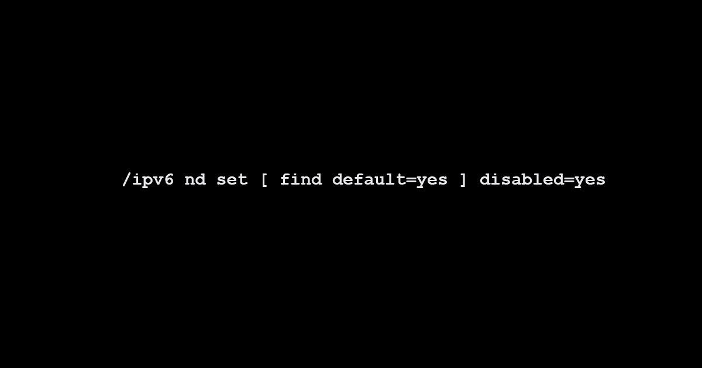

#### This article was sponsored by the cybersecurity company FastNetMon. They offer DDoS detection products for network operators ranging from telcos to small ISPs, which can be deployed on-premise or in the cloud. It features easy deployment and lightning-fast attack detection. You can claim your free 30-day trial using this link.

**This article has been published on the [APNIC blog](https://blog.apnic.net/2023/11/30/why-is-ipv6-router-advertisement-default-enabled-by-some-network-vendors/) as well.**

IPv6 Router Advertisement (RA) is a [Neighbour Discovery Protocol](https://en.wikipedia.org/wiki/Neighbor_Discovery_Protocol) (NDP) ICMPv6 message that is used to communicate specific information (via flags) to IPv6 **hosts** (or a device that does both routing and ‘hosting’). RA messages are sent by routers periodically without solicitation and in response to Router Solicitation (RS) messages from the hosts, depending on your specific configuration and timers. IANA has an [up-to-date list](https://www.iana.org/assignments/icmpv6-parameters/icmpv6-parameters.xhtml#icmpv6-parameters-11) for all the flags that RA can be used for.

## When do we need IPv6 RA?

Generally, we require and want to enable IPv6 RAs on a given link when said link is designed to be used for IPv6 addressing on a given layer 2 domain (LAN). IPv6 addressing on a LAN is handled by two methods, [Stateless Address Autoconfiguration](https://en.wikipedia.org/wiki/IPv6#Stateless_address_autoconfiguration_(SLAAC)) (SLAAC) or [DHCPv6](https://en.wikipedia.org/wiki/DHCPv6)—In both methods, they have one thing in common-IPv6 RAs.

IPv6 RA can be used for a combination of SLAAC + DHCPv6 using the O (other) flag, whereby we tell the hosts that for non-address configuration related parameters to communicate with a given DHCPv6 server instead.

This [article](https://blogs.infoblox.com/ipv6-coe/why-you-must-use-icmpv6-router-advertisements-ras/) explains RA use-cases in-depth.

## When do we not need IPv6 RA?

Since IPv6 RAs are required and meant for LAN use cases for SLAAC/DHCPv6 and the “other” information that can be provided for hosts—It has essentially zero use-case value for Point-to-Point (PtP) links, inter-AS links such as IP Transit, Private Network Interconnect (PNI) and IXP LAN connectivity.

### Security standpoint

There are well documented [security risks](https://blogs.infoblox.com/ipv6-coe/holding-ipv6-neighbor-discovery-to-a-higher-standard-of-security/) related to IPv6 RA, which can be exasperated when a network operator enables RA on interfaces that do not need it. Then there is another angle related to hyper-specific security issues that we cannot foresee—What do I mean by this? I am referring to undiscovered security holes, that an attacker may discover, whereby such a security hole could allow an attacker to crash a router’s OS or crash the corresponding daemon(s) simply by sending malformed RA packets. Even the godfather of network protocols, BGP, is not bullet-proof to malformed packets, see instances [here](https://labs.ripe.net/author/emileaben/unknown-attribute-28-a-source-of-entropy-in-interdomain-routing/) and [here](https://blog.benjojo.co.uk/post/bgp-path-attributes-grave-error-handling) from 2023 alone.

### Performance standpoint and network noise

IPv6 NDP in general and in specific to RA, rely on multicast routing on a given link. What this means is multicast packets are delivered to all devices on a network link, regardless of whether they are interested in receiving them or not. This can lead to unnecessary traffic load on the network, i.e. the usual [BUM traffic](https://en.wikipedia.org/wiki/Broadcast,_unknown-unicast_and_multicast_traffic). Now imagine the situation in production at scale, where you have hundreds to thousands of members or devices in an IXP LAN, where all members decided to ignore IPv6 RA configuration and all are flooding IPv6 RAs – Yeah, not a smart practice, now is it?

Therefore, with all the potential performance and security risks that come with general misconfigurations and/or unneeded configurations (such enabling IPv6 RA on interfaces that do not need it), as a network engineering professional, it is your both your job responsibility and as a working professional in good faith, to ensure that IPv6 RA misconfigurations are completely avoided network-wide.

I did a quick packet capture on my port that is connected to [ExtremeIX Bangalore](https://bgp.tools/ixp/Extreme+IX+Bangalore), and as expected I found some network operators who failed to correctly configure IPv6 RA on their equipment. Here there are two members, one is using Cisco equipment and the other is using MikroTik equipment, which we derived from the MAC addresses.

[](https://www.daryllswer.com/wp-content/uploads/2023/09/image.png)

_Figure-1 IPv6 RAs on ExtremeIX Bangalore_

## What about vendor default IPv6 RA behaviour?

Unfortunately, as usual in the world of networking, virtually no discussion is complete without vendor comparison—There are behavioural inconsistencies among network vendors.

| Vendor | Default IPv6 RA behaviour |
| --- | --- |
| Arista | Floods only RA MTU, but does respond to Router Solicitation |
| Cisco | Floods RAs by default |
| Cumulus Linux | RAs are disabled globally by default |
| Huawei | RAs are disabled globally by default |
| Juniper | RAs are disabled globally by default |
| MikroTik | Floods RAs by default |

_Table-1 Vendor Behavioural Differences_

As we can see in Table-1, different vendors have different behaviours. For documentation of each vendor:

- [Arista](https://www.arista.com/en/um-eos/eos-ipv6).
- [Cisco](https://www.cisco.com/c/en/us/td/docs/ios-xml/ios/ipv6/command/ipv6-cr-book/ipv6-i3.html#wp2583862361).
- [Cumulus Linux](https://docs.nvidia.com/networking-ethernet-software/cumulus-linux-56/Layer-3/Neighbor-Discovery-ND/#router-advertisement).
- [Huawei](https://support.huawei.com/enterprise/en/doc/EDOC1000041693/50c824ca/ipv6-nd-ra-halt-disable).
- [Juniper](https://www.juniper.net/documentation/us/en/software/junos/neighbor-discovery/topics/topic-map/ipv6-neighbor-discovery.html#:~:text=Router%20advertisement%20messages%20are%20disabled%20by%20default%2C%20and%20you%20must%20enable%20them%20to%20take%20advantage%20of%20SLAAC).
- MikroTik does not explicitly state it, but you can find the configuration details and some explanation on my [Edge/BNG guide](https://www.daryllswer.com/edge-router-bng-optimisation-guide-for-isps/).

I think the Huawei, Juniper and Cumulus Linux approach makes the most sense, instead of flooding RAs 24/7 on IPv6 enabled interfaces by default, they disabled RA globally by default allowing the user to enable RA on a per-interface basis as and when needed, therefore the end-result is minimal to zero misconfigurations.

### How to disable IPv6 RA?

On Arista, you disable it on per interface basis:

```
# This command suppresses all RAs on interface vlan 200.
# interface vlan 200
# ipv6 nd ra disabled all
```

On Cisco, you disable it on per interface basis as well:

```
# This command suppresses all RAs on interface vlan 100.
# interface vlan 100
# ipv6 nd ra suppress all
```

On MikroTik, you disable it at global level—Enable it on per interface basis when required:

```
/ipv6 nd set [ find default=yes ] disabled=yes
```

## My opinion on vendor implementations

The problem with varying implementations, documentations and in some cases standards is it leads to layer 8 overhead, and when we have layer 8 overhead, it is a prime factor that can lead to misconfigurations, performance, or security related issues. Humans by nature can make mistakes, can be incompetent, unwilling to learn correct information or knowledge.

This [article](https://blog.apnic.net/2021/08/30/lets-all-suppress-router-advertisements/) in the past has touched upon this specific subject of IPv6 RA, where the author emphasised nothing has changed much from their previous presentation work, quote from the article.

> Two years ago, at JANOG 44, I presented on the following IPv6 setting that I often see incorrectly used:  
> > *ipv6 nd ra suppress*
> 
> 
> 
> 
> 
> 
> 
> Unfortunately, not much has changed since my presentation, so I’d like to discuss this with the wider network operator community to improve awareness of how and why this needs to be fixed.

In the world of aviation, when a specific aeroplane hardware/software design or implementation is known to be a potential cause or factor for disaster, the responsible manufacturers and engineers will work to improve the design and implementation to minimise possible input errors from the human operator (pilot and co) and therefore potentially be life-saving in practice. The same kind of approach is found in automobile engineering, with a very famous example—The seatbelt.

Yet in the world of networking, proactive mindset towards improving the human-network compatibility layer such as UI/UX, some quirky protocol behaviour or in this case, vendor default behaviour, is something that is missing—what I am referring to specifically is [Human factors and ergonomics](https://web.archive.org/web/20240519205520/https://www.hfes.org/About-HFES/What-is-Human-Factors-and-Ergonomics) (HFE). Somewhere, somehow, the networking industry either grew into or started off with, not really pay a lot of attention to ergonomics and I think this needs to change.

Therefore, I think vendors ought to do more and make proactive efforts with “sensible defaults”, not just for IPv6 RAs to be disabled by default on a global level, but for anything else we could think of that would warrant a sensible default.

IPv6 RA is an essential part of IPv6 SLAAC and DHCPv6, but it is important to carefully remember, IPv6 RAs are not required nor suitable for all situations, and therefore it should be explicitly disabled when not required and enable it only on an interface where you require its functionalities.
