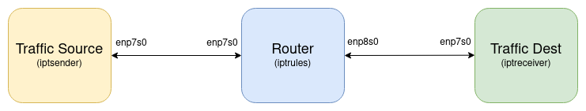
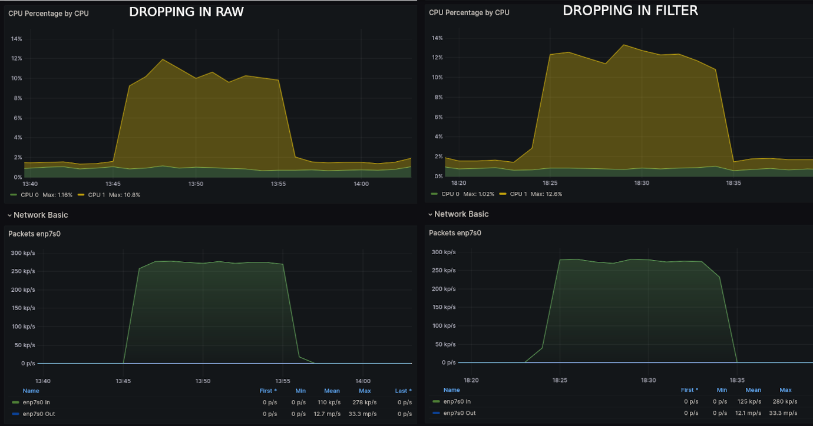
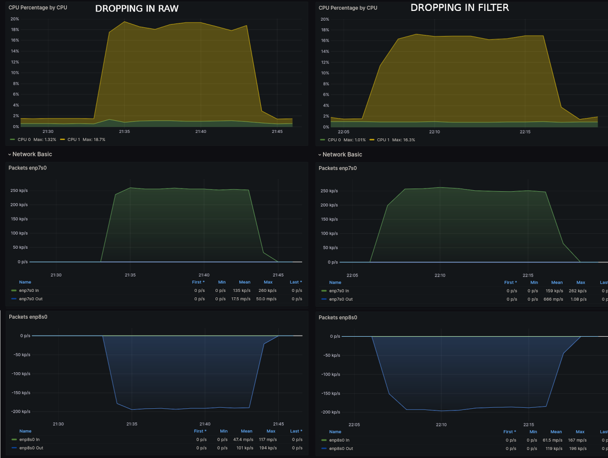

#### In this article, the context and writing structure will be a bit different. The original content was written by a friend of mine who would like to remain anonymous. He originally wanted to keep this information to just the two of us, but I felt that this would benefit the networking community. I would also emphasise this article’s intention is to shed some awareness into iptables raw vs filter table performance and potentially help you make a more efficient decision. It is definitely not one of my comprehensive guides.

**This article has been published on the [APNIC blog](https://blog.apnic.net/2024/02/09/drop-early-drop-often-raw-vs-filter-iptables-packet-filtering/) as well.**

This post is not an assessment of the most efficient packet processing technologies such as XDP or DPDK, it strictly pertains to legacy iptables. However, the concepts here are reasonably applicable to nftables, which supports various [priorities within hook](https://wiki.nftables.org/wiki-nftables/index.php/Netfilter_hooks#Priority_within_hook).

In a discussion with my friend, a question came up about the best place in Netfilter/legacy iptables to filter out spurious traffic where the destination is any of the local addresses on a router (or host). To be specific, the use case is a Linux device acting as a router, with certain services running locally on it, we want to use iptables to prevent unauthorised external parties from connecting to said services such as BGP, SSH, etc.

Although in this test scenario, we only used IPv4, the same 1:1 identical concepts and underlying logic applies to IPv6. There is no discrimination between the address families for the raw vs filter performance comparison.

## The Hypothesis

I maintained it was always preferable to have the rules to drop such traffic in the prerouting chain of the raw table, ensuring it happens prior to the route lookup. Especially in the case of a router with a full routing table of about 1 million IPv4 routes, where the route lookup becomes a very expensive operation.

It made perfect sense to my friend that it was more efficient to drop packets before doing the route lookup, however he wondered — in the case where the vast majority of packets coming in get **forwarded** through the router,  does it still make sense to evaluate all of them against the DROP rule in the prerouting chain, given the vast majority will pass on to the route lookup anyway?

The question ultimately condenses into:  
Is it more costly to do a route table lookup for the small number of packets we eventually drop, or do a rule evaluation for the large number of packets we end up forwarding? Consider the two situation:

1. Rule in **raw**/prerouting
  
  
  - All packets get evaluated on ingress by the DROP rule
  - Dropped packets do not go through route lookup
2. Rule in **filter**/input
  
  
  - All packets go through the route lookup stage
  - Only those for the local system get evaluated by the DROP rule

## Test Environment

We set up 3 VMs as shown below, the router’s VM had conn_track module loaded **but**NoTrack rule was configured in the raw table. They were running on Linux with QEMU, with the connections between them made with virtio devices bound to a separate hypervisor bridge device for each link:

[](https://www.daryllswer.com/wp-content/uploads/2024/01/iptables_raw_filter_setup.png)

_Figure-1 Virtual Topology_

The router VM had over 900,000 routes added to a selection of approx. 50 next-hops, all of which were configured on the receiver node. This was to ensure there was a very large routing table the system needed to look up as packets went through it. We set the next-hops to a bunch of about 50 IP addresses that we configured on the “traffic dest” VM, so there were plenty of next-hops groups too, for example:

```
root@iptrules:~# ip route show | head -6
default via 192.168.122.1 dev enp1s0
1.0.0.0/24 via 203.0.113.8 dev enp8s0
1.0.4.0/22 via 203.0.113.22 dev enp8s0
1.0.5.0/24 via 203.0.113.5 dev enp8s0
1.0.16.0/24 via 203.0.113.16 dev enp8s0
1.0.32.0/24 via 203.0.113.1 dev enp8s0

root@iptrules:~# ip route show | wc -l
925525

root@iptrules:~# ip neigh show dev enp8s0 | head -4
203.0.113.32 lladdr 52:54:00:5f:02:5f REACHABLE
203.0.113.28 lladdr 52:54:00:5f:02:5f STALE
203.0.113.10 lladdr 52:54:00:5f:02:5f REACHABLE
203.0.113.6 lladdr 52:54:00:5f:02:5f REACHABLE
```

### Test 1: Raw vs Filter table, with packets sent only to the router’s local IP addresses

In this test, we do a 1-to-1 test on using raw vs. filter table where all the packets we send will get dropped, so the question is if it is more efficient to drop them in raw, before route lookup, than in filter which is post route lookup. In theory, it should be more efficient to drop them in raw.

In both situations (raw vs filter), approximately 280k 128-byte UDP packets were sent per second for 10 minutes. **iPerf2** was used to generate the UDP streams on the traffic source VM, to the IP configured on enp8s0 of the router VM. iPerf2 command was as follows:

```
iperf -l 128 -i 10 -t 600 -c 203.0.113.1 -u -b 300M
```

The iptables raw table rules were as follows, this shows the state after the test including packet counters:

```
root@iptrules:~# iptables -L -v --line -n -t raw
Chain PREROUTING (policy ACCEPT 0 packets, 0 bytes)
num   pkts bytes target     prot opt in     out     source               destination
1     165M   26G CT         all  --  *      *       0.0.0.0/0            0.0.0.0/0            NOTRACK
2     165M   26G DROP       udp  --  *      *       198.51.100.1         0.0.0.0/0            udp dpt:5001 ADDRTYPE match dst-type LOCAL

Chain OUTPUT (policy ACCEPT 0 packets, 0 bytes)
num   pkts bytes target     prot opt in     out     source               destination
1      753  402K CT         all  --  *      *       0.0.0.0/0            0.0.0.0/0            NOTRACK
```

The iptables filter table test variant were configured as follows, this shows the state after the test including packet counters, the counters look similar in terms of total packets and drops:

```
root@iptrules:~# iptables -L -v --line -n -t raw 
Chain PREROUTING (policy ACCEPT 0 packets, 0 bytes)
num   pkts bytes target     prot opt in     out     source               destination
1     165M   26G CT         all  --  *      *       0.0.0.0/0            0.0.0.0/0            NOTRACK

Chain OUTPUT (policy ACCEPT 0 packets, 0 bytes)
num   pkts bytes target     prot opt in     out     source               destination
1      446  205K CT         all  --  *      *       0.0.0.0/0            0.0.0.0/0            NOTRACK
```

```
root@iptrules:~# iptables -L -v --line -n -t filter 
Chain INPUT (policy ACCEPT 0 packets, 0 bytes)
num   pkts bytes target     prot opt in     out     source               destination
1     165M   26G DROP       udp  --  *      *       198.51.100.1         0.0.0.0/0            udp dpt:5001

Chain FORWARD (policy ACCEPT 0 packets, 0 bytes)
num   pkts bytes target     prot opt in     out     source               destination

Chain OUTPUT (policy ACCEPT 0 packets, 0 bytes)
num   pkts bytes target     prot opt in     out     source               destination
```

Figure 2 shows the CPU usage for Test 1 comparison.

[](https://www.daryllswer.com/wp-content/uploads/2024/01/test-1-cpu-usage.png)

_Figure-2 Test 1 CPU usage_

As expected, dropping in raw, before the route lookup, used less CPU, which hovered around 10% average as opposed to 12% average when the packet dropping was done post route lookup. When removing 1.5% background CPU, is about 15% more CPU used when using the filter table.

### Test 2: Raw vs Filter table, with most packets forwarded to the destination

In this test, we do a 1-to-1 test on using raw vs. filter table on the original hypothesis. In this case, we generated 4 iPerf2 streams of traffic towards some IP addresses on the destination VM. These streams will be **forwarded** through the router, in parallel with the forwarded traffic, we also sent a lower number of packets to the router’s local IP addresses (similar to Test 1 but at a lower rate). The idea was to test the relative impact of doing the rule evaluation on all packets (when the rule is in the raw table), versus skipping that but having to do a routing lookup on everything, including what we’re going to drop.

The iptables raw table rules were as follows, this shows the state after the test including packet counters:

```
root@iptrules:~# iptables -L -v --line -n -t raw
Chain PREROUTING (policy ACCEPT 0 packets, 0 bytes)
num   pkts bytes target     prot opt in     out     source               destination
1     155M   84G CT         all  --  *      *       0.0.0.0/0            0.0.0.0/0            NOTRACK
2    58604 9142K DROP       udp  --  *      *       198.51.100.1         0.0.0.0/0            udp dpt:5001 ADDRTYPE match dst-type LOCAL

Chain OUTPUT (policy ACCEPT 0 packets, 0 bytes)
num   pkts bytes target     prot opt in     out     source               destination
1      386  185K CT         all  --  *      *       0.0.0.0/0            0.0.0.0/0            NOTRACK
```

The iptables filter table test variant were configured as follows, this shows the state after the test including packet counters:

```
root@iptrules:~# iptables -L -v --line -n -t raw 
Chain PREROUTING (policy ACCEPT 0 packets, 0 bytes)
num   pkts bytes target     prot opt in     out     source               destination
1     155M   83G CT         all  --  *      *       0.0.0.0/0            0.0.0.0/0            NOTRACK

Chain OUTPUT (policy ACCEPT 0 packets, 0 bytes)
num   pkts bytes target     prot opt in     out     source               destination
1      412  187K CT         all  --  *      *       0.0.0.0/0            0.0.0.0/0            NOTRACK
```

```
root@iptrules:~# iptables -L -v --line -n -t filter 
Chain INPUT (policy ACCEPT 0 packets, 0 bytes)
num   pkts bytes target     prot opt in     out     source               destination
1    58603 9142K DROP       udp  --  *      *       198.51.100.1         0.0.0.0/0            udp dpt:5001

Chain FORWARD (policy ACCEPT 0 packets, 0 bytes)
num   pkts bytes target     prot opt in     out     source               destination

Chain OUTPUT (policy ACCEPT 0 packets, 0 bytes)
num   pkts bytes target     prot opt in     out     source               destination
```

Figure 3 shows the CPU usage for Test 2 comparison.

[](https://www.daryllswer.com/wp-content/uploads/2024/01/test-2-cpu-usage.png)

_Figure-3 Test 2 CPU usage_

There’s clearly only a marginal difference, but it does appear the CPU usage was slightly lower with the drop rule placed in the filter table’s input chain. Despite the system having to do a routing lookup on the 58603 packets it dropped, not having to evaluate the DROP rule against the 155 million packets **forwarded** made the overall CPU usage lower.

## Conclusion

We think it is safe to say that the traffic mixture ratio is definitely a factor on deciding where it is best to deploy filtering rules for a given situation, which was my friend’s original contention. This test does not conform to a strict a controlled environment, but it is sufficient to derive an approximated conclusion.

As the ratio of packets being dropped increases, with the ultimate situation that everything is dropped (Test 1), being able to skip the route lookup for those packets brings lower CPU usage.

However, it’s worth nothing that, even if the majority of the packets are forwarded through the router (Test 2), a DoS/DDoS destined towards the router’s local IP addresses may drastically change the ratio of traffic, for which then, it would make sense to protect your router by dropping said packets in the raw table, as it would then be critical in such a situation to drop early to have any chance of preserving the system’s CPU.

Essentially, you may want to do something that’s less efficient in the normal circumstance, because of some benefit in some unusual circumstance.

It’s worth remembering that connection tracking is expensive and becomes vulnerable to a DDoS attack as the table may flood. I believe that opting for a stateless approach is preferable when the circumstances allow. However, if you are compelled to adopt a stateful approach, it is advisable to establish NoTrack rules for trusted traffic, [BUM traffic](https://en.wikipedia.org/wiki/Broadcast,_unknown-unicast_and_multicast_traffic), as well as trusted BGP/OSPF/LDP neighbours. Additionally, consider dropping certain types of traffic in the raw and filter stages based on your traffic distribution.

My friend’s intention with this test was not to determine the best thing for every situation, but rather to get a small sense of the relative performance of one of these options versus the other.
