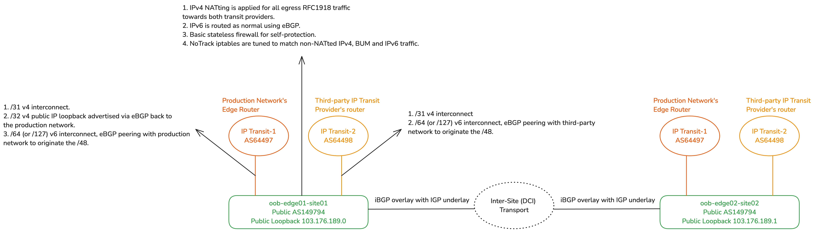
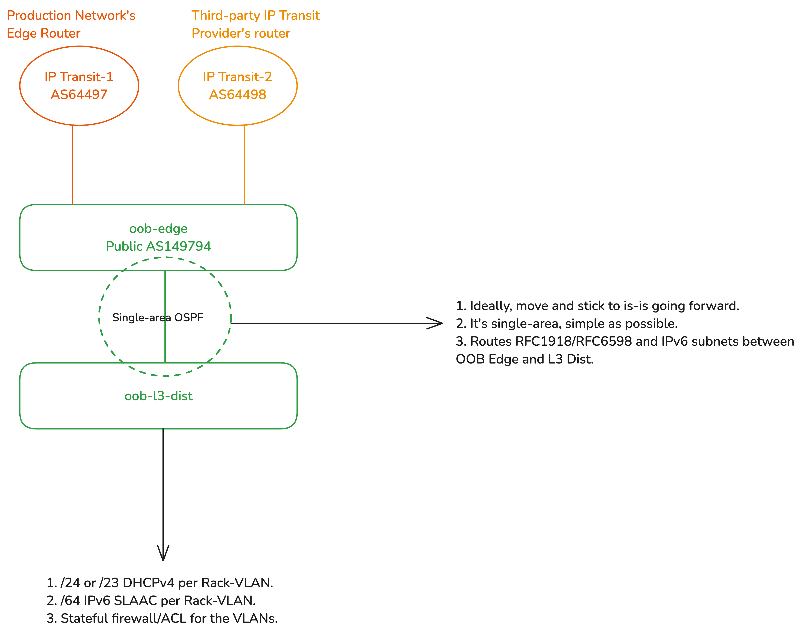
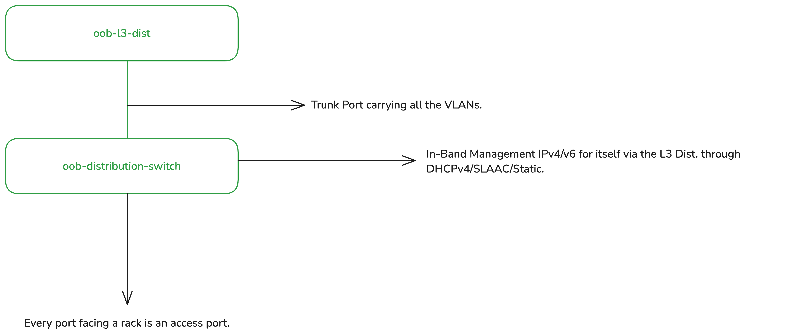
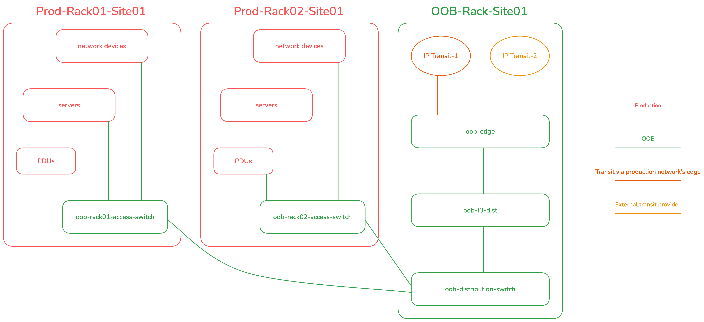
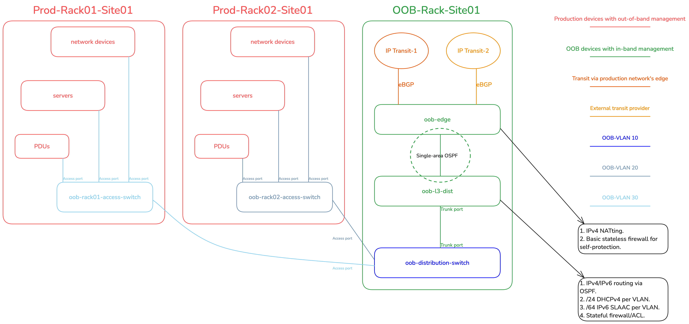
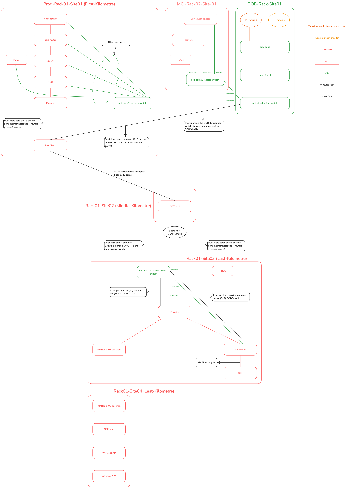
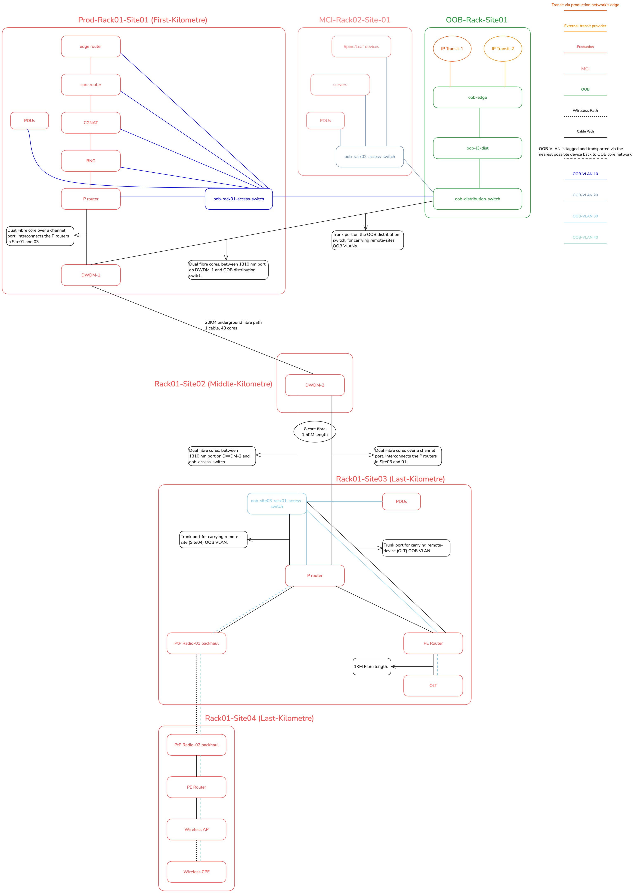
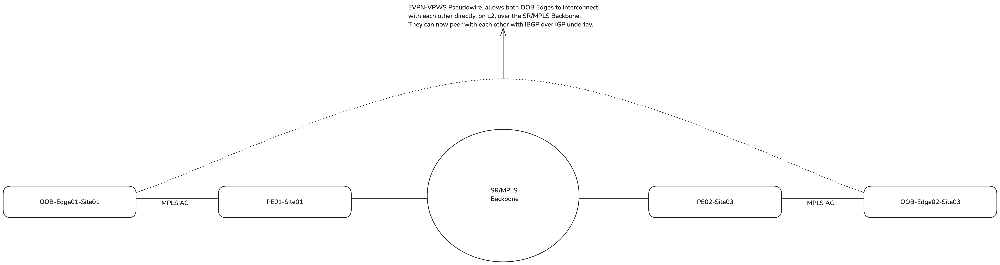
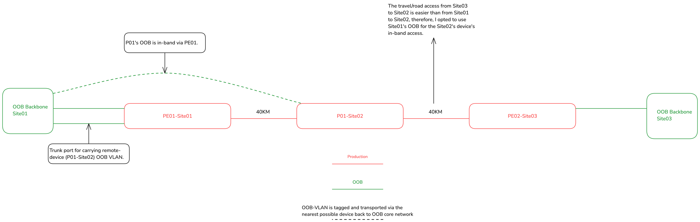

#### The design I am going to discuss in this article was inspired by a variant that Wido den Hollander originally built in a data centre environment, where he architected a medium-large network. It is not a typical Out-of-Band design that one may find reference for on the public Internet.

> **For professional Out-of-Band (OOB) network design services, [click here](https://www.swernetworks.com/).**

**This article has been published on the [APNIC blog](https://blog.apnic.net/2024/11/12/out-of-band-network-design-for-service-provider-networks/) as well as discussed on [The Hedge Podcast](https://rule11.tech/hedge-265/). It was also selected for APNIC’s 2024 “[Three of the best: How to](https://blog.apnic.net/2025/01/03/three-of-the-best-how-to-7/)”.**

Firstly, I recommend you read my [IPv6 Architecture and Subnetting Guide](https://www.daryllswer.com/ipv6-architecture-and-subnetting-guide-for-network-engineers-and-operators/) before proceeding with this article, as the implementations described here, are heavily dependent on global routing with IPv6.

A quick primer on Out-of-Band (OOB) networking — it is basically a network segment that is isolated from the production network or what I would call the ‘transit path’. Transit path, here, means the path used by customers to reach an endpoint on the public Internet and vice versa, the same way roads are public, but maintenance tunnels are not.

The OOB network is **exclusively** used for giving administrative access to the company’s authorised employees and systems. This access is used to automate, orchestrate, configure, monitor and troubleshoot a given network device, server, application software, or multiple devices at a time.

The ‘access’ can be in the form of SSH, SNMP, API, Web Portal, or some proprietary access method. This ‘OOB access path’ is behind a firewall and various access control lists (ACLs) that ensure only authorised end-points (such as a jump host or VPN server), and login credentials are permitted.

The security posture is inspired by [defence in depth](https://en.wikipedia.org/wiki/Defense_in_depth_(computing)), where the bare minimum is Layer 3+4 ACLs using a stateful firewall, and up to Layer 7 ACLs, or could go even up to Layer 8 with [Role-Based Access Control](https://en.wikipedia.org/wiki/Role-based_access_control).

A lot of network operators would tell me that the network is their ‘bread and butter’, well I say if the network is your bread-and-butter, then a proper OOB network is the ingredient to make the bread and butter combo happen.

We are using global routing with IPv6, for reachability over the Internet etc, something we cannot afford to do with legacy IPv4 public /24 per site just for OOB. Most, if not all configuration, access, monitoring, automation, and troubleshooting occurs over IPv6-only addressing. Legacy IPv4 only exists for the legacy devices to have legacy access to the legacy Internet with legacy [RFC1918](https://datatracker.ietf.org/doc/html/rfc1918) or [RFC6598](https://datatracker.ietf.org/doc/html/rfc6598) addressing and via legacy NAT44.

## The not-so-obvious benefits of dedicated OOB

When we have a dedicated OOB infrastructure in place, we can perform critical or intrusive changes to the network and system configurations or updates, without risking loss of access.

For example, if you have Internet of Things (IoT) devices for access control — such as door locks or building entry systems — these should ideally be connected through an OOB network. Each device would receive an IPv6 address, protected by a firewall and ACLs (discussed later in this article), allowing them to remain fully reachable even if the production network is completely offline. The OOB backbone would maintain multiple connectivity paths, ensuring high availability in case of a production network outage. This network can also provide backup console access to critical systems, like network devices and servers.

Additionally, if the Authoritative DNS for the Second-Level Domain ([SLD](https://en.wikipedia.org/wiki/Second-level_domain)) that we use for OOB networking is outside the company’s own infrastructure, it will stay online, even if your own infrastructure is offline at a global level — something that happened to [Meta on 4 October 2021](https://engineering.fb.com/2021/10/05/networking-traffic/outage-details/).

There was also **speculation** regarding the [2023 Optus outage](https://en.wikipedia.org/wiki/2023_Optus_outage) that one of the key blockers to restoring their services was due to a lack of proper OOB network implementation by interpreting this [information](https://www.theguardian.com/australia-news/live/2023/nov/13/australia-politics-live-monique-ryan-lobbyists-question-time-anthony-albanese-peter-dutton-cost-of-living-gaza?page=with:block-6551b7a78f08a95ef07ed924#block-6551b7a78f08a95ef07ed924) quoted below:

> These routing information changes propagated through multiple layers in our network and exceeded preset safety levels on key routers which could not handle these. This resulted in those routers disconnecting from the Optus IP core network to protect themselves.
> 
> 
> 
> 
> 
> 
> 
> The restoration required a large-scale effort of the team and in some cases **required** Optus to reconnect or **reboot routers physically**, requiring the **dispatch of people** across **a number of sites** in Australia. This is why restoration was progressive over the afternoon.
> 
> 
> 
> 
> 
> 
> 
> — Optus Spokesperson. Source: [The Guardian](https://www.theguardian.com/australia-news/live/2023/nov/13/australia-politics-live-monique-ryan-lobbyists-question-time-anthony-albanese-peter-dutton-cost-of-living-gaza?page=with:block-6551b7a78f08a95ef07ed924#block-6551b7a78f08a95ef07ed924)

### Financial benefits

- **Reduced site visit costs:** Remote troubleshooting minimises OpEx to far-off locations.
- **Lower personnel expenses:** Centralised OOB management reduces the need for on-site staff and support teams.
- **Efficient network expansion:**OOB can help assist support network growth.
- **Avoidance of SLA penalties:**Faster issue resolution helps ISPs avoid financial penalties from service-level breaches.
- **Remote power management:** Power cycling and device management can be done remotely, saving on-site intervention costs.
- **Employment:** OOB may potentially [even save your job](https://www.theguardian.com/business/2023/nov/20/optus-ceo-kelly-bayer-rosmarin-resigns-network-outage-australia).

## Original data centre variant and inspiration

In the original version of this network setup, which predate my time working at this particular network, it had some design flaws regarding how intra-AS traffic flowed between different OOB ‘backbones’ across sites, which impacted firewall filtering logic as it increased complexity for the stateful mechanism to track intra-as flows. I later revised the design to address these issues, simplifying and streamlining it. The version discussed in this article reflects this improved design.

The revised setup features a basic [collapsed-core topology](https://web.archive.org/web/20240128143515/https://study-ccna.com/collapsed-core-and-three-tier-architectures/) for the OOB network. There are edge routers for public eBGP transit in each backbone site, a Layer 3 distribution router (L3 dist.) for stateful firewalling/ACLing in each site, and an L2 distribution switch, which then provides downstream connectivity to the rack-specific OOB L2 access switches. It should be strongly noted, that the **OOB network** is a **completely seperate Autonomous System** (with its own **public Autonomous System Number**) from the production network. This separation ensures that the OOB network will remain fully functional and online and fully accessible from the public Internet for employees or authorised system/software access, even if all devices in the production network go offline.

We used MikroTik routers for the OOB edge and L3 distribution because they are cheap, affordable, can easily handle 10Gigabit+ if required (which will never happen in an OOB setup for most networks), and it is Linux based. It allows us to use iptables-like logic for the firewall. I specifically opted for the [CCR2116-12G-4S+](https://mikrotik.com/product/ccr2116_12g_4splus), because of its [single-ASIC implementation](https://i.mt.lv/cdn/product_files/CCR2116-12G-4S_240122.png) that allowed us to standardise the single Linux VLAN-aware bridge configuration approach across the entire OOB network. The single-Linux bridge config is [required](https://help.mikrotik.com/docs/display/ROS/L3+Hardware+Offloading#L3HardwareOffloading-Creatingmultiplebridges) to achieve end-to-end hardware offloading on MikroTik hardware.

For the OOB L2 distribution and access switches, we used some Juniper EX switch variants such as EX3200, EX4200 etc.

### Edge

The OOB edge router peers with third-party IP transit providers using its unique public ASN. In some sites, it also has an additional direct eBGP uplink to the production network’s edge router, serving as a secondary transit provider. From here, a **/48 IPv6 prefix** is originated for each OOB backbone site, following the guidance in my [IPv6 Architecture guide](https://www.daryllswer.com/ipv6-architecture-and-subnetting-guide-for-network-engineers-and-operators/). The OOB edge router uses single-area OSPF with the Layer 3 distribution router to handle routing for both IPv6 subnets and legacy RFC1918/RFC6598 address ranges.

The RFC1918/RFC6598 ranges are then NATted on the OOB edge on egress towards WAN. The OOB edge has at least one public IPv4 address, often from a Provider-Independent Address (PIA) space that the company owns, assigned to the loopback interface or using the Provider-Assigned (PA) address configured by the third-party transit provider.

The edge router has iptables **NoTrack** rules on the raw table for IPv6 (completely stateless) and for any traffic in IPv4 that’s **not** NATted (partially stateless). The edge has WAN/LAN and intra-AS interface list groupings (sometimes called zone-based firewalling). In this setup, intra-AS interfaces are those running iBGP with other OOB edge routers over an IGP underlay.

### iBGP Peering between edges

This setup involves a simple Internal Border Gateway Protocol (iBGP) route exchange with an Interior Gateway Protocol (IGP) underlay. We exchange the IPv6 /48s between OOB edges for localised routing (when inter-site transport is functional). If the inter-site transport fails, it will automatically fail over to your eBGP Transit(s).

For IPv4, the route redistribution is fully adaptable to your local environment. If all OOB clients are IPv6-enabled, then you do not need to re-distribute the RFC 1918/RFC 6598 subnets. However, you may choose to re-distribute the public loopback IPv4 addresses assigned to the OOB edges, these /32s of course, originate from your production network’s ASN.

[](https://www.daryllswer.com/wp-content/uploads/2024/10/Figure-1_OOB_Edge_in_the_DC.png)

_Figure-1 OOB Edge in the DC_

### Layer 3 distribution

Considering that the L3 distribution runs single-area OSPF with the edge, whereby the RFC1918 IPv4 and IPv6 prefixes are routed to the L3 distribution. The L3 distribution has a trunked port for the OOB distribution switch, with a unique VLAN per rack-served, where each VLAN (representing a rack) gets a /64 IPv6 prefix and a /24 legacy RFC1918 range. This means, if there are two racks, there are two VLANs, one for each. All the devices in a rack get their dedicated /128 Globally Unique Address (GUA) via SLAAC (EUI-64 is preferred to be enabled) and a /32 legacy IP over DHCP.

The L3 distribution then firewalls off WAN access to only permit established, related traffic, ICMPv4/ICMPv6, and any traffic where the source/destination IPs belong to various management-related servers/VPNs/jump hosts etc. All the rack-specific VLANs are grouped into an interface list called ‘LAN’ which simplifies firewall configuration, so we have a total of two groups, WAN (uplink to the edge) and LAN.

### OSPF vs is-is for IGP

This article is not suitable for a routing protocol deep-dive, but as a quick recommendation, I would recommend moving everything IGP-related to is-is (in general) and highly recommend you [watch this video](https://youtu.be/jWdD8SCwzHk) to understand why.

Another quick tip, for a use-case like this, when using is-is, use a single level (area) and configure both the OOB edge and L3 Dist. as Level 2-only routers — You can read more [here](https://blog.ipspace.net/2011/11/multi-level-is-is-in-single-area-think/).

[](https://www.daryllswer.com/wp-content/uploads/2024/10/Figure-2_OOB_L3_Dist_in_the_DC.png)

_Figure-2 OOB L3 Dist. in the DC_

### L2 distribution Switch

The L2 distribution switch has a trunk port running upstream to the L3 distribution router carrying all the rack-specific VLANs.

The L2 distribution switch receives an optional DHCPv4 address and an IPv6 SLAAC address (or statically configured) from the rack-specific VLAN in which it resides. For example, let’s assume there is site01-rack01 and we assigned VLAN10. In this rack, you have the production network and the OOB network. In this case, all devices share the same VLAN10 for the OOB, and therefore the L2 distribution switch also is a member of the same VLAN10. This set up enables L3 reachability into the management (MGMT) plane of the device.

The L2 distribution switch’s MGMT port/interface is not used, from the POV of the distribution switch itself, it is ‘in-band’ MGMT, as the uplink to the L3 distribution is connected to one of the switch’s regular Ethernet/SFP ports. The uplink is a trunked port, allowing multiple ways to configure VLANs. My preferred approach is to configure an L3 sub-interface (for running the DHCP client/IPv6 address) to be ‘untagged’ on ingress to itself but tagged on egress back to the L3 distribution uplink. Alternatively, you could just configure the L3 sub-interface as tagged, for instance with an [IRB](https://www.juniper.net/documentation/us/en/software/junos/multicast-l2/topics/topic-map/irb-and-bridging.html) on Juniper. Personally I prefer the L2 distribution switch’s L3 sub-interface to be untagged to itself. **Note:** My usage of the VLAN terminologies here is Linux-oriented and may not accurately reflect vendor-specific terms.

The switch then receives a DHCPv4 client IP (optional, for legacy support) and you can either configure the switch to accept IPv6 Router Advertisements (RAs) or configure a static IPv6 address from the prefix assigned to its rack-specific VLAN.

All downstream ports then become access ports for each specific rack with their respective VLANs tagged on ingress from those ports, and then ‘switched’ back to the trunk port. In most cases, one access port per rack is sufficient, but you could always do some variations if required.

[](https://www.daryllswer.com/wp-content/uploads/2024/10/Figure-3_OOB_Dist_Switch_in_the_DC.png)

_Figure-3 OOB Dist. Switch in the DC_

### Rack-Specific L2 Access Switch

In this setup, the access switch operates similarly to the distribution switch, the MGMT is ‘in-band’.**However** the access switch has **no** VLAN awareness or config by design, it is purely an L2 switching device, single broadcast domain. We configure a simple IRB under VLAN unit 0, where on top of the IRB’s unit 0, we configure a static IPv6 address from within the OOB’s VLAN-specific /64. Legacy IP can be additionally configured using DHCP if needed, but often it is not. It then just switches L2 traffic across all ports, from which those ports then provide OOB connectivity to all the devices in a rack via their MGMT port/interfaces.

Devices that support SLAAC will autoconfigure with EUI-64 if enabled (because this is OOB, it is easier to do MAC mapping) or just regular privacy extensions with stable addressing. Manual IPv6 address config is also an option if required. Power Distribution Units (PDUs), UPSes, and other electronic devices connect to the access switch via their MGMT Ethernet ports, each receiving an IPv6 address for management purposes.

The diagram below illustrates this (DC) implementation from a physical standpoint:

Figure 4 illustrates this data centre implementation from a physical standpoint.

[](https://www.daryllswer.com/wp-content/uploads/2024/10/Figure-4_OOB_in_the_DC_Layer_1.png)

_Figure-4 OOB in the DC (Layer 1)_

Figure 5 illustrates this data centre implementation from a logical standpoint.

[](https://www.daryllswer.com/wp-content/uploads/2024/10/Figure-5_OOB_in_the_DC_Layer_2-3.png)

_Figure-5 OOB in the DC (Layer 2-3)_

```
In the data centre example, I did not show the Mission Critical Infrastructure (MCI) for readability reasons, it is however elaborated in the ISP example, please read the ISP section even if you are a data centre network operator.
```

## VRF

The OOB IP addresses of the devices, are configured on the MGMT-only interfaces and VRF  to ensure that MGMT and transit traffic never collide or have any way of talking to each other for security and isolation from Layers 1-7.

The network devices (**excluding** the OOB-role switches) do have a **separate** **loopback** **IP** configured on the **main** VRF (**transit** path), these loopbacks can be pinged from the public Internet and allow easy traceroutes/troubleshooting and rDNS records. However, **all** MGMT services (SSH, SNMP, Streaming Telemetry, API etc) binds **exclusively** to the MGMT VRF.

## DNS and Loopback addressing

**Everything is DNS-based, where possible, we don’t need team members memorising IP addresses**.

Since everything is DNS-based, we should use an SLD that’s different from SLDs used for customers or production. The Authoritative DNS server for the SLD should ideally be outside the company’s own infrastructure. This can be offloaded to a third party instead or by setting up your own authoratives on third-party cloud providers, independent of your infrastructure. This approach ensures it is 100% accessible should the company’s own infrastructure go offline, as it did for Meta.

The IP addresses used for the FQDN AAAA records, representing each unique device and used in LibreNMS, monitoring software, automation frameworks, and user logins, are the OOB-assigned IP addresses on network devices, including the in-band addresses of distribution and access switches.

I prefer to have two types of FQDNs, one that represents the OOB IP addresses and another for loopback. For example, below is what I would do for my edge router:

- edge01-ams04.daryllswer.net — AAAA record is mapped to the OOB IPv6 address in the MGMT VRF.
- lo-edge01-ams04.daryllswer.net — AAAA or A record is mapped to the loopback IP addresses in the main VRF.

In these examples, AMS is the IATA airport code for Amsterdam, and ‘edge’ is the device type, referring to the production edge device.

## Adapting to the service provider environment

When tasked with designing an out-of-band (OOB) network from scratch for an ISP use case, I took a couple of weeks to step back, reflect, and analyse ways to adapt data centre-specific OOB designs for an ISP network. My goal was to incorporate a geographical denomination model similar to the one I’ve used in my [IPv6 Architecture](https://www.daryllswer.com/ipv6-architecture-and-subnetting-guide-for-network-engineers-and-operators/). Unlike data centres, which are typically uniform at the physical layer, ISP networking is shaped by geography and has unique constraints.

For example, in mountainous regions, it’s impractical and costly to dedicate separate fibre cores for OOB and transit traffic due to high CapEx, OpEx, and labour costs. Therefore, the geographical denomination model becomes essential, allowing the OOB network design to adapt to the unique demands and constraints of each physical environment.

Geography varies wildly and therefore, I cannot give an OOB design example for every possible geographical environment, Earth is a big place.

I will present a generalised ISP-specific OOB network design based on a real-world implementation that I did for a small wireless ISP and also based on various implementation methods used in fibre-only ISPs, where a colleague and I took advantage of the **1310 nm port** on**DWDM gear**and used multi-core single-mode dual fibre (or single-mode single fibre using BiDi modules) to deliver dedicated OOB transport for remote devices **without expending** channel ports on the DWDM gear.

The core design principles remain consistent for both WISP and fibre-optic-based service provider networks, the primary distinction lies at layer 1.

**In order to explain an ISP-specific OOB network design, I will assume a specific ISP setup with consistent variables in order to demonstrate a concise solution, from the perspective of a residential broadband ISP network.**

### Layer 1

#### High-level overview

The network is broadly broken down into three parent segments: The production network, the mission critical infrastructure (MCI) network and the OOB network.

The **production** network largely consists of edge routers, core routers, L3 distribution switches, CGNAT boxes, BNGs, MPLS P and PE routers, access switches behind the PE routers, wireless devices or PON OLTs in the case of fibre-based residential broadband.

The **MCI** network largely consists of a Clos Spine and Leaf architecture, and hosts (server nodes) and is always strictly in a DC environment.

The **OOB** network is mostly identical to the data centre variant in the first-kilometre of the network or when possible, also in the middle and last-kilometre.

#### Low-level overview

For **production** network:

The production network is further sliced into three metaphorical elements:

- The first-kilometre is often (but can vary) located in a data centre
- The middle-kilometre is a Point-of-Presence (PoP) that sits between the first-kilometre and the last-kilometre and acts as an aggregation point for the last-kilometre, often located in a Central Office, from my interpretation of American Telco lingo.
- The last-kilometre is the demarcation point that delivers physical connectivity to the customer’s premises.

The edge, core, L3 distribution and often the BNG and CGNAT boxes sit in the first-kilometre of the network. The P and PE routers are installed where necessary. In the last mile, you may have wireless backhauls, APs and OLTs.

For the **MCI** network:

The MCI network almost always sits exclusively in the first-kilometre of the network or potentially on a third-party cloud provider for some application-specific software like Netbox. The MCI runs applications like DNS Recursor, LibreNMS, Grafana/Prometheus, FreeIPA, [OSS/BSS](https://en.wikipedia.org/wiki/OSS/BSS) etc.

For the **OOB**network:

The edge and L3 distribution of the OOB network sits in the first-kilometre, always, but exceptions can *always*exist on a planet as big as Earth.

Figure 6 illustrates illustrates this service provider implementation from a physical standpoint.

[](https://www.daryllswer.com/wp-content/uploads/2024/10/Figure-6_OOB_for_ISP_Layer_1.png)

_Figure-6 OOB for ISP (Layer 1)_

### Layer 2

The ISP setup also uses identical rack-based VLAN segregation as in a data centre. However, for devices **outside** the rack or remote devices, VLANs are segmented on a per-site basis, which I’ll illustrate later with a diagram.

Remote devices have MGMT VLAN tagged, and that tagged VLAN is sent to the nearest device in the path that can carry that VLAN to the nearest OOB access switch or distribution switch depending on your topology.

This means for example, OLT’s MGMT VLAN is tagged in-band, back to the PE router, PE router may have an **additional** trunk port, where the OOB VLAN is tagged and ‘switched’ over back to an OOB access switch’s trunk port for example.

There are multiple possible combinations based on the setup, but the key point is that remote devices will send a tagged MGMT VLAN in-band to their nearest upstream neighbour, which continues the in-band transport until the VLAN reaches the OOB backbone network.

### Layer 3

Layer 3 is identical to the data centre variant. It is all centralised on the L3 distribution router of the OOB backbone network.

Figure 7 illustrates illustrates this service provider implementation from a logical standpoint.

[](https://www.daryllswer.com/wp-content/uploads/2024/10/Figure-7_OOB_for_ISP_Layer_2-3.png)

_Figure-7 OOB for ISP (Layer 2-3)_

## How do employees and systems access devices/services behind the OOB network?

### For employees

There are many ways to do this. For example, you can have jump hosts inside the MCI, that support regular SSH + SOCKS5 proxying dual-stacked (public IPv4/IPv6) and combine it with YubiKeys. Or, if you prefer VPN-based solutions, then the VPN server will have public v4/v6 addresses on its WAN interfaces, and then additionally a /64 is routed to the ‘LAN’ side of the host (either using BGP or DHCPv6 ia_pd), from this /64, we assign a /128 GUA address per employee profile or peer (in WireGuard), this ensures, even if the employees are behind legacy obsolete networks, they can still talk IPv6 over the VPN tunnel or SOCKS5 proxy.

Instead of using SOCKS5, you may want to build your own solutions by using something like [sshuttle](https://github.com/sshuttle/sshuttle), something that [Ammar Zuberi](https://www.linkedin.com/in/ammar-zuberi/) pointed me to, it is an interesting approach.

### For Systems

As previously explained, the L3 distribution handles L3 and L4 firewalling. Therefore, system endpoints like LibreNMS, Ansible, Grafana, and similar tools will have their FQDNs included in the ACL list on the L3 distribution. This setup ensures that only authorised systems can access the devices and services behind the OOB network.

## Inter-Site OOB Transport

There are broadly three aspects to transport in general:

1. There is the **downstream**-facing inter-site transport (this is the case in **Figures 6 and 7**), typically this applies to service provider networks.
2. There is the****Data center interconnect (DCI), inter-site transport, often used for routing-adjacency or L2/L3VPN services or even VXLAN/EVPN use-cases, this applies to both data centre and service provider networks.
3. There are hybrid data centre/service provider networks that share elements of both.

Generally speaking, most commercial networks have various PoPs, and these PoPs interconnect with each other, via various possible options such as active/passive DWDM, SR/MPLS L2/L3VPN, OTN, etc.

This guide cannot cover every possible inter-site transport architecture and implementation, so I will share a few generalised guidelines that you can modify to your specific needs:

1. Any downstream-facing inter-site OOB transport generally, is just stretching (yes stretching, not transport via L2VPN or other encapsulations) of the L2 OOB access VLANs to their intended remote sites or devices. We stretch the VLANs using simple VLAN tagging/untagging instead of any fancy SR/MPLS transport, because we want the OOB to function for these remote sites, even if the SR/MPLS network is offline. If there are no layer 1 failures or other single points of failure (LTE augmentation for example), we should be able to reach any, and every device in the network, irrelevant of the status of the SR/MPLS network.
  
  
  - As mentioned earlier, the 1310 nm expansion port of a DWDM unit can be used for (downstream) inter-site transport of OOB connectivity as highlighted in **Figure 6-7**.
2. For DCI inter-site OOB transport, typically, this will be used to establish iBGP adjacency between OOB edge routers in each data centre (site). So, if your DCI is SR-MPLS/EVPN, you can absolutely create a pseudowire (EVPN-VPWS) to allow a point-to-point interconnect between both OOB edge routers.
3. If you have **N**number of sites, at some point it may not be feasible for every OOB Edge router to peer with every other OOB edge router in N number of sites, using iBGP full mesh. For such cases, you can do any of the following:
  
  
  - Completely avoid iBGP adjacency between OOB edge routers, because OOB edges can still talk to each other over regular WAN routing via their IP transits. Because we are using globally reachable IPv6, with dedicated prefixes in each site, everything is just **routing**.
  - Establish iBGP adjacency only between directly connected data centres that do not have another data centre in between. For example, there can be iBGP adjacency between DC1 and DC2, but DC1 and DC3 would not have iBGP adjacency if the path is DC1<>DC2<>DC3.
  - Create your own rules and implementations as you see fit, for your specific use case and situation.
  - Avoid adding too much complexity to the OOB backbone network, for instance, there is no good reason to mimic a production-grade service provider network where you have route reflectors involved to work around iBGP full-mesh

Figure 8 shows an example of inter-site OOB transport using a traditional SR/MPLS topology as the preferred diagramming method.

[](https://www.daryllswer.com/wp-content/uploads/2024/10/Figure-8_Inter-Site_OOB_Transport.png)

_Figure-8 Inter-Site OOB Transport_

### Caveat

What about OOB **access** to the DCI inter-site **transport gear itself**, for example, your active DWDM/OTN gear, or your SR-MPLS/EVPN routers? There is no ‘clean’ answer to this.

For example, if there are two data centres — site01 and site03 — with a P router (site02) located between them, **physically outside** both data centres and equidistant from each, which site’s OOB backbone will provide in-band OOB access for this router?

As the network architect, it is entirely up to you to make this decision on a case-by-case basis, taking into account various factors and local environmental variables. For instance, if the physical route from site03 to site02 is easier than from site01, you might choose to use site01’s OOB backbone to facilitate the router’s in-band access, especially if most of the support staff are usually located at site02. Figure 9 illustrates what this setup could look like.

[](https://www.daryllswer.com/wp-content/uploads/2024/10/Figure-9_OOB_Access_for_Transport_Gear.png)

_Figure-9 OOB Access for Transport Gear_

## Augmentation of the OOB network

There are **N** number of possible combinations for network architecture, including OOB setups. While I cannot cover every possible scenario, here are some possible augmentations:

1. **LTE connectivity:** You can enhance your design with LTE connectivity in several ways. Here are a couple of examples:
  
  
  - You have an OOB site that does not have IP Transit, just regular residential broadband with additional LTE failover. In such a case, you can use WireGuard to establish a tunnel between the broadband circuit and the LTE circuit back to the OOB backbone in a data centre. In this setup, you could run BGP+BFD over the tunnels to route the IPv6 /48 prefix, your BGP route filters will have a lower local-preference for the LTE circuit on both ends of the tunnel, allowing simple failover and a higher preference for wired broadband.
  - Another option is to further enhance the overall design by installing an additional serial console server at every site, point of presence (PoP), and rack. Each device’s serial console port would connect to the console server, which would then uplink to the OOB edge or an LTE router via USB at a remote site. This provides an additional access path in case the core IP side of the OOB network fails.
2. **Tunnelling solutions:** If you choose to implement tunnelling solutions, I recommend keeping it simple with L3 and IPv6 routing. BGP and BFD work well over tunnels, but you should avoid any form of L2 tunnelling, as it increases complexity and overhead, which we want to minimise in OOB networks.

### Why I recommend WireGuard for any tunnelling?

WireGuard has built-in support for 4in6/6in4 encapsulation, so IPv6 would work over the tunnel, even over IPv4-only residential broadband. Additionally, the MTU overhead for WireGuard is clearly [defined](https://en.wikipedia.org/wiki/WireGuard#MTU_overhead), so you should set the WireGuard interface MTU to 1420 on both ends, regardless of the underlay MTU. This makes it easy to configure, deploy, and delete, allowing you to manage the setup effortlessly with automated templates.

## Preference for managing BUM traffic in the OOB network

I’ll keep this short, simple, and emphasise that this is **not** mandatory, but if you have tens of thousands of devices, [BUM](https://en.wikipedia.org/wiki/Broadcast,_unknown-unicast_and_multicast_traffic) traffic, even in OOB, can quickly get out of hand, I have seen this happening in real-life networks with under 1,000 thousand devices in a single OOB core network. My solution to this:

1. Enable IGMP**v3**+MLD**v2** **Snooping** on OOB Distribution and access **switches** on **all** ports/VLANs.
2. Configure and enable (simplified as possible) PIM-SM on the OOB L3 Distribution router for all OOB VLANs.

The simplest possible PIM-SM configuration would look like this on a MikroTik. It is literally just **four lines** to handle thousands of OOB VLANs. ‘OOB-Access-VLANs’ is an interface list grouping containing all the relevant L3 sub-interface VLANs.

```
/routing pimsm instance
add afi=ipv4 disabled=no name=pimsm-v4 vrf=main
add afi=ipv6 disabled=no name=pimsm-v6 vrf=main

/routing pimsm interface-template
add disabled=no instance=pimsm-v4 interfaces=OOB-Access-VLANs
add disabled=no instance=pimsm-v6 interfaces=OOB-Access-VLANs
```

The end result is that at a large scale, the OOB L2 switches will have their MDB table intelligently populated with the help of PIM-SM acting as the IGMP/MLD Querier and therefore BUM Flooding [will reduce](https://en.wikipedia.org/wiki/IGMP_snooping).

## Conclusion

In summary, if I am the owner of the network, I should be able to power cycle devices remotely, and globally. Even if my production network is offline, I should be able to access most devices via console over LTE for example, as a backup, in case the IP fabric of the OOB network itself fails. My reliance on on-site field personnel should be greatly reduced unless there is a physical issue.

I hope this article has broadened your understanding of the many ways to implement a dedicated OOB infrastructure. As the network architect, it’s your role to adapt, modify, and refine these concepts to suit your specific, localised use cases. My aim is for this content to be practical for everyone — from newcomers to experienced professionals and business owners.
