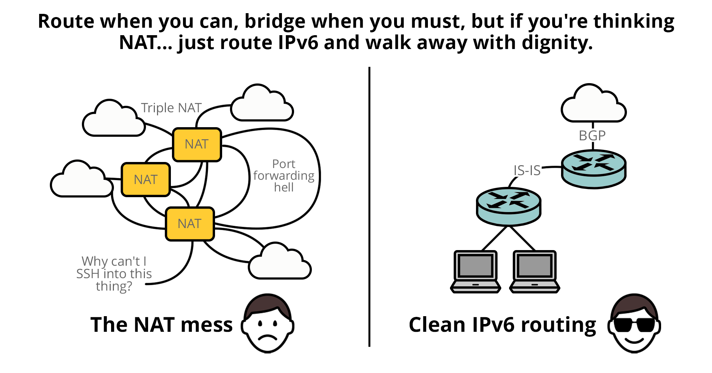

#### This article was sponsored by the cybersecurity company FastNetMon. They offer DDoS detection products for network operators ranging from telcos to small ISPs, which can be deployed on-premise or in the cloud. It features easy deployment and lightning-fast attack detection. You can claim your free 30-day trial using this link.

> **For professional CGNAT and IPv6 deployment services aligned with industry best practices, [click here](https://www.swernetworks.com/).**

**This article has been published on the [APNIC blog](https://blog.apnic.net/2025/05/13/lets-talk-about-cgnat-and-ipv6-again/) as well.**

I have had a few back-and-forth with a fellow blogger, on a series of blog posts on the subject of IPv4, NAT, CGNAT and IPv6[[1](https://www.daryllswer.com/lets-talk-about-cgnat-and-ipv6-yet-again/#h-references)][[2](https://www.daryllswer.com/lets-talk-about-cgnat-and-ipv6-yet-again/#h-references)][[3](https://www.daryllswer.com/lets-talk-about-cgnat-and-ipv6-yet-again/#h-references)], along with consistently seeing people who do not understand the right way to do NAT-ting in general, motivated me to write this blog post.

For years, I’ve tried advocating for best-practices when it comes to the ugly invention in network engineering called Network Address Translation (NAT), with its uglier sub-form called Port Address Translation (PAT), where the latter is what we commonly call ‘NAT’ in the modern day, this technology forced the creation of equally ugly hacks to work-around it.

The reality is, NAT broke the Internet by its very design in addition to default NAT configuration across most vendors and software implementations are often broken.

Software developers spent decades coming up with complex workarounds, simply because network engineers and network business stakeholders alike insisted decades ago that the way to future-proof the Internet ecosystem was to use (CG)NAT, handicap layer-4 across the planet to just TCP/UDP, destroy any hope of future replacements for either of these layer 4 protocols (DCCP, UDP-Lite, SCTP etc all died on arrival); instead of early adoption of native **routed** IPv6 (NAT-ted IPv4 **isn’t** **routing**), remember, IPv6 was first introduced into the public domain back in December 1995[[4](https://www.daryllswer.com/lets-talk-about-cgnat-and-ipv6-yet-again/#h-references)].

Sure, we could argue that stateful firewalls also played a role in handicapping layer 4, but that does not negate the point that NAT played a massive role in the state we are in today.

For some reason, **routing** still feels like an alien concept to many organisations and IT folks. In far too many environments, there’s more NAT-ing than actual routing—whether it’s IGP, BGP, or anything in between. And this isn’t just an IPv6/IPv4 issue. The misunderstanding of routing bleeds into Layer 2 as well: people often default to messy bridged networks, riddled with loops and an over-reliance on Spanning Tree Protocol, instead of embracing clean Layer 3 routing.

There’s a saying: *“Route when you can, bridge when you must.”* It’s solid advice—yet often ignored.

In fact, maybe we need a new one: *“Route when you can. Bridge when you must. But if you’re thinking NAT… just route IPv6 and walk away with dignity.*”

Because here’s the thing—with IPv6, you don’t need NAT. If you just **routed** everything end-to-end, things would be simpler, cleaner, and far more scalable. Now I am well aware of issues with IPv6 multi-homing and PA space, that’s already covered in my [IPv6 Architecture guide](https://www.daryllswer.com/ipv6-architecture-and-subnetting-guide-for-network-engineers-and-operators/), which is why *‘routed’* is **bolded** 😉 – PA multi-homing issue is no excuse to avoid IPv6, because it’s the same problem in IPv4[[5](https://www.daryllswer.com/lets-talk-about-cgnat-and-ipv6-yet-again/#h-references)].

## What ugly hacks?

In a nutshell, of acronyms — STUN, TURN, ICE, WebRTC, ALGs — things that didn’t need to exist in routed networks (excluding STUN, because we need it, even in routed networks due to stateful firewall deployments), but ended up coming into existence because of NAT.

People think NAT has little to no overhead, but that isn’t true — The reason it *appears* as such is because of decades of hard work from software developers who implemented the above acronyms in actual code to mask the side effects of NAT. With some common sense, it is safe to say tens of thousands of coding hours and resources, were spent on hacking around NAT with relays (TURN) discovery (STUN) and punching hit-and-miss holes in the NAT state machine (WebRTC/ICE and regular TCP/UDP) along with hacky packet header re-writes using ALGs (sometimes called NAT Helpers in Linux Netfilter terminology).

You don’t have to take my word for it, read a book or two about these acronyms[[6](https://www.daryllswer.com/lets-talk-about-cgnat-and-ipv6-yet-again/#h-references)], to see the insane complexity brought upon us by those who insisted NAT-ting > routing (hello IPv6!).

Despite these hacks being ubiquitous in most end-user applications today, it never truly unbroken the Internet ecosystem.

Let’s start with some P2P examples like VoIP/SIP and online gaming (a multi-billion dollar industry for starters, so there’s real business incentives here):

1. When we try to establish a P2P software telephony call between two endpoints over NAT, often times it’ll fail and the endpoint software will be forced to re-route traffic over a TURN server relay for the clients — this can result in insane latency, as the TURN server may be geographically and routing-wise really far away from the actual calling endpoints.
2. Here’s where it gets even worse in NAT-ted networks: If both calling endpoints are in the same LAN/broadcast domain, and their calling application software called upon STUN discovery to try to initiate the call, the call will fail, because most NAT configurations are missing NAT hairpinning (aka NAT Loopback)[[7](https://www.daryllswer.com/lets-talk-about-cgnat-and-ipv6-yet-again/#h-references)], what happens is both endpoints for example will be NAT-ted to a public IP 1.1.1.1, each endpoint has a unique source port, for example 1025, 1026, so now STUN discovers 1.1.1.1:1025, 1.1.1.1:1026, and now the endpoints try to talk to each other destined towards each of these public IP port mappings — and fails spectacularly because no hairpinning by default on most NAT configurations. Such a problem doesn’t exist in **routed**, **NAT-less** environments. What happens now is, the call will be routed through the public internet via TURN relay server, and the latency jumped from 1ms on the LAN to who knows what latency on the public internet.
3. Similarly, the same issue exists in online gaming, P2P gaming lobbies will often fail behind NAT and your game software will now use a TURN-relay instead, leading to unpredictable latencies. Even if all gamers in a lobby are within the same geographical location, all customers of the same BGP Autonomous System (AS), where latency would’ve been 1-2ms if it was pure routing, now thanks to (CG)NAT, and forced use of TURN-relay, their latency jumped to 50ms or whatever randomly or even more depending on the physical and routing-wise location of the TURN-relay.
4. Has the side effect of content centralisation amongst a few hyperscaler cloud network providers, due to broken P2P leading to normalised Server/Client model of data transfer between A and B endpoints in application software — Are we really doing humanity a favour with so much centralisation of internet content and traffic? I’ll leave that to your imagination.

“But this is hypothetical, isn’t it?” — Nope, you need to think about this in large scale SP networks and campus networks, a lot of endpoint-to-endpoint traffic does exist on everyday end-user applications like WhatsApp P2P calling for example, at large scale, so much traffic is TURN-relayed back into the public Internet, when it could’ve just stayed intra-AS or intra-LAN, with hairpinning[[8](https://www.daryllswer.com/lets-talk-about-cgnat-and-ipv6-yet-again/#h-references)] or in the case of native **routed** IPv6.

“Oh, but I’m a DC operator, I’m not an ISP or Enterprise, NAT is harmless for us, right?” — No. Give this podcast a listen[[9](https://www.daryllswer.com/lets-talk-about-cgnat-and-ipv6-yet-again/#h-references)], NAT has insane overhead even at hyperscaler companies like Meta or Google.

All of these problems and hacks, have overhead that’s not visible in a GUI/UI to the end-users of NATting, up and until latency goes bonkers because of TURN or something broke, and they start whining about it to the L1 customer support of an ISP or even MSP/Consultant of the enterprise.

Let’s not forget about CGNAT, aside from the issues described above, it has the obvious issue of port exhaustion — there’s only so much port availability for shared IP space across billions of humans and devices in the world. Yet another issue that does not exist in **routed** networking (hello IPv6 again).

## Broken NAT — is there a not-so-broken NAT?

Long story short, yes, mostly.

Longer story:

1. We start by enabling hairpinning[[7](https://www.daryllswer.com/lets-talk-about-cgnat-and-ipv6-yet-again/#h-references)] to ensure that intra-(CG)NAT traffic on the LAN or AS works correctly, this gets rid of TURN for intra-NAT traffic.
2. Then we enable EIM & EIF on the NAT device[[10](https://www.daryllswer.com/lets-talk-about-cgnat-and-ipv6-yet-again/#h-references)] for port range 1024-65535 for both TCP and UDP, this will help ensure P2P traffic continues to work for TCP/UDP, it will get rid of TURN for general global NAT-ted traffic that egresses from the (CG)NAT device.
3. You could go further and enable Port Control Protocol — But there’s no adoption of this in end-user OSes and applications, and the efforts to get adoption for this, is better spent on IPv6.

### Caveat

**Not-so-broken != Not-Broken.**

1. NAT Hairpinning/Loopback doesn’t work the same way and/or doesn’t work correctly on all operating systems. For example, it works out-of-the-box without user configuration on proprietary CGNAT solutions like A10 Networks (page 31)[[11](https://www.daryllswer.com/lets-talk-about-cgnat-and-ipv6-yet-again/#h-references)], but it won’t be that simple on a Linux-based device, if you try to create a Hairpin NAT rule on a Linux box, it may or may not work depending on the implementation, for all Src-NAT-ted traffic — Remember, hairpinning is supposed to permit intra-NAT traffic to work, without them necessarily being DNAT-ted, such as Xbox gaming sessions P2P between two hosts behind the NAT, or two SIP Clients trying to talk to each other over their Src-NAT-ted IP using STUN discovery without TURN. I have not yet seen RFC-like hairpinning **simplicity** on any vendor other than A10 CGNAT, if we go by their official documentation.
2. EIM+EIF NAT is often missing from operating systems or software that have a NAT functionality (such as vanilla Linux Kernel at the time of writing this article), or it is not implemented per the RFC. For example, on MikroTik, EIM is implemented only for UDP, but not TCP and EIF is missing completely.
3. None of the above workarounds, even if implemented per the relevant RFCs, will fix IP space/port exhaustion; the only solution is to opt for **routing** with **IPv6**.

## IPv6 adoption is just as broken

There’s no denying this, IPv6 adoption has been lack-lustre at best, and even when an ISP does deploy it, they do it, using IPv4-archaic mindset and fail to adhere to best practices such as [BCOP-690](https://www.ripe.net/publications/docs/ripe-690/).

Happy Eyeballs is a useful mechanism, but perhaps from a human psychological perspective it ended up being a double-edged sword that indirectly incentivise lazy network operators from fixing broken IPv6 deployments.

There’s no cure to broken IPv6 other than:

1. Obsolete IPv4 dinosaurs should head into retirement and allow the next-generation of engineers to replace them. The same way, IP/MPLS engineers replaced the circuit-switched dinosaurs who were against IP/MPLS during the [Protocol Wars](https://en.wikipedia.org/wiki/Protocol_Wars#Packet_switching_vs_circuit_switching). Ludditism should be against corporate policies and against job contracts while we’re at it.
2. Fix the education system along with vendor certification programmes — IPv6 should be the default Address Family when introducing IP addressing and routing concepts to beginners and aspiring network engineers. Teaching networking fundamentals through IPv6 offers a simpler, more scalable, and future-ready foundation compared to IPv4. IPv4, along with NAT and its complex workarounds such as TURN, ICE, WebRTC, EIM/EIF NAT, Hairpinning etc, should be introduced later as legacy technologies, not as the standard starting point. By prioritising IPv6 from the beginning of a course or certification programme, students should gain a clear understanding of networking principles without outdated constraints, setting them up for success in a world that’s rapidly transitioning beyond IPv4.

## But NAT is a firewall!

No, it isn’t[[12](https://www.daryllswer.com/lets-talk-about-cgnat-and-ipv6-yet-again/#h-references)][[13](https://www.daryllswer.com/lets-talk-about-cgnat-and-ipv6-yet-again/#h-references)] — If you need a firewall, then you enable a firewall for both IPv4 and IPv6, NAT isn’t a firewall technology.

## Conclusion

The conclusion is factually simple: Routing > NAT-ting, and in order to route sufficient address space in today’s ever-growing world, IPv6 comes into play. But if broken IPv6 continues, then NAT-ting would persist in IPv6 (NAT66) and nothing actually gets solved.

NAT was and always will be what we call in India, [jugaad engineering](https://en.wikipedia.org/wiki/Jugaad), the English translation would closely resemble [frugal engineering](https://en.wikipedia.org/wiki/Frugal_innovation).

## References

1. [https://blog.ipspace.net/2025/03/response-end-to-end-connectivity/#2585](https://blog.ipspace.net/2025/03/response-end-to-end-connectivity/#2585)
2. [https://blog.ipspace.net/2025/04/response-nat-traversal/](https://blog.ipspace.net/2025/04/response-nat-traversal/)
3. [https://blog.ipspace.net/2025/04/response-peer-to-peer-apps-ipv6/](https://blog.ipspace.net/2025/04/response-peer-to-peer-apps-ipv6/)
4. [https://www.rfc-editor.org/rfc/rfc1883.html](https://www.rfc-editor.org/rfc/rfc1883.html)
5. [https://blog.ipspace.net/kb/Internet/MH_Redundancy/](https://blog.ipspace.net/kb/Internet/MH_Redundancy/)
6. [https://webrtcforthecurious.com/](https://webrtcforthecurious.com/)
7. [https://www.rfc-editor.org/rfc/rfc4787#section-6](https://www.rfc-editor.org/rfc/rfc4787#section-6)
8. [https://www.linkedin.com/feed/update/urn:li:activity:7315988308252086273?commentUrn=urn%3Ali%3Acomment%3A%28activity%3A7315988308252086273%2C7316010203462696961%29&dashCommentUrn=urn%3Ali%3Afsd_comment%3A%287316010203462696961%2Curn%3Ali%3Aactivity%3A7315988308252086273%29](https://www.linkedin.com/feed/update/urn:li:activity:7315988308252086273?commentUrn=urn%3Ali%3Acomment%3A%28activity%3A7315988308252086273%2C7316010203462696961%29&dashCommentUrn=urn%3Ali%3Afsd_comment%3A%287316010203462696961%2Curn%3Ali%3Aactivity%3A7315988308252086273%29)
9. [https://www.buzzsprout.com/2127872/episodes/16106562](https://www.buzzsprout.com/2127872/episodes/16106562)
10. [https://datatracker.ietf.org/doc/html/rfc7857#section-5](https://datatracker.ietf.org/doc/html/rfc7857#section-5)
11. [https://www.a10networks.com/wp-content/uploads/A10-DG-Carrier_Grade_NAT_CGN_Large_Scale_NAT_LSN.pdfhttps://www.a10networks.com/wp-content/uploads/A10-DG-Carrier_Grade_NAT_CGN_Large_Scale_NAT_LSN.pdf](https://www.a10networks.com/wp-content/uploads/A10-DG-Carrier_Grade_NAT_CGN_Large_Scale_NAT_LSN.pdf)
12. [https://www.f5.com/resources/white-papers/the-myth-of-network-address-translation-as-security](https://www.f5.com/resources/white-papers/the-myth-of-network-address-translation-as-security)
13. [https://samy.pl/slipstream/](https://samy.pl/slipstream/)
