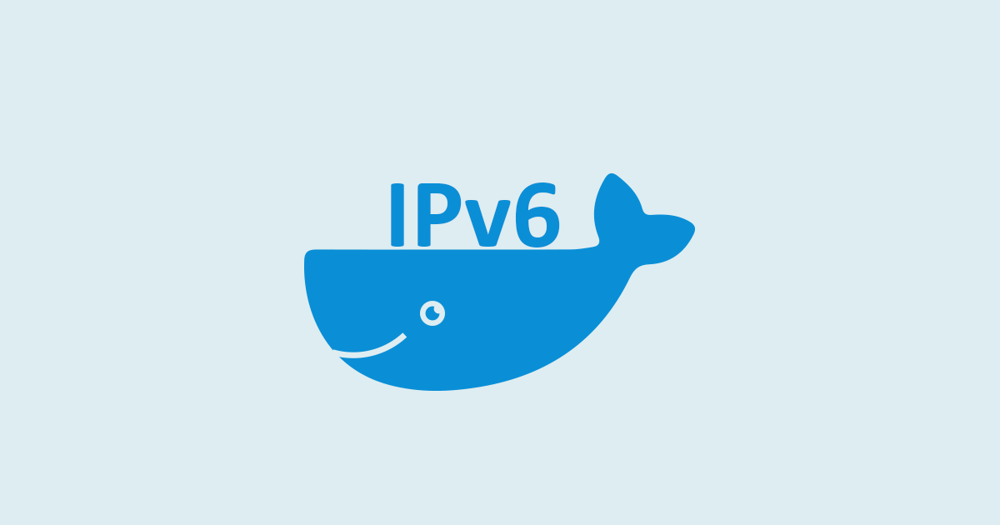

**This article has been published on the [APNIC blog](https://blog.apnic.net/2025/05/19/how-to-configure-routed-ipv6-in-docker/) as well.**

I felt the need to write this short blog post, as I still receive DMs and emails from people who were not able to get native **routed** IPv6 working on Docker. In this post, I’ll show you how to do it in a simplified manner, while obscuring some details of network architecture for the purpose of solely focusing on Docker.

I have been using routed IPv6 on Docker for years before the ‘[routed mode](https://github.com/moby/moby/pull/47871)‘ configuration was officially added in 2024. However, even with the updates added in [Docker v27](https://docs.docker.com/engine/release-notes/27/#ipv6), I still see users online struggling to get IPv6 working properly.

A lot of the confusion seems to stem from misinformation across the web and the lack of network engineering knowledge amongst the public in general. The concept of **routing** is alien-enough even in the [network engineering world](../2025-04-22-lets-talk-about-cgnat-and-ipv6-yet-again/index.md). This creates confusion for people with terms like ‘NAT’, ‘Bridge’, ‘Host Driver’, and ‘NDP Proxy’ in the context of Docker.

I had planned to write a more detailed article on how to do IPv6 with Docker in collaboration with Docker Inc. and publish it [here](https://docs.docker.com/guides/). But life got in the way. I still plan to make it happen one day, so keep an eye on this [GitHub issue](https://github.com/docker/docs/issues/19556) for updates.

## What does ‘routed’ really mean?

In this context, the IPv6 prefix is reachable via native Layer 3 packets forwarding without hacks like NAT66 and/or NDP proxying. Specifically, in the Docker additional context, it means the Docker ‘network’ isn’t bridged with the [host’s underlying network infrastructure](https://docs.docker.com/engine/network/drivers/macvlan/#bridge-mode), and containers aren’t relying on the host’s IPv6 address for connectivity.

In other words, routing means **no** bridging, **no** NAT-ting, **no** sharing of the host’s public IPv6 address on the WAN interface. It’s completely Layer 3 native packet forwarding from your network infrastructure to the host’s Docker network segment.

## Assumptions

1. We will use [Docker Compose](https://docs.docker.com/compose/).
2. You know how routing works.
3. You know [how to route an IPv6 prefix](../2023-04-04-ipv6-architecture-and-subnetting-guide-for-network-engineers-and-operators/index.md) (preferably a /64) from the underlay network to the Docker host.
4. The Docker host can be a Pi, a laptop running Debian, a server box running a hypervisor or a regular Debian OS, or a Virtual Machine (VM) behind a hypervisor or possibly behind a KubeVirt.
5. The Docker host’s iptables/nftables is clean; there’s no user-defined configuration that could break Docker and/or IPv6 networking.
6. Let’s assume our Docker public IPv6 Prefix is `2001:db8::/64`, and it is routed to the Docker host from the underlying network.

## Routing Protocol Recommendation

I recommend BGP as the preferred routing protocol, as it’s the standard approach in data centre Clos fabrics. Alternatively, [is-is](https://youtu.be/jWdD8SCwzHk) is a viable option.

As a best practice, remember to route the IPv6 prefix to a blackhole with a high administrative distance (or metric) on the Docker host. This acts as a safety net if Docker fails in production. Any traffic that was previously live at scale would now just get routed to the blackhole, minimizing CPU load that would otherwise be spent generating ICMPv6 ‘Destination Unreachable’ packets.

## Docker Compose configuration

You can create a custom Docker bridge and assign the routed IPv6 prefix to it. From here, the rest is simple; containers will get an IPv6 address from the configured prefix, or you can also assign a static IPv6 address to a container if you prefer that.

```
networks:
  ipv6_native:
    driver: bridge
    driver_opts:
      com.docker.network.bridge.gateway_mode_ipv6: "routed"
    enable_ipv6: true
    ipam:
      driver: default
      config:
        - subnet: 2001:db8::/64
          gateway: 2001:db8::1
```

## Additional tips on firewall rules

I recommend using network engineering-centric firewall rules whereby the rules are constructed to permit **solicited** peer-to-peer (P2P) traffic in both directions, permit certain ports directly, permit ICMPv4/v6, permit UDP traceroute etc. To achieve this, you can disable Docker’s manipulation of the iptables and ip6tables (or eventually nftables).

Disable Docker’s iptables/ip6tables manipulation using [this](https://docs.docker.com/engine/network/packet-filtering-firewalls/#prevent-docker-from-manipulating-iptables):

```
#Add these lines in your /etc/docker/daemon.json
{
  "iptables": false,
  "ip6tables": false
}
```

But remember, you need to build your own rules to protect the host and containers along with NAT rules for IPv4 to work. A quick example of NAT-ting IPv4 using nftables; the ‘persistent’ keyword just helps make STUN work better from the client-side due to persistent port mapping between [RFC1918](https://datatracker.ietf.org/doc/html/rfc1918) address and the public IP, but this is a complex topic of its own and outside the scope of this post. Just move everything to IPv6 and forget about these NAT-related hacks and complexities.

```
table inet docker {
    chain postrouting {
	type nat hook postrouting priority 100; policy accept;
	ip saddr 172.16.0.0/16 oifname "eth0" snat to 192.0.2.1 persistent;
    }
}
```

If you want to continue using Docker’s built-in iptables manipulation, then remember, even with routed IPv6, you still need to [publish the ports](https://docs.docker.com/get-started/docker-concepts/running-containers/publishing-ports/#use-docker-compose) that you want global accessibility to.

## Conclusion

As we’ve seen in this post, routed IPv6 with Docker doesn’t need to be complex.
