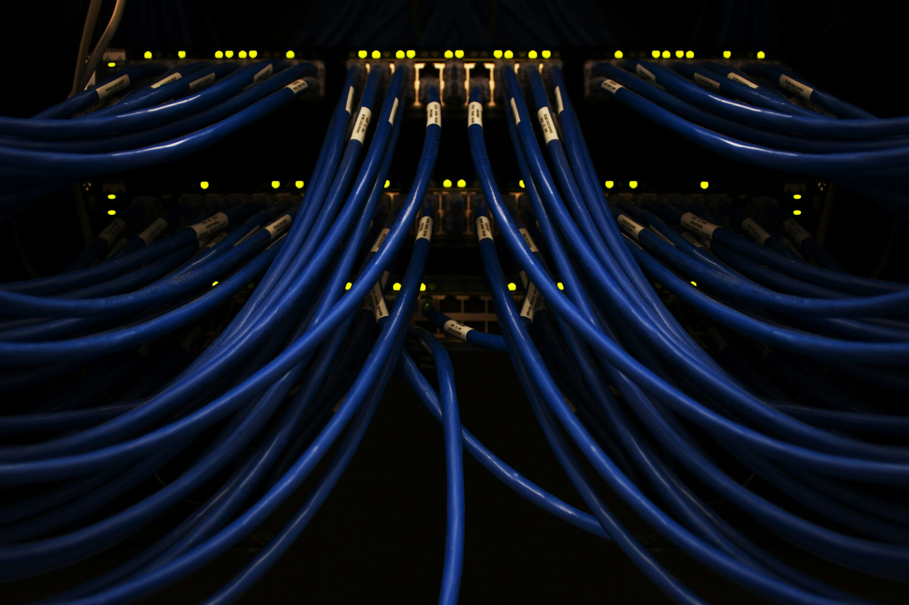
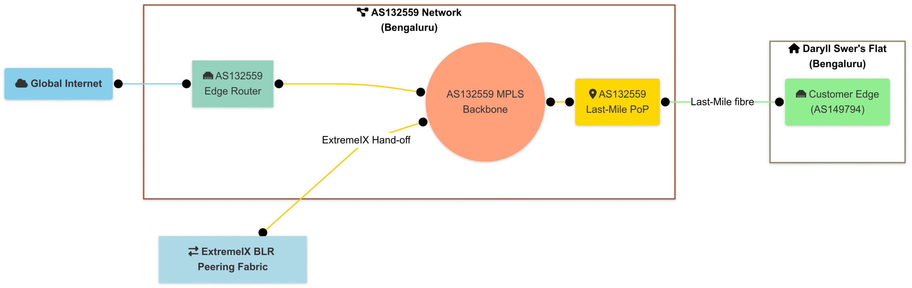
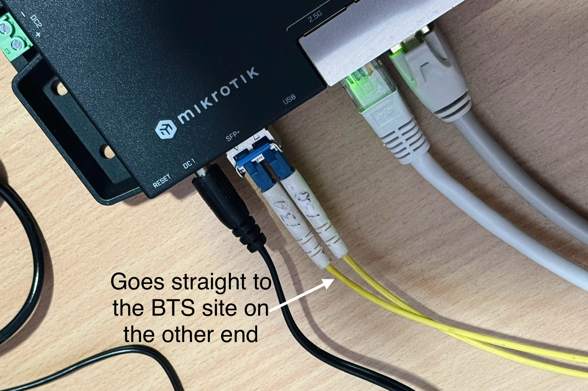
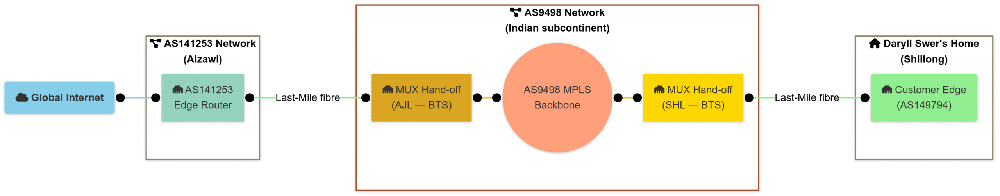
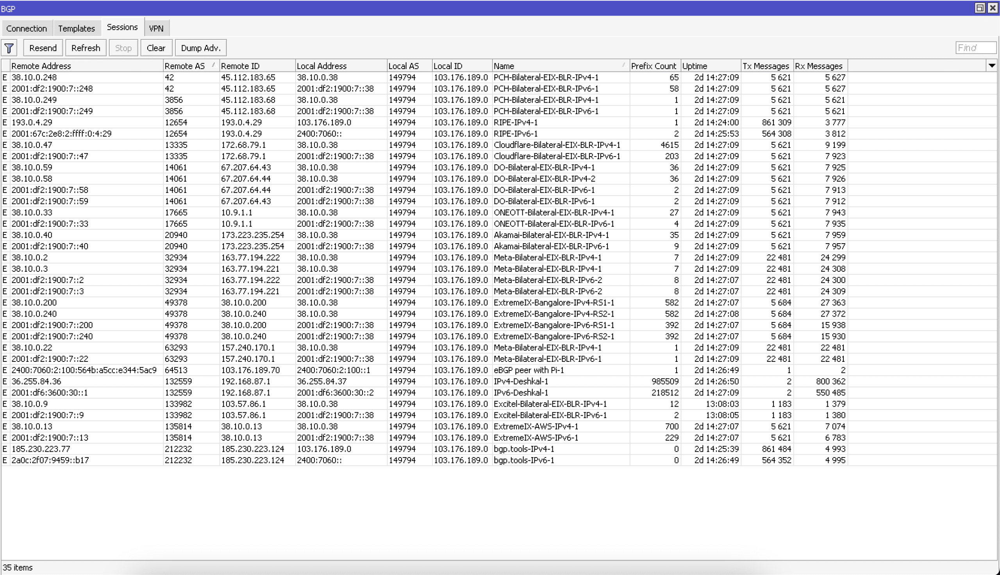

**This article has been published on the [APNIC blog](https://blog.apnic.net/2025/05/26/how-to-bring-data-centre-like-connectivity-to-your-home-with-ipttth/) as well.**

Most people get their Internet through a standard fibre or broadband service,
supplied by a residential ISP. What if you could bring enterprise-grade, carrier-level
connectivity direct to your home, bypassing the usual ISP setups and having your
own dedicated MPLS-delivered IP transit?

This post details my personal experience with this kind of set up in India. I’ll share
how I built the network ([AS149794](../2022-07-01-how-did-i-set-up-my-own-autonomous-system/index.md)), what it took to maintain, and whether the dream of true enterprise-grade Internet at home is worth it. It is a bit different from my usual focus.
Instead of diving into network engineering, I’ll be looking at the costs and the Layer 8
challenges of managing a unique home network.

I’m not the first or only person on to have had this type of setup. I’ve heard of people
from the USA, and at least of one other person in India, having similar
setups in their personal homes, but I believe you could probably count the total on one hand.

# IPTTTH

What exactly do I mean by IP Transit-To-The-Home (IPTTTH) in the
context of this post? Put simply, it’s having **physical** IP transit — delivered over
MPLS — directly to your home. Not your typical Fibre-to-the-Home (FTTH), but
actual IP Transit-To-The-Home.

IP Transit isn’t to be conflated with DIA, [there is a difference](https://www.zayo.com/resources/ip-transit-or-dedicated-internet-access-dia-which-is-right-for-me/).

This post explores the concept of IPTTTH based on my own experience with this type of setup, in the Indian economy. I’ve actually had two distinct implementations of IPTTTH, and we’ll go through each one separately.

To kick things off, I’ll break down the setup — starting from Layer 1, moving up to Layer 3, and then jumping straight to Layer 8. And no, this isn’t about fancy virtual tunnels or software overlays. We’re talking about real, physical IP transit delivered over MPLS, all the way to a residential home.

## Layer 1 overview

At Layer 1, the exact setup can vary depending on the location. However, for this blog post, we’ll focus on India as a real-world example of IPTTTH implementation, based on my firsthand experience.

### Implementation BLR (Bengaluru, India)

For this implementation, the setup was based in [Bengaluru](https://en.wikipedia.org/wiki/Bengaluru) (BLR). The MPLS carrier, physical fibre transport provider, and IP transit provider were all handled by AS132559, a local ISP in BLR. Since they owned the infrastructure end-to-end, they could deliver true MPLS Delivered IP transit directly to the home.

The setup was fairly straightforward. At the ISPs Point of Presence (PoP), they had a Layer 2 switch uplinked to an MPLS Provider Edge (PE) router, which itself had multipath protection back to their edge router. From that switch, a single fibre optic cable — using BiDi optics — ran approximately 1.5 kilometres directly to my flat in Bengaluru. It was a fairly straightforward implementation.

AS132559 also carried my VLAN to ExtremeIX BLR for IXP peering. Since ExtremeIX and AS132559 already had a cross-connect at a mutual data centre, setting up my peering was straightforward — they simply configured an additional VLAN for me. The topology is shown in Figure 1.

_Figure-1 BLR Layer 1 topology_

### Implementation S-A (Shillong<>Aizawl, India)

This implementation involved a long-distance circuit between [Shillong](https://en.wikipedia.org/wiki/Shillong) (SHL) and [Aizawl](https://en.wikipedia.org/wiki/Aizawl) (AJL), with the total distance estimated by Google Maps to be around 800 km.

The carrier backbone and middle-mile were fully outsourced to AS9498, with the carrier delivering the MUX port hand-off at one of their [BTS sites](https://en.wikipedia.org/wiki/Base_transceiver_station) in Shillong (SHL), the location closest to mine. From there, I contracted a fibre cable operator to run an overhead fibre from the MUX port directly to my home, spanning about 2 km. The fibre terminates in my residence and connects straight to a Small Form-factor Pluggable (SFP) module on my router (Figure 2).

_Figure-2 Fibre Termination in my SHL home_

On the other end of this MPLS circuit, there’s a similar setup that terminates at my transit provider sponsor at the time of writing this article, AS141253, in AJL. The circuit was initially set up with a capacity of 200 Mbps in 2023, but this was later revised to 150 Mbps starting from 2024. The topology is shown in Figure 3.

_Figure 3 — The SHL Layer 1 topology_

## Layer 2 Overview

### Implementation BLR

Layer 2 of this implementation involved two tagged VLANs from my end. One VLAN was dedicated to IP transit directly with AS132559, and the other was for IXP connectivity with ExtremeIX BLR. These VLANs were then transported over VPLS on AS132559’s end for termination.

### Implementation S-A

Layer 2 of this implementation was largely handled by the carrier, AS9498, and was somewhat obscured. However, we know that the VLAN was manually tagged on the other end of the circuit by my transit provider, as multiple circuits were delivered over a single port. Given this setup, it’s safe to assume the circuit was an Ethernet Virtual Private Line (EVPL) and likely used SR-MPLS with EVPN on the carrier’s side. This assumption considers that AS9498 is a major Juniper customer, making it highly unlikely they would continue using legacy protocols like LDP/RSVP-TE and traditional L2 circuits indefinitely.

## Layer 3 Overview

### Implementation BLR

A simple BGP session was established with AS132559 for both IPv4 and IPv6, with a 9,000 L3MTU. I took full routing tables for both address families (AFIs) from AS132559, as their edge router supported a full table-capable Forwarding Information Base (FIB) at that time.

Separate BGP sessions were also set up with ExtremeIX Route Servers and other members with a 1,500 MTU.

_Figure-4 Screenshot of past BLR BGP peers that were live on Layer 1_

### Implementation S-A

A simple BGP session was established with AS141253 for both IPv4 and IPv6, using a 9,000 L3MTU. I received a default route for both AFIs from AS141253, as their edge router did not have a full table-capable FIB at that time.

## Financial Feasibility

Here comes the fun part, finance!

The pricing for IP transit differs from that of a Point-to-Point (PtP) pseudowire and will always vary depending on the carrier, ISP, and location. It’s also worth noting that USD conversion rates fluctuate daily, and the value of the Indian rupee has been steadily dipping. So, the rates I’m converting to USD here aren’t going to be 100% accurate, but they should give a reasonable estimate.

### General ISP Service Pricing in BLR (2024)

These rates were provided by the local ISP in BLR, are generally applicable across most of India (excluding taxes):

| Service | Pricing (INR) | Pricing (USD) | Terms |
| --- | --- | --- | --- |
| 9G PtP (pseudowire) circuit | ₹6,750,000 | $78,764 | Per annum |
| 1G PtP (pseudowire) circuit | ₹750,000 | $8,751 | Per annum |
| 9G IP Transit | ₹13,050,000 | $152,277 | Per annum |
| 1G IP Transit | ₹1,450,000 | $16,919 | Per annum |

_Table-1 IP transit and PtP circuit pricing (India)_

### SHL<>AJL Circuit Costs (2025)

For my specific setup, the costs between SHL and AJL in 2025 are shown in Table 2. These are based on actual quotations received.

| Service | Pricing (INR) | Pricing (USD) | Terms |
| --- | --- | --- | --- |
| Fibre Installation (2023) | ₹17,000 | $200 | One-time fee for 2 KM fibre link between BTS and my home. |
| Fibre Re-routing (2024) | ₹2,000 | $24 | For adjusting fibre path inside my property. |
| 200M PtP (pseudowire) circuit via AS9498 | ₹13,000 | $152 | Per month (₹15,340/$179 with GST) |
| 150M PtP (pseudowire) circuit via AS9498 | ₹9,000 | $106 | Per month (₹10,620/$124 with GST) |
| IP Transit Pricing | Similar to BLR rates | Similar to BLR rates | Minor variations based on bandwidth |

_Table-2 SHL — AJL circuit costs (2025)_

As shown in Tables 1 and 2, these prices are extremely high, making it virtually impossible for most people to afford IPTTTH without a sponsor. Alternatively, you could opt for lower bandwidth PtP circuits, cover the cost yourself, and then have someone sponsor the transit and cross-connect at the data centre. While this scenario is unlikely, it’s still technically possible.

You might wonder how I managed to secure these sponsors in the first place. The answer is simple — the barter system. I offer my network engineering expertise whenever they need it, and in exchange, I was able to secure these circuits.

### What about global pricing?

Obviously, it’s impossible to gather global pricing and implementation details for the sake of the blog post. However, based on anecdotal information from clients and friends in economies like the Netherlands and the US, laying underground PtP fibre from the carrier hand-off location (such as a central office or carrier/fibre hotel) to your home can cost tens of thousands of dollars. Unlike in India, where you can get away with overhead fibre cables, which wouldn’t be possible in many parts of the world unless you have jumped through many bureaucratic and legal hurdles.

This effectively makes IPTTTH virtually unfeasible in most western nations, where strict government regulations govern fibre deployment on public lands. Unless your ISP already has existing infrastructure, they can sponsor you with, or unless there are unique circumstances, it’s a tough challenge.

One potential workaround could be using Passive Optical Network (PON) infrastructure with VLAN tagging, which isn’t technically impossible. In this setup, the ISP could configure a unique, tagged VLAN for your Optical Network Terminal (ONT), then carry that VLAN through their SR-MPLS/EVPN pipe. From there, the VLAN would be routed to a PE router, which they use for selling Dedicated Internet Access (DIA)/IP transit services, rather than terminating it on the Broadband Network Gateway (BNG) like they do for regular residential users. However, this is a rare and complex solution.

## Operational Feasibility

Here comes the other fun part, operational overhead!

While having your own transit at home physically delivered over an MPLS carrier, is incredibly fun and a unique experience — especially having the ability to assign public IPv4+IPv6 addresses to devices like your iPhone or MacBook without the need for NAT. This enables native P2P application software behaviour and a smoother experience compared to the TURN-relayed traffic most users deal with.

However, operating this type of home network is challenging for several reasons.

Sometimes the upstream Transit provider, or their own upstream(s), misconfigure their routers. This can cause routing loops and/or blackholing of your public IPv4/IPv6 prefixes, affecting your internet traffic at home. When that happens, you need to call up your contact person, or text them, and wait either for a 5 mins fix, or a 7-day fix depending on the problem, root cause and where the problem lies. Since this is a ‘sponsored’ setup, there is no SLA, there’s no guarantee of timely response for obvious reasons.

There have been times when routing issues occurred due to misconfigurations by the upstream providers of my upstream. One example was AS9498 looping traffic to my IPv6 prefix on the global routing table between themselves and AS6939. It took 4–5 days to resolve, with help from a contact I had at HE at the time.

On other occasions, misconfigurations in the provider’s Layer 2 switches led to problems with Neighbor Discovery Protocol (NDP), effectively breaking my IPv6 peering sessions. In the event of a fibre cut, the resolution time could vary greatly — it might be fixed within an hour, or it could take up days, depending on the situation.

I’m sure you can imagine many other issue scenarios, but one thing is certain — it can be difficult for a single individual to manage this type of setup.

A funny example would be me chasing down my Transit provider’s upstream to fix their broken routing policies facing the Default Free Zone (DFZ). This even involved their Network Operations Centre (NOC) team calling me at 12am. Luckily, I’m a night owl, so I was probably watching Netflix when they rang.

All these small — and sometimes large — issues add up to significant Layer 8 management overhead for the operator (in this case, me). Especially when something critical is going on in your life, the last thing you want to do is remotely log into your provider’s DFZ-facing edge routers to troubleshoot a misconfigured BGP policy. This is in stark contrast to the experience of a typical residential broadband user, who can outsource all that work to the ISP.

## Conclusion

Regardless of potential issues, having this unique setup helped me gain valuable insights from a Layer 8 perspective, particularly when dealing with my sponsoring providers, their upstreams, third parties from global network providers, and so on. This is the kind of knowledge that no network vendor certification programme can teach you — specifically, the unpredictable and complex human dynamics involved. From negotiation strategies in a barter system to building enough trust to gain super-admin access to networks worldwide, it’s a different kind of skill. In some cases, you’re trusted to the point where stakeholders forgo a formal legal contract, relying purely on trust and mutual understanding.

Still, nothing ‘free’ lasts forever, so my general advice would be to make the most of it while you can. For example, in my BLR setup, the provider went through an organisational restructure, I lost my point of contact (PoC). Soon after, my transit and transport service were discontinued. However, I was fortunate to have had a solid three-plus years of service before that happened! It also forged a friendship between the PoC and myself — which started as a phone call about [RFC4638](https://datatracker.ietf.org/doc/html/rfc4638) on their residential broadband services when I first landed in BLR back in 2021.

All things considered, if you’re as passionate about network engineering as I am and believe the trade-offs discussed are worth it, then this unique Internet experience is something worth taking if you have the opportunity.

Thanks to owning my own IPv6 Provider-independent Address (PIA) space, nothing beats the feeling of being able to configure IPv6 SLAAC with an ‘infinity’ preferred and valid lifetime timer on my home LAN. Being both a network engineer and an end-user offers a truly rewarding perspective that I encourage you to pursue!
